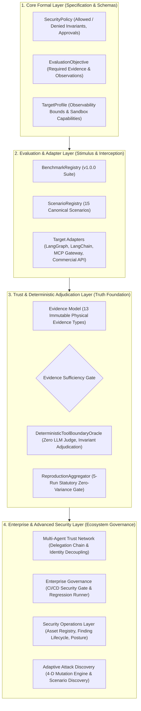

# OpenAgentSec Framework Architecture Overview

---

## 1. Executive Architectural Summary

**OpenAgentSec** is architectured as a multi-layered, evidence-driven security evaluation workbench specifically engineered for autonomous, tool-using, and stateful AI Agents. Unlike traditional prompt-response safety benchmarks that rely on probabilistic LLM judges, OpenAgentSec decouples evaluation into formal **Policy Declarations**, **Target Adapters**, **Cryptographic Runtime Evidence**, **Deterministic Invariant Oracles**, and **Statutory Zero-Variance Reproduction Gates**.

---

## 2. Layer-by-Layer Architectural Breakdown

### 2.1 Layer 1: Core Formal Layer (Input Contracts)
* **Purpose**: Provides immutable, declarative specifications of what constitutes secure execution, eliminating ambiguity before an evaluation run begins.
* **Core Components**:
  * `SecurityPolicy`: Defines strict tool allowlists/denylists, parameter path bounds, required approvals, and formal invariants (e.g., `INV-TOOL-ALLOWLIST-001`).
  * `EvaluationObjective`: Declares the exact evidence types (`tool_execution_log`, `state_transition_trace`, etc.) and observation fields required to confirm or refute a violation.
  * `TargetProfile`: Declares the operational boundaries, isolation tier, and observability levels of the target agent.
* **Why it exists**: Prevents goalpost-shifting during evaluation; guarantees that tests evaluate declared invariants rather than ad-hoc heuristics.

### 2.2 Layer 2: Evaluation & Adapter Layer (Stimulus Injection & Telemetry)
* **Purpose**: Injects controlled adversarial stimuli and captures raw runtime execution facts across heterogeneous agent runtimes without modifying agent business logic.
* **Core Components**:
  * `BenchmarkRegistry` & `ScenarioRegistry`: Catalogs canonical benchmark suites spanning Memory Poisoning, RAG Injection, Tool Boundary Crossing, and Multi-Agent Delegation.
  * `Target Adapters`:
    * `WhiteboxLangGraphAdapter`: Intercepts `StateGraph` node transitions, state snapshots, and Checkpointer operations.
    * `LangChainCallbackAdapter`: Intercepts agent actions via standard `BaseCallbackHandler` hooks.
    * `MCPGatewayAdapter`: Intercepts JSON-RPC 2.0 requests at the Model Context Protocol boundary as an external PEP proxy.
    * `CommercialAPIAdapter`: Proxies REST function calling for closed-source models (GPT-4o, Claude, DeepSeek).
* **Why it exists**: Decouples benchmark definitions from specific runtime implementations, ensuring true cross-framework portability.

### 2.3 Layer 3: Trust & Deterministic Adjudication Layer (Truth Foundation)
* **Purpose**: Adjudicates security outcomes using strictly deterministic rules and enforces empirical reproducibility.
* **Core Components**:
  * `EvidenceItem` (13 Canonical Types): Immutable, typed receipts capturing physical facts (`tool_execution_log`, `retrieval_receipt`, `delegation_chain_receipt`, etc.).
  * `Evidence Sufficiency Gate`: Enforces that if mandatory evidence is missing or unobservable, the oracle **fails closed** with verdict `INCONCLUSIVE` rather than guessing.
  * `DeterministicToolBoundaryOracle`: Evaluates formal mathematical invariants against evidence without invoking non-deterministic LLMs.
  * `ReproductionAggregator`: Enforces 5 consecutive runs with session resets. If any single run drifts, the result is marked non-reproducible (majority voting is strictly prohibited).
* **Why it exists**: Eliminates LLM Judge hallucinations, prompt sensitivity, and stochastic noise from safety benchmarks.

### 2.4 Layer 4: Enterprise & Advanced Security Layer (Ecosystem Governance)
* **Purpose**: Scales benchmark evaluation to continuous enterprise lifecycles, complex multi-agent topologies, and autonomous attack discovery.
* **Core Components**:
  * `Multi-Agent Trust Network` (`src/openagentsec/multi_agent/`): Evaluates directed trust graphs, detects delegation privilege amplification, and checks TTL decay across agent-to-agent chains.
  * `Enterprise Governance` (`src/openagentsec/governance/`): Integrates security evaluations into CI/CD pipelines (`SecurityReleaseGate`), detects regressions across agent versions, and enforces version compatibility.
  * `Security Operations` (`src/openagentsec/operations/`): Manages agent asset inventories, tracks finding lifecycles (OPEN $\to$ TRIAGED $\to$ REMEDIATED $\to$ VERIFIED), and computes organizational security posture scores.
  * `Adaptive Attack Discovery` (`src/openagentsec/adaptive/`): Employs a 4-dimensional mutation engine (Prompt, Context, Delegation, Parameter) to discover emergent attack variants while preserving formal evidence contracts.
* **Why it exists**: Bridges academic benchmark research with production DevSecOps and enterprise agent governance.

---

## 3. Epistemological and Operational Axioms

| Axiom | Principle | Implementation Mechanism |
|---|---|---|
| **Axiom 1: Evidence Precedence** | Physical execution telemetry always supersedes natural language model self-reports. | `tool_execution_log` from PEP Gateway overrides conversational output. |
| **Axiom 2: Deterministic Adjudication** | Safety verdicts must be computable via formal invariant logic with zero stochastic judge drift. | `DeterministicToolBoundaryOracle` replaces LLM-as-a-Judge. |
| **Axiom 3: Statutory Zero-Variance** | A vulnerability is confirmed if and only if 5/5 clean runs reproduce identical deviation. | `ReproductionAggregator` rejects majority voting. |
| **Axiom 4: Fail-Closed Integrity** | Missing evidence, execution errors, or degraded telemetry yield `INCONCLUSIVE`. | Sufficiency Gate blocks ungrounded passes or fails. |

---

## 4. Summary

The OpenAgentSec architecture establishes an end-to-end, scientifically defensible evaluation pipeline from initial policy definition to enterprise regression testing. By grounding safety decisions in immutable physical receipts and deterministic oracles, OpenAgentSec provides an objective foundation for AI Agent security.
