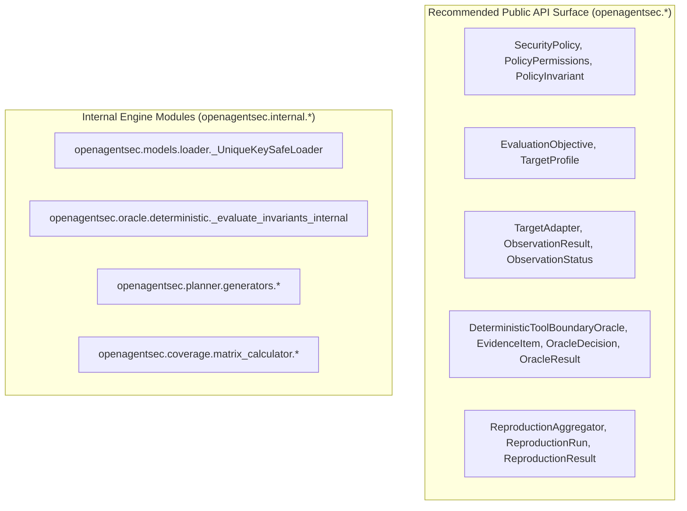
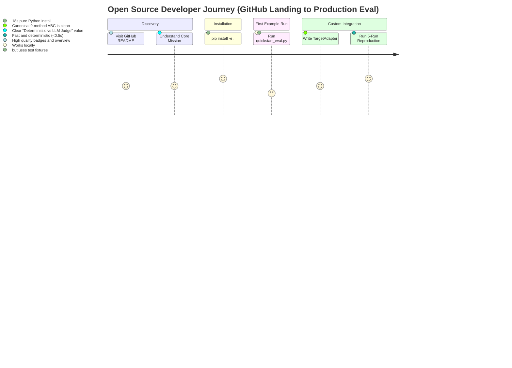
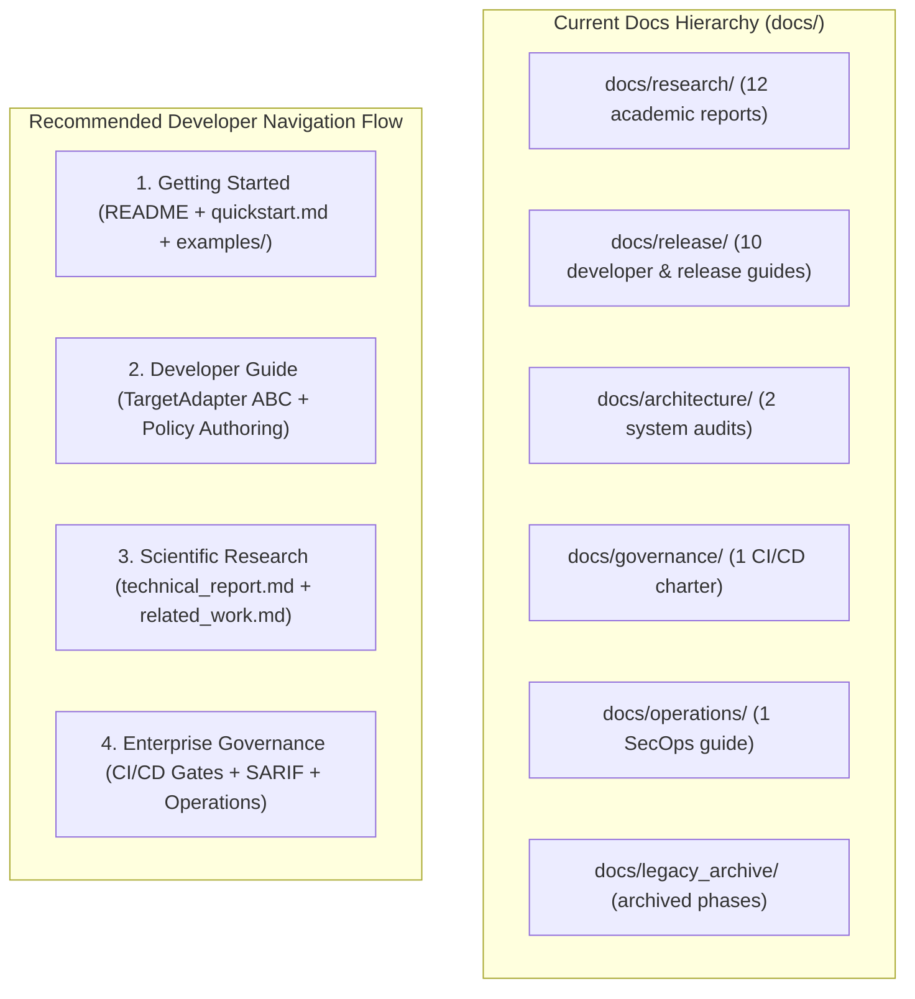
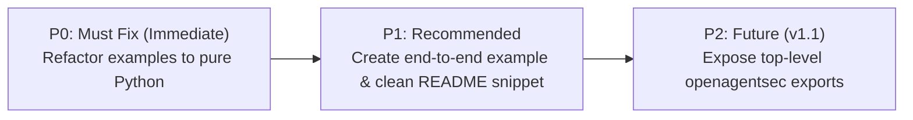

# OpenAgentSec Public API & Developer Experience (DX) Audit

**Document ID**: `OAS-DOC-PUBLIC-API-DX-001`  
**Version**: `1.0.0 GA (v1.x Series)`  
**Audit Target**: Public API Surface, Developer Journey, Examples Usability, Documentation Hierarchy, and Stability Risks  
**Date**: August 2026  
**Status**: Formal Architectural Audit  

---

## 1. Executive Summary

This audit evaluates OpenAgentSec's transition from an academic **Research Artifact** into a sustainable, developer-friendly **Open Source Research Framework**.

### Strategic Questions (RQs) Summary:
- **RQ1: Third-party comprehensibility**: The 7-stage evaluation flow (`Policy + Objective + TargetAdapter -> Oracle -> Evidence Precedence -> Reproduction`) is conceptually clear, but deep module import paths (`openagentsec.oracle.deterministic...`) create unnecessary cognitive friction.
- **RQ2: Python API stability**: The core dataclasses and ABC interfaces are mathematically robust and invariant, but lack a unified top-level `openagentsec` public namespace export.
- **RQ3: Example realism**: Existing examples correctly demonstrate the Oracle and Adapter mechanics, but rely on internal test fixtures (`tests/unit/fixtures/v4/`) rather than pure programmatic schemas or standalone assets.
- **RQ4: Primary adoption barrier**: The absence of a single-line runner / 5-line pure Python programmatic API and the mixing of deep academic proofs with operational developer guides.

---

## 2. Public API Surface Audit

### Detailed API Exposure Audit:

| Object / Class | Current Import Path | Stability Status | Recommended Scope | Audit Rationale & Recommendation |
|---|---|:---:|:---:|---|
| **`SecurityPolicy`** | `openagentsec.models.security_policy` | **STABLE** | **Public API** | Core governance contract. Expose at top-level or `openagentsec.models`. |
| **`PolicyPermissions`** | `openagentsec.models.security_policy` | **STABLE** | **Public API** | Mandatory dataclass for defining allowed/denied tool boundaries. |
| **`PolicyInvariant`** | `openagentsec.models.security_policy` | **STABLE** | **Public API** | Core invariant definition specifying expected system invariants. |
| **`EvaluationObjective`**| `openagentsec.models.evaluation_objective` | **STABLE** | **Public API** | Primary benchmark contract defining questions, stop conditions, and required signals. |
| **`TargetProfile`** | `openagentsec.models.target_profile` | **STABLE** | **Public API** | Declarative metadata profile characterizing the target under evaluation. |
| **`TargetAdapter`** | `openagentsec.adapters.base` | **STABLE** | **Public API** | Canonical 9-method ABC required for external agent framework integration. |
| **`ObservationResult`** | `openagentsec.adapters.observation` | **STABLE** | **Public API** | Mandatory wrapper enforcing explicit 3-state observability semantics. |
| **`ObservationStatus`** | `openagentsec.adapters.observation` | **STABLE** | **Public API** | Enum (`OBSERVED`, `EMPTY`, `PARTIAL`, `NOT_OBSERVABLE`, `ERROR`). |
| **`EvidenceItem`** | `openagentsec.oracle.evidence` | **STABLE** | **Public API** | Canonical telemetry receipt submitted to the Oracle. |
| **`DeterministicToolBoundaryOracle`** | `openagentsec.oracle.deterministic` | **STABLE** | **Public API** | Target-agnostic deterministic invariant evaluator. |
| **`OracleDecision`** | `openagentsec.oracle.enums` | **STABLE** | **Public API** | Enum (`CONFIRMED_DEVIATION`, `NO_CONFIRMED_DEVIATION`, `INCONCLUSIVE`). |
| **`OracleResult`** | `openagentsec.oracle.result` | **STABLE** | **Public API** | Structured decision record containing reason codes and evidence provenance. |
| **`ReproductionAggregator`** | `openagentsec.reproduction.aggregator` | **STABLE** | **Public API** | Statutory 5-run zero-variance evaluator. |
| **`ReproductionRun`** | `openagentsec.reproduction.result` | **STABLE** | **Public API** | Individual run execution record for reproduction suites. |
| **`ReproductionResult`** | `openagentsec.reproduction.result` | **STABLE** | **Public API** | Aggregated consensus record with variance metrics. |
| **`ScenarioRegistry`** | `openagentsec.benchmark.registry` | Internal / Semi-Public | Internal | Internal scenario database loader; users rarely need direct class access. |
| **`MetricRegistry`** | `openagentsec.benchmark.registry` | Internal / Semi-Public | Internal | Internal quantitative metrics calculator. |
| **`SecurityGate`** | `openagentsec.governance.gate` | **STABLE** | **Public API** | Enterprise CI/CD threshold enforcement gate. |

---

## 3. Example Usability Audit

| Example Script | Target Workflow | Current Status | Deficiencies Identified | Actionable Recommendation |
|---|---|:---:|---|---|
| **`examples/quickstart_eval.py`** | Minimal Evaluation Flow | **Functional** | Loads YAML fixtures from `tests/unit/fixtures/v4/`, which are missing in pip package distributions. | Refactor to construct `SecurityPolicy` and `EvaluationObjective` programmatically in pure Python. |
| **`examples/custom_adapter_example.py`** | Custom Agent Adapter | **Functional** | Depends on `tests/unit/fixtures/v4/target_profile/langgraph_mvp1_whitebox.yaml`. | Instantiate `TargetProfile` directly in Python; provide simulated tool dispatcher. |
| **`examples/end_to_end_eval.py`** | Full 5-Stage Pipeline | **Missing** | No single script demonstrating `Policy -> Objective -> TargetAdapter -> Oracle -> ReproductionAggregator`. | Create `examples/end_to_end_eval.py` as the flagship end-to-end tutorial. |

---

## 4. Developer Journey Review

### Granular Journey Obstacle Analysis:

| Journey Stage | Current Developer Experience | Friction / Obstacle | Recommended DX Optimization |
|---|---|---|---|
| **1. README Discovery** | Developer sees extensive research papers and academic claims. | High cognitive density; hard to find the 3-line code snippet immediately. | Add a **"Quick Code Example" (10 lines)** in the top third of `README.md`. |
| **2. Installation** | `pip install -e .` works smoothly. | Users installing from PyPI won't have the `tests/` directory. | Ensure all examples are 100% self-contained without filesystem fixture dependencies. |
| **3. First Execution** | Runs `examples/quickstart_eval.py`. | Terminal outputs structured results. | Provide clean colorized summary logging. |
| **4. Writing Adapter** | Copies `custom_adapter_example.py`. | Finding which of the 9 methods are mandatory vs optional. | Provide docstrings indicating default `EMPTY` implementations for optional signals. |

---

## 5. Documentation Architecture Review

### Documentation Optimization Plan:
1. **Preserve Physical Directory Structure**: Do not move or rename files in `docs/` to maintain citation and bookmark integrity.
2. **Refine Master Index (`docs/README.md`)**: Group the master index into 4 distinct user persona tracks:
   - *Track A: 5-Minute Quickstart & Examples* (New Developers)
   - *Track B: Target Adapter & Integration Guide* (Agent Framework Developers)
   - *Track C: Academic Research & Technical Report* (Safety Researchers)
   - *Track D: Enterprise Governance & CI/CD* (Security Operations / DevSecOps)

---

## 6. Research Artifact vs. Open Source Framework Boundary

To maintain research reproducibility while providing a clean open-source developer surface:

| Repository Subsystem | Nature / Boundary | Operational Policy |
|---|---|---|
| **`src/openagentsec/`** | **Software Framework Core** | **Strictly Frozen v1.x Core**. Stable public APIs exported via clean top-level paths. |
| **`artifact/benchmark/`** | **Governed Benchmark Artifact** | **Immutable Reference Baseline**. Changes strictly forbidden in v1.x. |
| **`experiments/`** | **Scientific Experiment Receipts** | Preserved for independent academic replication. |
| **`legacy/`** | **Historical Archive (Phases 1–5)** | Clearly demarcated; excluded from package builds via `pyproject.toml`. |
| **`examples/`** | **Developer Usability & DX** | Actively maintained, self-contained reference implementations. |

---

## 7. Public API Stability Risk Analysis

| Risk Category | Severity | Description | Mitigation Strategy |
|---|:---:|---|---|
| **A. Directory Restructuring Risk** | High | Moving modules in `src/openagentsec/` breaks existing user scripts and import paths. | **Freeze all existing module paths**. Never delete or move existing submodules in v1.x. |
| **B. Internal Module Exposure** | Medium | Users directly importing private helpers (e.g. `_UniqueKeySafeLoader`). | Prefix private functions and classes with leading underscores; document canonical public imports. |
| **C. Test Fixture Dependency in Examples** | High | Examples importing YAML from `tests/unit/fixtures/v4/` fail when installed as a PyPI wheel. | **Eliminate test fixture imports in `examples/`**; construct objects programmatically in Python. |
| **D. Future v2.0 Incompatibility** | Low | New multimodal signals or eBPF sidecars in v2.0 breaking v1.0 `TargetAdapter`. | Enforce Semantic Versioning: v1.x maintains 100% backward compatibility; v2.0 introduces additive non-breaking extensions. |

---

## 8. Minimal Improvement Action Plan

### P0 (Must Fix - Immediate):
1. **Refactor `examples/quickstart_eval.py`**: Remove `tests/unit/fixtures/v4/` imports; construct `SecurityPolicy` and `EvaluationObjective` directly in Python dataclasses.
2. **Refactor `examples/custom_adapter_example.py`**: Remove `tests/unit/fixtures/v4/` imports; construct `TargetProfile` in Python.

### P1 (Recommended - Immediate):
1. **Create `examples/end_to_end_eval.py`**: Implement a complete, self-contained evaluation script chaining `Policy -> Objective -> Adapter -> Oracle -> ReproductionAggregator`.
2. **Update `README.md`**: Add an immediate 10-line code snippet showing how to evaluate an agent in pure Python.

### P2 (Future Consideration - v1.1):
1. **Top-Level `__init__.py` Convenience Exports**: Export core classes (`SecurityPolicy`, `TargetAdapter`, `DeterministicToolBoundaryOracle`) directly at `openagentsec.*` in v1.1 after formal deprecation cycles.
