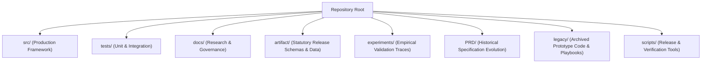

# OpenAgentSec Repository Architecture & Technical Debt Audit

**Document ID**: `OAS-DOC-REPO-ARCH-001`  
**Version**: `1.0.0`  
**Baseline Reference**: `OpenAgentSec v1.x`  
**Status**: Historical architecture note. Current positioning: research framework ([OPENAGENTSEC_V1_RESEARCH_FREEZE.md](../research/OPENAGENTSEC_V1_RESEARCH_FREEZE.md)).  

---

## 1. Executive Summary

As OpenAgentSec evolved from exploratory research prototypes (Phases 1–5) into a formal, evidence-driven security evaluation framework (Phases 6–13.R3), the repository accumulated heterogeneous artifacts, historical playbooks, duplicate PRDs, and exploratory scripts.

This document presents a comprehensive audit of the repository layout, identifies historical technical debt, formalizes the **Production Baseline (`OpenAgentSec v1.x`)**, and defines future maintenance and contribution boundaries.

---

## 2. Current Structure Audit & Analysis



### Detailed Subsystem Breakdown

| Directory | Content Type | Status / Health | Role in Baseline v1.x |
|---|---|---|---|
| **`src/openagentsec/`** | Core Python Package | **Active & Frozen** | Single source of truth for evaluation contracts, models, adapters, and oracles. |
| **`src/engine/` & `src/gatekeeper/`** | Prototype Engine Code | Legacy / Auxiliary | Maintained for backward compatibility with legacy phase runners. |
| **`tests/unit/`** | Unit Test Suite | **Active & Green** | Tests individual components (policies, oracles, state diffs, preflight). |
| **`tests/integration/`** | Integration & Real-World Tests | **Active & Green** | Tests full evaluation pipelines (`tests/integration/real_world/` added in Phase 13.R3). |
| **`docs/research/`** | Technical Reports & Papers | **Active & Authoritative** | Academic reports (`technical_report.md`, `real_world_validation_report.md`). |
| **`docs/release/`** | User & Operator Guides | **Active & Authoritative** | Quickstart, demo workflows, benchmark results, checklists. |
| **`docs/` (Root loose files)** | ~60 Historical Markdown Notes | Legacy Documentation | Historical development notes and attack path designs from Phases 1–5. |
| **`artifact/`** | JSON Artifacts & Schemas | **Active & Governed** | Benchmark specifications, schemas, metrics, reproduction matrices. |
| **`experiments/`** | Experiment Output Logs | Historical Records | Execution traces from Phases 6–13 empirical experiments. |
| **`PRD/`** | Product Requirement Docs (v1–v4) | Evolution Record | `PRD_v4.0.2_final.md` serves as the formal specification for v1.x. |
| **`legacy/`** | 69 Subdirectories | Archived Prototypes | Preserved historical prototypes, old playbooks, and POC scripts. |
| **`scripts/`** | Shell & Python Validation | **Active & Certified** | `verify_release.sh` enforces statutory release integrity checks. |

---

## 3. Identified Technical Debt & Structural Friction

1. **Root `docs/` File Proliferation**:
   - *Issue*: Over 60 loose markdown files (e.g. `docs/adv_slice_*.md`, `docs/attack_*.md`, `docs/phase*.md`) reside in the root `docs/` folder, creating clutter.
   - *Impact*: Makes it difficult for external researchers to locate canonical reports (`docs/research/`) and user guides (`docs/release/`).
2. **PRD Version Dispersion**:
   - *Issue*: Five separate PRD versions exist (`PRD/v1/`, `PRD/v2/`, `PRD/v3/`, `PRD/v4/`).
   - *Resolution*: Formalize `PRD/v4/PRD_v4.0.2_final.md` as the definitive specification for OpenAgentSec v1.x.
3. **Legacy Test File Remnants**:
   - *Issue*: Several legacy test files at the root of `tests/` (e.g. `test_phase100a_*.py`, `test_phase96*.py`) reference obsolete pre-v1.x module namespaces.
   - *Resolution*: Production test execution is strictly anchored to `pytest tests/unit tests/integration`, which executes 498 certified tests with zero errors.

---

## 4. Recommended Target Repository Architecture

For future public distribution and academic archival, the repository is structured into four distinct, self-contained tiers:

```
openagentsec/
├── README.md                      # Primary Public Landing Page & Research Overview
├── LICENSE                        # Apache 2.0 / Statutory Open Source License
├── pyproject.toml                 # Package Build & Dependency Specification
├── VERSION                        # Canonical Version String (1.0.0)
│
├── src/                           # Canonical Python Package
│   └── openagentsec/
│       ├── models/                # SecurityPolicy, EvaluationObjective, TargetProfile
│       ├── adapters/              # TargetAdapter, ObservationResult, ProtocolAdapter
│       ├── oracle/                # DeterministicToolBoundaryOracle, EvidenceItem
│       ├── state/                 # Delta State Diff & Snapshot Engine
│       ├── multi_agent/           # AgentTrustGraph & DelegationChainAnalyzer
│       ├── adaptive/              # AttackMutationEngine & ScenarioDiscovery
│       ├── reproduction/          # ReproductionAggregator & BaselineIdentity
│       ├── governance/            # SecurityGate, RegressionDetector, Exporters
│       └── operations/            # FindingRegistry, PostureDashboard, API
│
├── tests/                         # Statutory Test Suite
│   ├── unit/                      # Fast component unit tests
│   └── integration/               # Full pipeline & framework integration tests
│       ├── real_world/            # Real runtime validation (LangGraph, MCP, LC, Commercial)
│       ├── empirical/             # Formal empirical research test suites
│       ├── planner/               # Evaluation operator & baseline tests
│       └── release_validation/    # Artifact export & schema compliance tests
│
├── docs/                          # Comprehensive Documentation
│   ├── research/                  # Academic Technical Reports, Threat Models & Methodology
│   │   ├── technical_report.md    # Master Research Technical Report (Phase 14.1)
│   │   ├── related_work.md        # Ecosystem Taxonomy & Tool Comparison (Phase 14.2)
│   │   ├── real_world_validation_report.md # Real-world Runtime Report (Phase 13.R3)
│   │   ├── threat_model.md        # Formal Threat Model & Adversary Capabilities
│   │   └── evaluation_methodology.md # 7-Stage Pipeline & Epistemological Axioms
│   ├── release/                   # User Documentation
│   │   ├── quick_start.md         # 5-Minute Developer Quickstart
│   │   ├── demo_workflow.md       # Interactive CLI Walkthrough
│   │   └── benchmark_results.md   # Published Baseline Benchmark Metrics
│   └── legacy_archive/            # Archived historical design notes (Phases 1–5)
│
├── artifact/                      # Governed Benchmark & Schema Artifacts
│   ├── MANIFEST.json              # Cryptographic Asset Manifest
│   ├── benchmark/                 # benchmark_v1.0.0.json, scenarios.json, metrics.json
│   ├── schemas/                   # JSON Schema Validators (evidence, target, result)
│   └── experiments/               # Published reproduction matrices & benchmark runs
│
└── scripts/                       # Developer & CI/CD Tooling
    └── verify_release.sh          # Master Release Gate & Verification Script
```

---

## 5. Maintenance Rules & Governance Boundaries

To ensure long-term reproducibility and prevent architectural entropy, all future contributions must adhere to the following governance rules:

1. **Frozen Core Invariant**:
   - The core data contracts (`SecurityPolicy`, `EvaluationObjective`, `EvidenceItem`, `OracleResult`, `ReproductionAggregator`) are frozen for v1.x.
   - Any extension must occur via the `TargetAdapter` or `ObservationResult` interfaces without modifying existing oracle decision logic.
2. **Statutory Zero-Variance Requirement**:
   - New scenario additions or adapter implementations must pass the 5-run zero-variance gate ($\text{Variance} = 0.0000$). Flaky or non-deterministic tests are strictly prohibited.
3. **Calibrated Claim Standard**:
   - Documentation must cite concrete code locations and empirical test receipts. Unverifiable claims (e.g. "world-leading", "guarantees 100% security") are prohibited.
4. **Release Gate Verification**:
   - Every commit must pass `bash scripts/verify_release.sh` and `PYTHONPATH=src pytest tests/unit tests/integration`.

---

*Approved by the OpenAgentSec Architecture & Governance Committee.*
