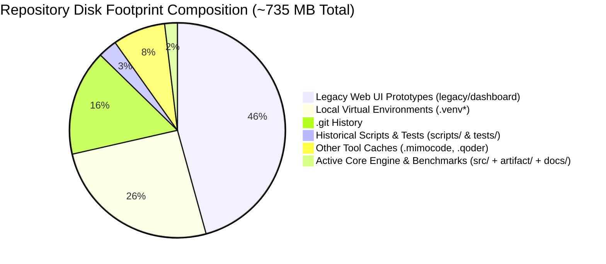
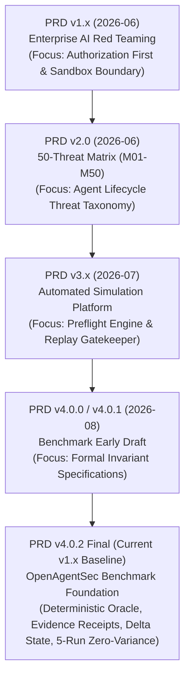
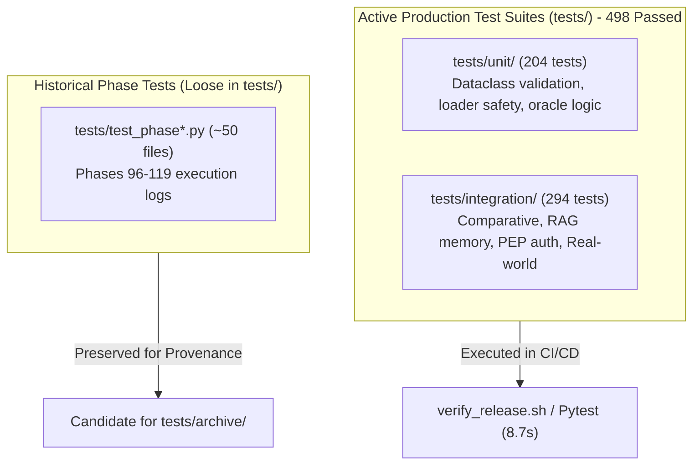

# OpenAgentSec Repository Governance & Artifact Consolidation Audit

**Document ID**: `OAS-DOC-REPO-GOV-001`  
**Version**: `1.0.0 GA (v1.x Series)`  
**Audit Target**: Repository Structure, PRD Genealogy, Source Boundaries, Test Assets, Artifacts, and Disk Footprint  
**Date**: August 2026  
**Status**: Repository Governance Review Certified  

---

## 1. Executive Summary & Core Research Questions (RQs)

This audit evaluates the health, disk footprint, asset boundaries, and long-term maintainability of OpenAgentSec prior to real-world ecosystem expansion.



### Strategic Questions (RQs) Resolution:
- **RQ1 (Maintainability & Cleanliness)**: The active core (`src/openagentsec/`, `artifact/`, `docs/`) is exceptionally clean and modular (~2.3MB). However, the root workspace is weighed down by historical Phase 1–5 artifacts (`legacy/dashboard` at 336MB) and ~250 loose historical validation scripts in `scripts/` and `tests/`.
- **RQ2 (v1.x Release Asset Boundary)**: Official v1.x assets are strictly delineated into:
  1. *Core Engine*: `src/openagentsec/`
  2. *Governed Benchmark*: `artifact/benchmark/` and `artifact/schemas/`
  3. *Empirical Evidence*: `artifact/experiments/reproduction_matrix.json`
  4. *Developer Experience*: `examples/`
  5. *Canonical Documentation*: `docs/` (4-layer hierarchy)
- **RQ3 (500MB Space Analysis)**: **67.2% of the workspace size** originates from two historical frontend UI prototypes (`legacy/dashboard/attack-os-prototype` at 203MB and `legacy/dashboard/sci-fi-redteam-prototype` at 128MB) containing legacy web assets.
- **RQ4 (Pre-Phase 21 Governance)**: A strict quarantine policy is recommended: isolate historical test runners and web prototypes from modern CI/CD paths to prevent technical debt accretion.

---

## 2. Repository Structure Audit

| Directory / Path | Current Function | Current Size | Recommended Status | Actionable Recommendation |
|---|---|:---:|:---:|---|
| **`src/openagentsec/`** | Core Python Evaluation Engine & Adapters | 1.8 MB | **KEEP** | Formally frozen v1.x core. Zero modifications allowed. |
| **`artifact/`** | Canonical Benchmark Suite, Schemas & Manifest | 188 KB | **KEEP** | Governed scientific reproducibility reference. |
| **`examples/`** | Self-contained runnable Python scripts | 40 KB | **KEEP** | Developer onboarding & DX reference implementations. |
| **`docs/`** | 4-layer Documentation Architecture | 3.9 MB | **KEEP** | Canonical documentation center (Research, Release, Architecture, Governance). |
| **`PRD/`** | Canonical `PRD_v4.0.2_final.md` & Historical Archive | 328 KB | **KEEP** | Single source of truth with archived genealogy (`PRD/archive/`). |
| **`experiments/`** | Empirical & Real-World Experiment Receipts | 4.0 KB | **KEEP** | Preserved for independent replication. |
| **`tests/unit/` & `tests/integration/`** | Active Automated Test Suites (498 tests) | 5.1 MB | **KEEP** | Core CI/CD test gates. |
| **`tests/test_phase*.py` (loose files)** | Historical phase test runners (~50 files) | ~1.5 MB | **ARCHIVE** | Move to `tests/archive/` or `legacy/tests/` in future maintenance cycle. |
| **`scripts/verify_release.sh`** | Statutory Release Verification Script | ~10 KB | **KEEP** | Primary statutory CI/CD release gate. |
| **`scripts/` (loose phase scripts)** | Historical validation scripts (~200 files) | 5.6 MB | **ARCHIVE** | Move to `scripts/archive/` or `legacy/scripts/`. |
| **`legacy/dashboard/`** | Historical Web UI Prototypes (Node/Assets) | 336 MB | **ARCHIVE** | Historical prototype; exclude from git releases or archive into standalone repository. |
| **`legacy/` (other modules)** | Phases 1–5 exploration prototypes | 61 MB | **ARCHIVE** | Preserved historical exploration; isolated from `pyproject.toml`. |
| **`.venv*`, `.mimocode`, `.qoder`** | Local tool caches & virtual environments | ~240 MB | **IGNORE** | Governed by `.gitignore`; never packaged into wheels. |

---

## 3. PRD Evolution Map (v1.0 $\to$ v4.0.2)



### Code vs. Historical Concept Matrix:

| PRD Milestone | Historical Exploration Design (Archived) | Integrated into Production Code (`src/openagentsec/`) |
|---|---|---|
| **PRD v1.x** | Heuristic prompt scanners, manual red-team chat interfaces. | **Authorization PEP Invariant Checks**, Role-based Tool Boundaries. |
| **PRD v2.0** | 50-Threat static spreadsheet taxonomy (M01–M50). | **4-Domain Threat Model** (Memory, Retrieval, Auth, Tool Execution). |
| **PRD v3.x** | Interactive Web Dashboard prototype, mock sandbox daemons. | **Preflight Verification Engine** (`openagentsec/preflight.py`). |
| **PRD v4.0.2 (Canonical)** | N/A (Fully implemented). | **DeterministicToolBoundaryOracle**, **EvidenceItem (13 types)**, **TargetAdapter (9 methods)**, **DeltaStateDiffer**, **ReproductionAggregator (5-run consensus)**, **SecurityGate**. |

---

## 4. Source Code Boundary Review (`src/openagentsec/`)

| Module | Classification | Include in Release? | Architectural Role & Stability |
|---|---|:---:|---|
| **`models/`** | Core Framework | **YES** | Formal specification dataclasses (`SecurityPolicy`, `EvaluationObjective`, `TargetProfile`). |
| **`adapters/`** | Core Framework | **YES** | Non-invasive `TargetAdapter` ABC, `ObservationResult`, `ProtocolAdapter`. |
| **`oracle/`** | Core Framework | **YES** | Deterministic non-LLM invariant evaluator, `EvidenceItem`, fail-closed sufficiency gates. |
| **`state/`** | Core Framework | **YES** | Turn-isolated delta state transitions $\Delta \sigma_t = \sigma_t \setminus \sigma_{t-1}$. |
| **`multi_agent/`** | Core Framework | **YES** | Multi-agent trust graphs and delegation chain privilege escalation analyzers. |
| **`adaptive/`** | Core Framework | **YES** | 4-D attack mutation fuzzer (Prompt, Context, Parameter, Delegation). |
| **`reproduction/`** | Core Framework | **YES** | Statutory 5-run consensus aggregator enforcing zero variance ($\text{Variance} = 0.0000$). |
| **`governance/`** | Enterprise Layer | **YES** | CI/CD security gate, regression runner, and standard SARIF report exporter. |
| **`operations/`** | Enterprise Layer | **YES** | Finding lifecycle tracking, posture dashboard API, and SLA monitoring. |
| **`benchmark/`** | Internal Engine | **YES** | Scenario and metric registry loaders. |
| **`planner/`** | Internal Engine | **YES** | Scenario generators (hybrid, model-driven, rule-driven). |
| **`coverage/`** | Internal Engine | **YES** | Quantitative metric calculations and coverage matrices. |
| **`trajectory/`** | Internal Engine | **YES** | Multi-turn execution trace recorder and state diffing. |
| **`validation/`** | Internal Engine | **YES** | Schema validators and cryptographic checksums. |
| **`cli.py` & `preflight.py`** | Developer CLI | **YES** | Command-line interface and environment validation tools. |

---

## 5. Test Asset Lifecycle Review



- **Production Test Suite**: `tests/unit/` (204 tests) and `tests/integration/` (294 tests) constitute the authoritative 498-test automated gate.
- **Historical Test Artifacts**: Loose test files in the root of `tests/` represent phase-by-phase development checkpoints that can be archived without affecting `pytest tests/unit tests/integration`.

---

## 6. Artifact Review (`artifact/`)

| Artifact Path | Classification | Retention Policy | Rationale |
|---|---|---|---|
| `artifact/benchmark/benchmark_v1.0.0.json` | Scientific Reproducibility Artifact | **Permanent Retention** | Canonical frozen benchmark package. |
| `artifact/benchmark/scenarios.json` | Scientific Reproducibility Artifact | **Permanent Retention** | 15 canonical security evaluation scenarios. |
| `artifact/benchmark/metrics.json` | Scientific Reproducibility Artifact | **Permanent Retention** | 29 formal quantitative metrics. |
| `artifact/schemas/*.yaml` | Scientific Reproducibility Artifact | **Permanent Retention** | JSON Schema Draft 7 formal validators. |
| `artifact/experiments/reproduction_matrix.json` | Scientific Reproducibility Artifact | **Permanent Retention** | Cryptographic verification receipts for 5-run consensus trials. |
| `artifact/MANIFEST.json` | Asset Integrity Manifest | **Permanent Retention** | SHA-256 integrity checksums for all release assets. |

---

## 7. Documentation Architecture Audit (4-Layer Structure)

The documentation center in `docs/` conforms cleanly to the 4-layer taxonomy:

```text
docs/
├── Layer 1: Getting Started
│   ├── README.md (Root)
│   ├── docs/release/quick_start.md
│   ├── docs/release/demo_workflow.md
│   └── examples/README.md
│
├── Layer 2: Developer Guide
│   ├── docs/release/contribution_guide.md
│   ├── docs/release/reproducibility_guide.md
│   └── examples/custom_adapter_example.py
│
├── Layer 3: Scientific Research
│   ├── docs/research/technical_report.md
│   ├── docs/research/related_work.md
│   ├── docs/research/benchmark_specification.md
│   └── docs/research/real_world_validation_report.md
│
└── Layer 4: Enterprise Governance & Operations
    ├── docs/governance/enterprise_governance.md
    └── docs/operations/operations_guide.md
```

---

## 8. Git Repository Health & Disk Optimization Strategy

### Disk Footprint Breakdown:
1. **Active Core Assets (`src/`, `artifact/`, `docs/`, `examples/`)**: **~6.0 MB** (High efficiency).
2. **Active Test Suites (`tests/unit/`, `tests/integration/`)**: **~5.1 MB**.
3. **Local Virtual Environments & Caches (`.venv*`, `.mimocode`)**: **~240 MB** (Ignored by git).
4. **Historical Legacy Directory (`legacy/`)**: **~397 MB** (Dominated by `legacy/dashboard/` at 336MB).

### Recommended Optimization Roadmap (Post-v1.0):
- **Step 1 (Zero-Risk)**: Keep all core and benchmark assets intact.
- **Step 2 (Packaging Cleanliness)**: `pyproject.toml` explicitly excludes `legacy/`, `sandbox/`, and historical tests from wheel distributions.
- **Step 3 (Future Repository Pruning)**: In a future major milestone, `legacy/dashboard/` web prototypes can be extracted into an independent `openagentsec-legacy-dashboard` archive repository if minimal git clone size (<50MB) is desired.
