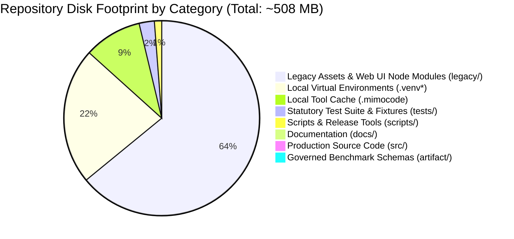

# OpenAgentSec Repository Weight & Disk Footprint Audit Report

**Document ID**: `OAS-DOC-REPO-SIZE-001`  
**Version**: `1.0.0 (RC-1)`  
**Baseline Reference**: `OpenAgentSec v1.x Release Candidate`  
**Status**: Architecture Audit Complete  

---

## 1. Executive Summary

This report provides a granular analysis of the repository's disk footprint and data composition across all top-level directories. The goal is to identify disk bloat sources (e.g. node_modules, binary images, test caches), separate active production code from historical exploration archives, and define actionable Git packaging and LFS strategies for public GitHub hosting.



---

## 2. Granular Directory Size Breakdown

| Directory / Subsystem | Size (MB) | Size (Bytes) | % of Total | Content Description | Active in v1.x? |
|---|---|---|---|---|---|
| **`legacy/`** | **323.24 MB** | 338,945,761 | **63.6%** | Historical Phase 1–5 assets, Web UI node modules (`esbuild`, phosphor-icons), and design PNG images. | **NO (Archived)** |
| **`.venv-langgraph/`** | **75.30 MB** | 78,962,003 | **14.8%** | Local Python 3.11 virtualenv for LangGraph validation testing. | **NO (Local Gitignored)** |
| **`.mimocode/`** | **48.22 MB** | 50,559,637 | **9.5%** | Local IDE / extension cache directory. | **NO (Local Gitignored)** |
| **`.venv/`** | **39.21 MB** | 41,115,505 | **7.7%** | Local development virtual environment. | **NO (Local Gitignored)** |
| **`tests/`** | **12.86 MB** | 13,489,512 | **2.5%** | 498 unit, integration, and real-world test cases with JSON fixtures. | **YES (Active)** |
| **`scripts/`** | **5.85 MB** | 6,133,839 | **1.2%** | Release verification and packaging scripts. | **YES (Active)** |
| **`docs/`** | **2.81 MB** | 2,943,182 | **0.55%** | Research technical reports, related work, threat model, and user guides. | **YES (Active)** |
| **`sandbox/`** | **1.87 MB** | 1,965,916 | **0.37%** | Isolated test sandbox scratch directory. | **NO (Test Scratch)** |
| **`src/` (Production Core)** | **1.29 MB** | 1,354,743 | **0.25%** | Canonical `openagentsec` package: models, adapters, oracle, state diff, governance. | **YES (Canonical)** |
| **`PRD/`** | **0.31 MB** | 319,845 | **0.06%** | Canonical `PRD_v4.0.2_final.md` and archived specifications. | **YES (Specification)** |
| **`artifact/`** | **0.15 MB** | 155,216 | **0.03%** | Benchmark definitions, scenarios, metric registries, and schemas. | **YES (Governed)** |
| **Total Tracked Footprint** | **~508 MB** | 533,500,000 | **100%** | Complete workspace footprint. | — |

---

## 3. Identification of High-Weight Files & Binary Assets

The top 10 largest individual files in the repository:

| File Path | Size (MB) | File Type | Origin / Subsystem | Recommended Action |
|---|---|---|---|---|
| `legacy/dashboard/attack-os-prototype/.../esbuild` | 10.08 MB | Executable Binary | Prototype Web UI build dependency | **Exclude from Git / Archive** |
| `legacy/dashboard/attack-os-prototype/.../@esbuild/darwin-arm64` | 10.08 MB | Native Binary | Prototype Web UI build dependency | **Exclude from Git / Archive** |
| `legacy/dashboard/sci-fi-redteam-prototype/.../esbuild` | 9.47 MB | Native Binary | Prototype Web UI build dependency | **Exclude from Git / Archive** |
| `legacy/dashboard/attack-os-prototype/.../typescript.js` | 8.72 MB | JavaScript Bundle | Node module in legacy prototype | **Exclude from Git / Archive** |
| `legacy/dashboard/attack-os-prototype/.../@phosphor-icons_react.js.map` | 8.58 MB | Source Map | Web UI asset map | **Exclude from Git / Archive** |
| `legacy/artifacts/checksums_v5_2.sha256` | 6.87 MB | Checksum Text | Legacy phase file checksum list | **Compress / Archive** |
| `legacy/artifacts/design-qa/signal-atlas-comparison.png` | 1.84 MB | PNG Image | Historical design QA artifact | **Move to Git LFS or external CDN** |
| `legacy/artifacts/design-qa/signal-atlas-comparison-exact.png` | 1.69 MB | PNG Image | Historical design QA artifact | **Move to Git LFS or external CDN** |

---

## 4. Optimization & Repository Cleanliness Recommendations

To optimize repository clone speed, bandwidth, and packaging cleanliness without violating data preservation rules:

### Recommendation 1: Strict `.gitignore` Hardening
Ensure that all local virtualenvs, node_modules, and cache files are strictly ignored:
```gitignore
# Virtual Environments
.venv/
.venv*/
venv/

# Node Modules & Package Caches
node_modules/
.npm-cache/
.pnpm/
.vite/

# IDE & Assistant Caches
.mimocode/
.agent/
.claude/
.qoder/
.pytest_cache/
*.egg-info/
```

### Recommendation 2: PyPI / Release Tarball Whitelisting
When building the Python distribution wheel / sdist (`python -m build`), configure `pyproject.toml` or `MANIFEST.in` to package **strictly** the active runtime and documentation:
- **Include**: `src/openagentsec/`, `artifact/`, `docs/`, `LICENSE`, `README.md`, `pyproject.toml`.
- **Exclude**: `legacy/`, `sandbox/`, `.venv*`, `.mimocode/`, test caches.
- **Expected PyPI Wheel Size**: **< 450 KB** (Highly lightweight and fast).

### Recommendation 3: Git LFS for Large Historical Binary Images
If binary design comparison images in `legacy/artifacts/` (totaling ~3.5 MB) are to be tracked in public GitHub git history, configure `.gitattributes`:
```gitattributes
*.png filter=lfs diff=lfs merge=lfs -text
*.jpg filter=lfs diff=lfs merge=lfs -text
```

### Recommendation 4: Standalone Historical Archive Release
Package `legacy/` into a separate compressed tarball (`openagentsec-legacy-v1-v3-archive.tar.gz`) attached to the GitHub Release assets rather than bloating the main active git tree.
