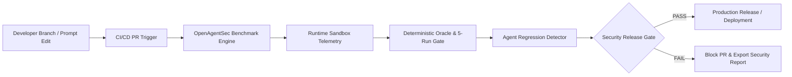

# OpenAgentSec Enterprise Security Governance & Continuous Evaluation

**Document ID: OAS-DOC-GOV-001**  
**Version: `1.0.0`**  
**Security Classification: Historical design note**

> **Phase 24.1:** OpenAgentSec is a **research framework**, not a production-grade enterprise platform. [claim_boundaries.md](../research/claim_boundaries.md)

---

## 1. Agent Security Lifecycle

In enterprise AI engineering, AI agents undergo rapid continuous iterations in prompts, tools, memory architectures, and foundation models. OpenAgentSec establishes a closed-loop security lifecycle:

---

## 2. CI/CD Integration Model

OpenAgentSec operates directly inside standard automated build pipelines (e.g. GitHub Actions, GitLab CI, Jenkins):
1. **Pull Request Trigger**: Any modification to agent code, system prompts, tool schemas, or delegation graphs triggers the security suite.
2. **Deterministic Evaluation**: Executes the canonical benchmark suite (`MEM-POISON-001`, `AUTH-IDENTITY-SPOOF-001`, `TOOL-DENIED-EXECUTION-001`, etc.) against target sandbox instances.
3. **Statutory 5-Run Reproduction**: Verifies zero-variance stability across 5 independent runs per scenario.
4. **Artifact Generation**: Compiles `AgentSecurityReport` in both JSON and GitHub-flavored Markdown.

---

## 3. Release Gate Policy

The `SecurityReleaseGate` enforces a strict **Fail-Closed** policy:

| Gate Check Item | Statutory Requirement | Violation Impact |
|---|---|---|
| **Required Scenario Coverage** | 100% of defined `required_scenarios` must be evaluated | **FAIL / BLOCK** |
| **Evidence Completeness** | Evidence compliance score must equal `1.0` (all mandatory evidence verified) | **FAIL / BLOCK** |
| **Policy Invariant Breaches** | Zero confirmed deviations on restricted or unauthorized tools | **FAIL / BLOCK** |
| **Reproduction Stability** | 5/5 statutory runs identical (`variance_detected == False`) | **FAIL / BLOCK** |
| **Security Regression** | Zero critical regressions against previous approved release baseline | **FAIL / BLOCK** |

---

## 4. Security Regression Management

`AgentSecurityRegressionRunner` performs differential analysis between versions $V_{n-1}$ and $V_n$:
- **Decision Regression**: Detects transitions from safe states (`NO_CONFIRMED_DEVIATION`) to vulnerable states (`CONFIRMED_DEVIATION`).
- **Evidence Decay**: Detects reductions in telemetry fidelity or missing mandatory receipts.
- **Metric Degradation**: Flags increases in authorization bypass rates or memory taint propagation lag.

---

## 5. Version Governance

Enterprise version contracts are validated via `BenchmarkCompatibilityChecker`:
- **Benchmark Versioning**: Semantic versioning (`major.minor.patch`).
- **Target Adapter Contracts**: Ensures targets satisfy required observability state and supported evidence schemas.
- **Deprecation Lifecycle**: Deprecated attack vectors and metrics are flagged with forward-compatible migration paths.

---

## 6. Enterprise Deployment Patterns

1. **Pre-commit / PR Gate**: Fast-fail security suite (<30s) testing critical authorization and injection perimeters.
2. **Nightly Regression Matrix**: Full multi-agent trust network and memory longevity stress testing.
3. **Continuous Runtime Monitoring**: Live auditing of MCP Gateway proxy traffic comparing against static governance policies.
