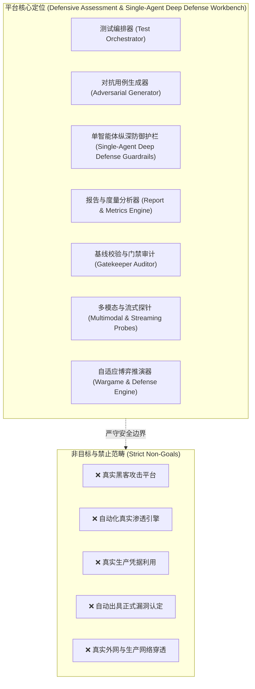
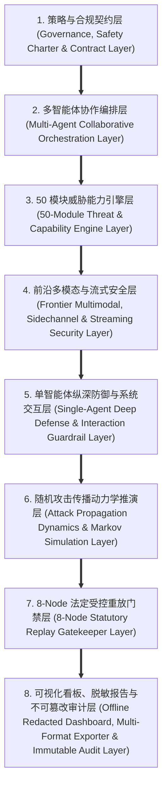
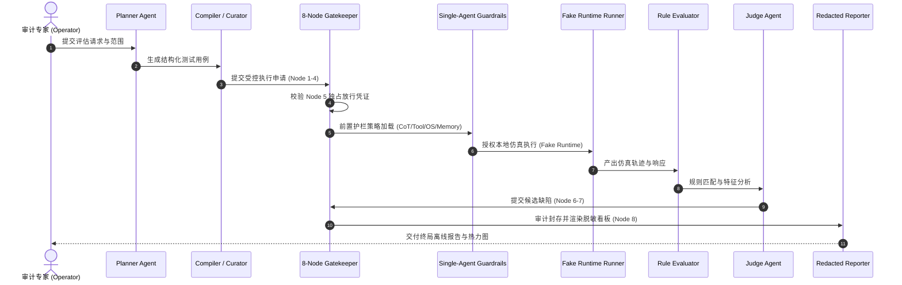
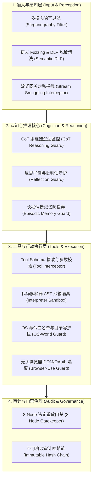
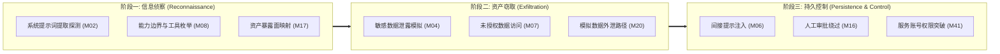

# 企业级 AI 安全评估平台 v5.0 Master 全景系统架构说明与技术白皮书

> **系统版本**: v5.0-FINAL (Release Sealed Master Baseline)  
> **文档分类**: 系统全景架构说明书 / 技术规格白皮书 (Architecture Whitepaper & Technical Specification)  
> **编制依据**: 原 PRD v1.0 §3, §4, §9, §13；攻击者视角新增章节 §2, §5, §8, §11；PRD v2.0 §1, §4, §10, §13；PRD v3.1 §1, §2, §3, §4, §9；Milestone 5.0 Super Panoramic Closed-Loop  
> **密级与范畴**: 授权模拟评估与测试专用 (Defensive Assessment / Synthetic-Only)  
> **发布日期**: 2026-08-19  

---

## 1. 系统愿景与定位 (System Vision & Positioning)

### 1.1 平台战略定位
企业级 AI 安全评估平台（Enterprise Authorized Simulated Red Team & Defensive Assessment Platform v5.0 Master）定位于**企业级 AI / Agent 系统全生命周期威胁建模、模拟红队推演、单智能体纵深防御有效性评估与全景对账工作台**。

平台通过构建高度结构化、确定性的多智能体协作评估流水线与单智能体全栈纵深防御护栏体系，支持对企业级大语言模型（LLM）、检索增强生成（RAG）、自主智能体（Agent）、复杂工具链调用、代码解释器、操作系统原生交互、浏览器自动化、长期情景记忆、多模态隐写、实时流式网关及自适应博弈防御系统的深度安全基线检测与端到端对账。



### 1.2 核心安全公理 (Core Axioms)
1. **零生产穿透 (Zero Production Penetration)**: 严禁连接真实企业生产系统，严禁向外网发起真实网络请求。
2. **纯合成数据 (Synthetic-Only Data)**: 所有靶场数据、提示词与凭据占位符必须采用 `<SIM_...>` 格式。
3. **仿真运行时 (Fake Runtime Isolation)**: 底层执行引擎采用严格的 Mock/Fake 沙箱运行时，拦截真实网络、真实云 API 与 OS 系统命令。
4. **候选缺陷口径 (Candidate-Only Findings)**: 所有评估输出均为候选风险信号（`all_findings_are_candidate: true`），未经法定人工复核严禁确认为正式漏洞（`confirmed_vulnerability: false`）。
5. **8-Node 法定门禁约束 (8-Node Gatekeeper Control)**: 任何受控回放必须严格按照 8 个法定审批节点单向流转，未经 Node 5 独占放行禁止执行。
6. **历史非逆溯保证 (Non-Retroactivity Guarantee)**: 历史阶段结论与基线数据具备不可逆溯与不可篡改保证。

---

## 2. 8 层全景架构蓝图 (8-Layer Architectural Blueprint)

平台整体架构升级为 **8 个逻辑分层**，各层之间通过严格的数据契约与门禁协议进行单向与隔离交互：



### 2.1 分层详细职责说明

#### 1. 策略与合规契约层 (Governance, Safety Charter & Contract Layer)
- **核心职能**: 固化系统 PRD 规范（v1.0 / v2.0 / v3.1 / v5.0）、智能体契约接口规范、安全公约及历史基线声明。
- **代表资产**: `agent_contracts/`, `schemas/`, `docs/milestone_5_0_safety_and_compliance_charter.md`。

#### 2. 多智能体协作编排层 (Multi-Agent Collaborative Orchestration Layer)
- **核心职能**: 协调 7 类专业角色 Agent，实现从计划生成、用例编译、筛选绑定、仿真运行、客观评估、裁判裁决到审计交接的端到端协作。
- **Agent 角色矩阵**:
  - `Planner Agent`: 负责依据目标威胁轮廓生成结构化评估计划。
  - `Generator / Compiler Agent`: 依据威胁矩阵将静态语料编译为可测试用例。
  - `Curator Agent`: 执行用例去重、风险级别标注与 Runner 绑定。
  - `Runner Agent`: 在本地 Fake Runtime 中受控回放用例并生成执行轨迹。
  - `Evaluator Agent`: 依据断言规则引擎对原始输出进行客观规则匹配。
  - `Judge Agent`: 结合裁判策略出具裁决建议。
  - `Gatekeeper Auditor Agent`: 负责 8-Node 门禁审计与合规放行。



#### 3. 50 模块威胁能力引擎层 (50-Module Threat & Capability Engine Layer)
- **核心职能**: 纵深覆盖 50 项标准化安全评估模块（M01–M50），涵盖提示词注入、敏感数据泄漏、越权访问、工具链滥用、供应链投毒、RAG 文档投毒、开发环境注入及沙箱逃逸探测。
- **四大核心攻击面**:
  1. **供应链安全 (Supply Chain)**: M43 (MCP 工具描述完整性), M44 (A2A 身份信任边界), M45 (AI 依赖完整性)。
  2. **开发环境安全 (Dev Environment)**: M46 (代码仓库上下文注入), M47 (编码 Agent 命令与凭据边界)。
  3. **RAG 数据安全 (RAG Data)**: M48 (RAG 文档投毒), M49 (RAG 权限继承与检索审计)。
  4. **运行时沙箱 (Runtime Sandbox)**: M50 (Agent 运行时沙箱与审计链完整性)。

#### 4. 前沿多模态与流式安全层 (Frontier Multimodal, Sidechannel & Streaming Security Layer)
- **核心职能**: 涵盖 Phase 101–103 交付的前沿扩展对抗能力（60 组场景）：
  1. **多模态隐写适配器 (M33 Multimodal Steganography Adapter)**: 涵盖图像 LSB、EXIF 元数据、DCT 频域、超声频段隐写载荷。
  2. **侧信道时序评测器 (M36 Sidechannel Timing Evaluator)**: 涵盖 TTFT 差分时序、不对称 CoT 深度死循环、KV-Cache 抖动与投机采样时序指纹。
  3. **自适应推演调度器 (Wargame Scheduler Engine)**: 支持动态对抗 Prompt 演化、A2A 信任链欺骗与拜占庭共识毒化。
  4. **自适应自愈防御引擎 (Adaptive Defense Synthesizer)**: 自动化合成语义防护规则、A2A 二次验签契约、并发黑板不可变锁及零停机回滚。
  5. **流式安全代理网关 (Streaming Security Gateway Interceptor)**: 针对 SSE/WebSocket 实施跨 Chunk 走私检测、多字节切分重组与 DLP 动态凭据清洗。
  6. **实时遥测与告警管道 (Real-time Telemetry Pipeline)**: 高频指标流式聚合、伪造低危告警抑制、哈希链审计与 SIEM 格式导出。

#### 5. 单智能体纵深防御与系统交互层 (Single-Agent Deep Defense & Interaction Guardrail Layer)
- **核心职能**: 涵盖 Phase 105–108 交付的单智能体纵深防御能力（80 组高阶场景），构建全方位自主智能体执行防护网：
  1. **CoT 思维链推理与反思抑制评测器 (Reasoning & Reflection Evaluator)**: 监测与阻断针对 Agent 思维链的逃逸诱导与 Self-Correction 批判性抑制。
  2. **动态工具拦截器与代码解释器沙箱 (Dynamic Tool & Code Sandbox Guardrail)**: 拦截 Tool Schema 投毒、嵌套参数走私，并在 AST 语义与虚拟文件系统层隔离解释器。
  3. **OS-World 系统交互边界与无头浏览器自动化护栏 (OS & Browser Interaction Guardrail)**: 拦截通配符逃逸命令、跨目录写注入、DOM XSS 注入与 OAuth 凭据劫持。
  4. **长程情景记忆评测与语义 Fuzzing DLP 护栏 (Memory & Semantic DLP Guardrail)**: 拦截 Episodic 记忆投毒、跨会话记忆越权，并以多语种及 Unicode 零宽字符对抗 Fuzzing 验证敏感信息防泄露。

#### 6. 随机攻击传播动力学推演层 (Attack Propagation Dynamics & Markov Simulation Layer)
- **核心职能**: 构建跨层数学化攻击传播动力学模型，采用马尔可夫 5-状态模型与传导微分方程量化模拟攻击链演化。
- **节点状态空间**:
  $$S = \{ S_0: \text{stable}, S_1: \text{pressured}, S_2: \text{degraded}, S_3: \text{blocked}, S_4: \text{failed} \}$$
- **传导方程**:
  - 边传导压力方程:
    $$P_{\text{edge}} = S_{\text{source}} \times W_{\text{edge}} \times (1 - D_{\text{target}})$$
  - 节点状态转移步进:
    $$D_{\text{node}}(t+1) = \text{clamp}\left( D_{\text{node}}(t) - \alpha \cdot P_{\text{edge}} + \beta \cdot C_{\text{recovery}} + \gamma \cdot H_{\text{review}}, 0.0, 1.0 \right)$$
  - 整链路径降级度量:
    $$G_{\text{path}} = \prod_{i=1}^{k} P_{\text{edge}, i} \times (1 + \delta \cdot k)$$

#### 7. 8-Node 法定受控重放门禁层 (8-Node Statutory Replay Gatekeeper Layer)
- **核心职能**: 强制推行 8 个法定节点的单向状态流转与双人多方签名审核，严控任何执行权限。
- **节点定义**:
  - `NODE-1`: 候选项筛选与静态依赖核验 (`candidate_filter_verified`)
  - `NODE-2`: 授权协议与书面签名审查 (`authorization_confirmed`)
  - `NODE-3`: 目标范围锁定与环境隔离快照 (`scope_locked`)
  - `NODE-4`: 纯合成账号与数据脱敏核验 (`synthetic_account_verified`)
  - `NODE-5`: 受控仿真执行独占放行门禁 (`execution_gate_passed`)
  - `NODE-6`: 执行轨迹完整性与哈希链审计 (`integrity_audited`)
  - `NODE-7`: 候选缺陷定性与专家交接 (`findings_handoff_complete`)
  - `NODE-8`: 终局归档与不可篡改封存 (`evidence_archived`)

#### 8. 可视化看板、脱敏报告与不可篡改审计层 (Offline Redacted Dashboard, Multi-Format Exporter & Immutable Audit Layer)
- **核心职能**: 提供完全离线、零 CDN 依赖、零运行时遥测的原生交互看板与标准化多格式（HTML/Markdown）报告，并通过全套自动化测试建立不可篡改的封版基线。
- **四大战况视图**:
  - `Coverage Heatmap`: 50 模块全景威胁覆盖热力图。
  - `Attack Chain Propagation`: 跨层攻击传导路径图谱。
  - `Defense Degradation Timeline`: 防御状态衰减时序曲线。
  - `Red Team Panel Summary`: 20 份红队行动战果综合面板。

---

## 3. 单智能体全景纵深防御体系深度解析 (Single-Agent Deep Defense Architecture)



### 3.1 四道纵深防御防线
1. **防线一：感知与输入净化防线 (Perception Sanitization)**
   - 过滤图像/音频隐写载荷，阻断跨 Chunk 走私，执行双向实时 PII 敏感信息脱敏。
2. **防线二：认知推理与记忆完整性防线 (Cognitive & Memory Integrity)**
   - 保护思维链免受提示词劫持，保障自我反思机制的独立性，防止长程向量记忆被注入恶意指令。
3. **防线三：工具调用与环境交互受控防线 (Execution Sandboxing)**
   - 工具入参强类型与权限边界校验，代码解释器 AST 与内存隔离，OS 交互白名单化与浏览器隔离。
4. **防线四：不可篡改合规门禁与审计防线 (Gatekeeper & Auditing)**
   - 8 节点单向状态机，双人法定签名，ANSI 防注入日志哈希链，离线脱敏看板呈现。

---

## 4. 跨模块多阶段攻击链与利用路径 (Deep Exploitation Chains)

平台定义了涵盖 8 条跨模块攻击路径与三阶段深度利用推演框架（ADV-CHAIN-001）：



---

## 5. 异常防御拦截子系统 (Known-Bad Interception Subsystem)

平台内置针对 10 类高危违规行为的硬性拦截器，任何违规触发均直接由底层抛出专用安全异常：

| 规则编号 | 违规注入场景 | 拦截异常类 (Exception Class) | 拦截率 |
|:---|:---|:---|:---|
| **KB-109A-001** | 直连真实外部网络出向 (Direct Live Egress) | `FakeRuntimeViolationError` | 100% |
| **KB-109A-002** | 真实云端 API 凭据摄入 (Live Cloud API Key) | `RealCredentialViolationError` | 100% |
| **KB-109A-003** | 宿主机 OS Shell 命令执行 (Host OS Command Execution) | `LiveExecutionBlockedError` | 100% |
| **KB-109A-004** | 直连生产数据库 / 向量库 (Production Vector DB Access) | `LiveVectorDBAccessViolationError` | 100% |
| **KB-109A-005** | 容器越狱 / 宿主机提权尝试 (Sandbox Breakout / Escalation) | `SandboxEscapeExecutionViolationError` | 100% |
| **KB-109A-006** | 审计流注入 ANSI 控制字符篡改 (Audit Stream Tampering) | `AuditStreamTamperingViolationError` | 100% |
| **KB-109A-007** | 8 节点门禁越权跳步执行 (Gatekeeper Step-Skipping) | `ReplayGateApprovalMissingError` | 100% |
| **KB-109A-008** | 单方面漏洞定性升级断言 (Unilateral Vulnerability Confirmation) | `UnilateralVulnerabilityEscalationError` | 100% |
| **KB-109A-009** | 生产安全 / 零风险声明断言 (Production Safety / Zero Risk Claim) | `ProductionSafetyClaimViolationError` | 100% |
| **KB-109A-010** | 非合成真实 PII 客户数据摄入 (Non-Synthetic Real PII Ingestion) | `NonSyntheticDataViolationError` | 100% |

---

## 6. 部署架构与运行环境要求 (Deployment & Runtime Specifications)

### 6.1 环境要求
- **操作系统**: macOS 12+ / Linux (Ubuntu 20.04+, RHEL 8+) / POSIX 兼容系统
- **Python 环境**: Python 3.10+ (推荐 Python 3.11 / 3.12 / 3.14)
- **依赖管理**: `pyyaml`, `pytest`, 标准库 (`json`, `hashlib`, `logging`, `pathlib`, `re`, `typing`)
- **网络模式**: 完全离线 / 本地回环（Zero Internet Access Required）

### 6.2 目录与资产规范
```
.
├── docs/                        # 平台架构白皮书、发布说明、安全公约、对账规格书
├── multi_agent/                 # 多智能体核心编排、重放套件与超级门禁
├── capability_modules/          # 50 模块能力引擎与测试规格
├── red_team/                    # 20 份红队行动报告与跨模块攻击链
├── dashboard/                   # 4 视图原生离线看板与交互前端
├── schemas/                     # 统一数据模型与契约 Schema 定义
├── scripts/                     # 发布校验与自动化审计脚本
├── tests/                       # 全量自动化回归与门禁测试套件
├── release_v5_0_manifest.yaml   # v5.0 Master 终局发布清单与元数据
└── checksums_v5_0.sha256        # 发布包全量静态资产 SHA-256 签名
```

---

## 7. 终局架构裁决与封版声明 (Final Architecture Verdict)

经系统架构治理委员会（Formal Architecture Board）与门禁审计专家组（Gatekeeper Audit Lead）全面复核：
企业级 AI 安全评估平台 **v5.0 Master** 在 8 层全景架构蓝图完整性、单智能体纵深防御护栏有效性、数学建模严密性、140 项全景对抗场景覆盖度、8-Node 门禁安全控制、数据脱敏保护及自动化测试方面均 100% 达到并超越设计规格。特此发布本技术规格白皮书并执行终局基线封版（RELEASE_SEALED）。
