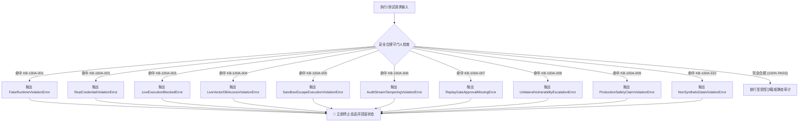

# 企业级 AI 安全评估平台 v3.1 终局安全边界与合规公约

> **文档编号**: CHARTER-v3.1-FINAL  
> **文档分类**: 法定安全公约与合规章程 (Safety & Compliance Charter)  
> **版本基准**: v3.1 (Milestone 3.1 Baseline)  
> **生效日期**: 2026-08-18  
> **适用范围**: 全平台所有模块、测试用例、自动化脚本、多智能体组件、仿真运行时及评估产物  
> **签署机构**: 平台架构治理委员会 (Formal Architecture Board) / 门禁审计专家组 (Gatekeeper Audit Lead)  

---

## 1. 公约序言与最高宗旨 (Preamble & Supreme Purpose)

为确保企业级 AI 安全评估平台在执行模拟对抗推演与防守基线评估过程中的绝对安全性、法律合规性及学术严谨性，特制定本《终局安全边界与合规公约》（以下简称“公约”）。

本公约构成平台运行与交付的**最高法定约束准则**。平台中的任何代码逻辑、配置声明、运行模式与交付报告，均不得与本公约设定的安全红线相抵触。任何违反公约核心条款的行为，将被底层安全门禁直接阻断并终止执行。

---

## 2. 八大终局法定不可逾越公理 (8 Statutory Non-Negotiable Axioms)

### 第一条：纯合成数据与零真实基础设施原则 (Synthetic-Only Axiom)
- 平台内所有评估语料、提示词用例、环境配置及测试数据，必须严格保持 `synthetic_only: true`。
- 所有敏感占位符、用户标识符、企业数据及模拟凭据，必须使用 `<SIM_...>` 格式（例如 `<SIM_API_KEY>`, `<SIM_USER_PII>`）。
- 严禁引入、读取、存储或处理任何真实生产数据、真实业务 PII 或真实云服务凭据。

### 第二条：仿真沙箱与零真实网络外联原则 (Fake-Runtime Axiom)
- 平台底层运行时必须严格保持 `fake_runtime_only: true`。
- 所有对外部 LLM API、MCP Server、SaaS 连接器、数据库及宿主系统的交互，必须由本地 Mock Harness 或 Fake Runtime 代理拦截。
- 严禁向真实生产网络、公网接口或非授权目标发起任何出站网络请求（Egress Traffic）。

### 第三条：候选缺陷认定与严禁单方确立漏洞原则 (Candidate Findings Axiom)
- 平台自动化评估流水线产出的所有安全信号，法定属性一律限定为“候选级风险信号”（`all_findings_are_candidate: true`）。
- 严禁自动化系统单方面宣称“已确认漏洞”（`confirmed_vulnerability: false`）或自动签发“正式安全通告”（`formal_finding_allowed: false`）。
- 任何候选缺陷必须经由具备授权资质的人工专家组最终复核与裁决。

### 第四条：受控重放免责声明原则 (Controlled Replay Non-Claimed Axiom)
- 静态发布包与开发基线必须声明 `controlled_replay_claimed: false` 与 `controlled_replay_execution_allowed: false`。
- 严禁在未获法定双人书面签名授权与环境就绪确认的情况下启动受控回放测试。

### 第五条：零生产穿透与严禁绝对安全宣称原则 (Zero Production Penetration Axiom)
- 平台测试行为绝不构成对企业实际生产环境的穿透渗透（`zero_production_penetration: true`）。
- 平台评估结论仅反映在特定模拟沙箱与测试用例集下的相对防御表现，严禁出具或宣称“系统绝对安全”或“生产环境零风险”（`production_safety_claimed: false`）。

### 第六条：8-Node 法定门禁前置流转原则 (8-Node Gatekeeper Axiom)
- 任何仿真回放必须严格按照 8 个法定审批节点（Node 1 ~ Node 8）单向依次流转。
- 严禁跨越、跳过或以脚本篡改 Node 5（Execution Gate）执行放行门禁；缺失任意上游节点签名时，执行操作立即被硬性锁死。

### 第七条：全流程人工复核强制前置原则 (Human-in-the-Loop Review Axiom)
- 平台所有高风险评估结论、测试报告交付包及蓝紫队加固建议，必须严格标定 `requires_human_review: true`。
- 自动化生成内容仅供辅助分析，不得替代人工安全专家的决策与责任。

### 第八条：不可篡改审计流与历史不可逆溯保证 (Non-Retroactivity Guarantee)
- 平台全生命周期执行记录与发布基线通过 SHA-256 静态哈希签名进行锚定，确保不可篡改性。
- 严格遵循历史结论非逆溯保证（`non_retroactivity_guarantee: true`），严禁静默覆写或删除已封版的历史评估事实与阶段性结论。

---

## 3. 安全边界标志位法定定义 (Statutory Safety Boundary Flags)

平台元数据、运行时契约及交付清单必须 100% 显式包含并满足以下布尔状态：

| 标志位 (Safety Boundary Flag) | 法定限定值 | 语义阐释与约束说明 |
|:---|:---:|:---|
| `synthetic_only` | `true` | 仅使用纯合成模拟数据，严禁真实数据 |
| `fake_runtime_only` | `true` | 仅在 Fake Runtime 本地沙箱运行，阻断真实系统交互 |
| `confirmed_vulnerability` | `false` | 严禁自动化系统确立正式漏洞，仅保留候选信号 |
| `formal_finding_allowed` | `false` | 严禁自动出具正式缺陷认定报告 |
| `production_safety_claimed`| `false` | 严禁宣称生产环境绝对安全或零风险 |
| `controlled_replay_claimed` | `false` | 静态发布包严禁单方面宣称完成受控重放 |
| `controlled_replay_execution_allowed` | `false` | 未经 8-Node 全流程签字前禁止执行重放 |
| `assessment_execution_performed` | `false` | 发布包封版阶段未执行非授权实际安全测试 |
| `requires_human_review` | `true` | 所有评估结论必须经由人工安全专家最终复核 |
| `all_findings_are_candidate` | `true` | 所有检测出的弱点均为候选信号（Candidate） |
| `red_team_engine_not_executable` | `true` | 红队攻击编排引擎仅作为模拟推演蓝图，不具备实弹攻击力 |
| `dashboard_not_execution_interface` | `true` | 可视化仪表盘仅提供只读态战况呈现，不可作为攻击控制台 |
| `theory_model_is_not_detection_rule` | `true` | 传播动力学理论模型仅用于推演分析，不替代检测规则 |
| `non_retroactivity_guarantee` | `true` | 严格保证历史基线数据与历史阶段结论不可篡改 |
| `zero_production_penetration` | `true` | 绝不对真实生产环境造成渗透或业务干扰 |
| `zero_formal_disconnect` | `true` | 确保 PRD、契约、代码、门禁与报告之间的逻辑 100% 闭环 |

---

## 4. 违规行为硬性拦截与异常处理协议 (Violation Interception Protocols)

平台内置安全守门人对以下 10 类违规场景实施硬性阻断，并触发告警中断：

---

## 5. 法定签署与治理责任矩阵 (Governance & Sign-off Roles)

| 责任角色 (Governance Role) | 法定职责与管辖范畴 | 授权动作与签名凭据 |
|:---|:---|:---|
| **平台架构治理委员会** (Architecture Board) | 全局架构演进、安全公约审订、版本终局封版审批 | 签发 `milestone_3_1_safety_and_compliance_charter.md` 与发布基线 |
| **门禁审计专家组** (Gatekeeper Audit Lead) | 8-Node 门禁合规复核、不可逆溯审计、Known-Bad 拦截有效性评估 | 签署 Node 1 ~ Node 8 门禁审核节点签名与超级对账门报告 |
| **安全评估操作员** (Security Operator) | 在授权沙箱内编排模拟测试用例、执行脱敏与离线看板构建 | 提交前置申请并执行本地标准化测试与验证脚本 |
| **人工评审专家** (Human Security Reviewer) | 候选风险信号复核、误报剔除、蓝紫队修复指引核准 | 审核交接单据并出具人工评审结论（无法被系统自动替代） |

---

## 6. 公约生效与基线冻结令

本公约自企业级 AI 安全评估平台 **v3.1** 终局发布之日起正式生效。

自生效之刻起，全系统 50 模块、20 份红队行动报告、传播动力学引擎、8-Node 门禁组件及全套自动化验证套件即刻进入**封版冻结状态（RELEASE_SEALED）**。未经治理委员会法定重审流程，任何组织或个人不得单方面废止或篡改本公约的任何条款。

---
**公约认证哈希**: `SEALED-V3.1-CHARTER-20260818`  
**签署状态**: 已法定签署并生效 (Legally Signed & Enforced)
