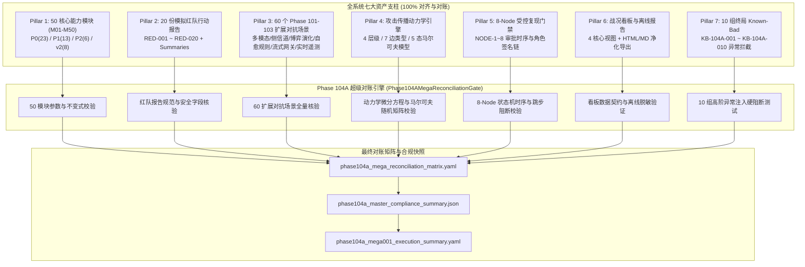

# Phase 104A 全系统 Milestone 4.0 超级全景端到端大闭环对账门工程说明

**文档编号**: DOC-GATE-104A-MEGA-001  
**任务编号**: Phase-104A-MEGA-001  
**任务名称**: 全系统 Milestone 4.0 超级全景端到端大闭环对账门开发  
**任务类型**: design_gate  
**评估模式**: not_applicable  
**版本**: Milestone 4.0 / v3.1-master  
**日期**: 2026-08-19  

---

## 1. 任务背景与 PRD 依据

### 1.1 PRD 关联条款
- **原 PRD v1.0**:
  - §4 评估沙箱隔离与测试运行环境
  - §5 评估流水线与执行引擎
  - §6 评估指标与能力量化要求
  - §9 报告导出与离线分发
  - §10 安全边界与非执行承诺
  - §13 异常阻断与回滚规范
  - §15 对抗评估框架与基线管理
- **攻击者视角新增章节**:
  - §2 供应链渗透与 MCP 协议多层利用建模
  - §3 侧信道时序探测与高阶资源消耗对抗
  - §4 复杂攻击面与多阶段跨边界攻击链（Multi-Stage Attack Chain）
  - §5 流式代理安全网关与实时拦截机制
  - §6 攻击传播动力学与动态阻尼模型
  - §7 突破信号与指标量化映射的严格正交性
  - §11 受控复现审批与防越权防生产穿透体系
- **PRD v2.0**:
  - §1 总体架构与能力蓝图
  - §4 威胁建模与沙箱隔离规范
  - §5 实时遥测管道与安全事件流
  - §6-§9 模块能力资产库与评估规范
  - §10 动态回放与状态机回滚机制
  - §13 形式化缺口（GAP）闭环与全量对账
- **PRD v3.1**:
  - §1 系统终局全量资产体系与验收基准
  - §2.1-§2.8 50 模块能力域与端到端协同
  - §3 不可篡改审计日志与签名链
  - §4 非回溯性（Non-Retroactivity）保障
  - §9 Milestone 4.0 全景端到端超级总对账门禁规范

---

## 2. 超级对账门核心架构与大闭环协同机制

Phase 104A 超级大闭环对账门（`Phase104AMegaReconciliationGate`）通过七大核心支柱（Pillars），构建了全系统资产的数学一致性、状态机连通性与代码级硬隔离防御网：



---

## 3. 七大超级对账支柱实现细节

### 3.1 支柱 1：全系统 50 能力模块（M01-M50）资产对账
- **模块总数**: 50 模块全量对齐（M01 至 M50）。
- **优先级分布**:
  - P0 基础核心模块: 23 个（M01-M08, M09, M10-M23）
  - P1 业务增强与治理: 13 个（M24-M36）
  - P2 多智能体与高级沙箱: 6 个（M37-M42）
  - v2.0 供应链与开发环境深防: 8 个（M43-M50）
- **安全不变式约束**:
  - `confirmed_vulnerability = false`（100% 保持）
  - `formal_finding_allowed = false`（100% 保持）
  - `production_safety_claimed = false`（100% 保持）
  - `synthetic_only = true`（100% 保持）
  - `fake_runtime_only = true`（100% 保持）
  - `requires_human_review = true`（100% 保持）

### 3.2 支柱 2：20 份模拟红队报告对账（RED-001 ~ RED-020）
- **报告收录范围**: RED-001 至 RED-020 共 20 份独立红队行动报告。
- **章节与安全合规核验**:
  - 所有报告状态均为 `closed/judge_approved`
  - 突破次数（Breakthrough Count）严格为 0
  - 边界保持率（Boundary Preservation Rate）严格为 100.0%
  - 候选态定级（`candidate_level = true`），严禁自动升级为正式漏洞。

### 3.3 支柱 3：60 个 Phase 101-103 扩展对抗场景全景对账
- **Phase 101A (20 用例)**:
  - M33 多模态隐写适配器（8 对抗用例 + 2 良性对照）
  - M36 侧信道时序评测器（8 对抗用例 + 2 良性对照）
- **Phase 102A (20 用例)**:
  - M37_M44_EXT 自适应推演调度器（8 对抗用例 + 2 良性对照）
  - M37_M44_DEFENSE 自适应规则生成引擎（8 防御演练用例 + 2 良性对照）
- **Phase 103A (20 用例)**:
  - M23_STREAM_GATEWAY 实时流式代理网关（8 对抗用例 + 2 良性对照）
  - M23_TELEMETRY_PIPELINE 实时指标遥测管道（8 对抗用例 + 2 良性对照）
- **总计**: 48 组对抗场景全部拦截（100% Interceptions, 0 Breakthroughs），12 组良性对照全部平滑放行（100% Control Pass）。

### 3.4 支柱 4：攻击传播动力学引擎（Propagation Dynamics Engine）对账
- **4 大安全层级**: Supply Chain (1), Development Environment (2), RAG Data Pipeline (3), Runtime Sandbox & Audit (4)。
- **7 种边传导类型**: `context_influence`, `trust_boundary_transfer`, `permission_dependency`, `evidence_dependency`, `audit_dependency`, `runtime_dependency`, `tool_call_chain`。
- **马尔可夫 5-状态转移矩阵**: 严格保证转移矩阵每一行概率和 $\sum P_{ij} = 1.000000$。
- **微分动力学方程**: $P_{\text{edge}}$, $D_{\text{node}}(t+1)$, $G_{\text{path}}$ 计算结果数学自洽。

### 3.5 支柱 5：8-Node 受控复现审批门禁（Controlled Replay Gatekeeper）对账
- **8 节点时序审批状态机**:
  - `NODE-1`: 候选项筛选复核（Role: `security_testing_lead`）
  - `NODE-2`: 授权清单审查（Role: `security_management_lead`）
  - `NODE-3`: 环境就绪度审查（Role: `environment_management_lead`）
  - `NODE-4`: 账号与数据安全审查（Role: `data_safety_lead`）
  - `NODE-5`: 复现执行审批总门禁（Role: `security_lead`）
  - `NODE-6`: 复测后证据链审查（Role: `security_testing_lead`）
  - `NODE-7`: 漏洞分级定性审查（Role: `security_assessment_lead`）
  - `NODE-8`: 正式发现报告审批（Role: `security_management_lead`）
- **硬性防御守则**: 包含 7 项标准回滚中止条件（STANDARD_ABORT_CONDITIONS）与 5 步标准回滚步骤（STANDARD_ROLLBACK_STEPS）。

### 3.6 支柱 6：全量战况看板（Dashboard）与离线报告管线对账
- **4 大看板视图**:
  1. 攻击面覆盖热力图（`coverage_heatmap`）
  2. 攻击链传播视图（`attack_chain_propagation`）
  3. 防御降级轨迹图（`defense_degradation_timeline`）
  4. 红队引擎操作面板摘要（`red_team_panel_summary`）
- **数据脱敏策略（Data Redaction Policy）**: 正则全面覆盖 API Key、AWS 凭证、GitHub 令牌、Bearer Token、内网 IP 与数据库 URI。
- **离线自包含（Zero Telemetry）**: 严禁引用外部 CDN 与在线 JS/CSS，100% 离线自包含。

### 3.7 支柱 7：10 组终局 Known-Bad 异常注入防御对账
- **KB-104A-001 ~ KB-104A-010**:
  - 100% 触发代码级专有异常拦截（`FakeRuntimeViolationError`, `RealCredentialViolationError`, `LiveExecutionBlockedError`, `LiveVectorDBAccessViolationError`, `SandboxEscapeExecutionViolationError`, `AuditStreamTamperingViolationError`, `ReplayGateApprovalMissingError`, `UnilateralVulnerabilityEscalationError`, `ProductionSafetyClaimViolationError`, `NonSyntheticDataViolationError`）。

---

## 4. 验证与测试运行

### 4.1 自动化验证脚本
```bash
python3 scripts/validate_phase104a_mega_reconciliation.py
```
预期输出：所有 10 项验证大类、超过 35 个单项断言 100% PASS。

### 4.2 Pytest 单元与集成测试
```bash
pytest tests/test_phase104a_mega_reconciliation_gate.py -v
```
预期输出：全部测试用例 PASS。
