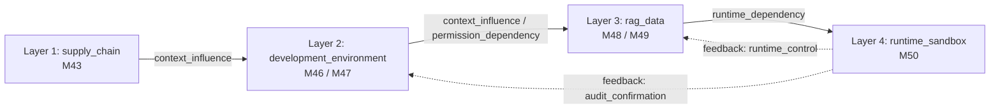

# Phase 97A — 跨模块传播动力学引擎架构设计文档

**文档编号**：`DOC-PHASE97A-PROPAGATION-001`  
**任务标识**：`Phase-97A-PROPAGATION-001`  
**评估模式**：`defensive_evaluation`  
**证据模式**：`synthetic_only`  
**PRD 依据**：PRD v3.1 §2.4, §2.6；原 PRD v1.0 §4, §9；Phase 83A/85A  

---

## 1. 概述与设计目标

跨模块传播动力学引擎（`PropagationDynamicsEngine`）是平台针对 AI / Agent 跨模块多层安全评估的核心演算中枢。基于统一攻击情报理论（Phase 82A/83A/85A），该引擎实现了模拟攻击信号在 4 个安全层级与 7 类跨模块边上的动态传播、衰减、放大与状态转移演算。

```yaml
safety_boundary_declarations:
  confirmed_vulnerability: false
  formal_finding_allowed: false
  production_safety_claimed: false
  synthetic_only: true
  red_team_engine_not_executable: true
  propagation_equation_is_not_exploit_chain: true
  theory_model_is_not_detection_rule: true
```

---

## 2. 4 个安全层级架构 (4 Security Layers)

系统将六个评估模块严格划分为 4 个安全层级，定义了单向流动与反馈的拓扑结构：

| 层级标识 (Layer ID) | 层级顺序 | 层级名称 | 核心模块 | 默认脆弱度 ($V_{node}$) | 职责与安全语义 |
| :--- | :---: | :--- | :--- | :---: | :--- |
| `supply_chain` | 1 | AI 供应链层 | M43 | 0.90 | MCP 工具描述、包清单、第三方元数据完整性 |
| `development_environment` | 2 | 开发环境层 | M46, M47 | 0.60 | Coding Agent 仓库上下文、命令执行、凭据保护 |
| `rag_data` | 3 | RAG 数据管道层 | M48, M49 | 0.50 | 文档检索投毒防御、租户权限继承与审计追踪 |
| `runtime_sandbox` | 4 | 运行时沙箱层 | M50 | 0.20 | Agent 执行沙箱、审计链路完整性、受控回放门禁 |



---

## 3. 7 类跨模块边与电导权重体系 (7 Edge Types & Conductivity)

边电导权重 $W_{edge} \in [0.0, 1.0]$ 表征不同边类型对攻击信号的理论传导能力：

| 边类型 (Edge Type) | 电导权重 ($W_{edge}$) | 传导级别 | 理论语义与应用场景 |
| :--- | :---: | :---: | :--- |
| `context_influence` | 0.60 | medium | 跨模块上下文与提示词语义影响流动 |
| `trust_boundary_transfer` | 0.50 | medium_low | 跨越安全信任边界的信号传递 |
| `permission_dependency` | 0.80 | medium_to_high | 跨模块/跨租户权限依赖，具有较高渗透压力 |
| `evidence_dependency` | 0.30 | low | 防御证据与判定信号消费 |
| `audit_dependency` | 0.40 | low_to_medium | 审计日志与追溯链完整性约束 |
| `runtime_dependency` | 0.60 | medium | 运行时沙箱与工具调用环境依赖 |
| `tool_call_chain` | 0.70 | medium_to_high | 工具链式调用与外部 API 分发依赖 |

---

## 4. 核心动力学方程式

### 4.1 边传播压力方程式 (EQ-EDGE-PROPAGATION-001)

描述在时间步 $t$ 下，信号从源节点沿单条边传播到目标节点的理论压力 $P_{edge}(t)$：

$$P_{\text{edge}}(t) = S_{\text{source}}(t) \times W_{\text{edge}} \times A_{\text{pattern}} \times (1 + F_{\text{feedback}}) \times (1 - D_{\text{target}})$$

其中：
- $S_{source}(t) \in [0.0, 1.0]$：源节点攻击信号强度（通常由 $1.0 - D_{source}(t)$ 导出）。
- $W_{edge} \in [0.0, 1.0]$：边电导权重。
- $A_{pattern} \in [0.0, 2.0]$：模式级放大/修正因子（默认 1.0）。
- $F_{feedback} \in [-1.0, 1.0]$：反馈循环因子（负反馈削弱，正反馈增强）。
- $(1 - D_{target}) \in [0.0, 1.0]$：目标节点防御脆弱度/开放度（目标防御越强，$1-D_{target}$ 越小，压力越低）。
- 最终结果严格截断在 $[0.0, 1.0]$ 区间。

### 4.2 节点防御状态演化方程式 (EQ-NODE-STATE-001)

描述单个节点在时间步 $t \to t+1$ 的防御健康度 $D_{node}$ 的动态演变：

$$D_{\text{node}}(t+1) = \text{clamp}\Big(D_{\text{node}}(t) + R_{\text{control}} - P_{\text{in}}(t) \times V_{\text{node}} + H_{\text{review}}, 0.0, 1.0\Big)$$

其中：
- $P_{in}(t) = \text{clamp}\big(\sum P_{edge\_inbound}(t), 0.0, 1.0\big)$：所有入向边压力之和。
- $V_{node} \in [0.0, 1.0]$：节点自身脆弱度系数。
- $R_{control} \in [0.0, 1.0]$：控制恢复与边界阻断强度。
- $H_{review} \in [0.0, 0.5]$：人工审查补偿增益。

### 4.3 路径级防御降级模型 (EQ-PATH-DEGRADATION-001)

聚合整条攻击路径上的压力与防御要素，产出路径级净降解指数 $G_{path}$：

$$G_{\text{path}} = \Big(\sum P_{\text{edge}}(t)\Big) \times (1 + A_{\text{seq}}) - \sum A_{\text{attenuation}} + \sum A_{\text{amplification}} - \sum B_{\text{blocking}}$$

**轨迹分类映射表**：
- $G_{path} < 0.0$：`stable_or_pressured`（有效遏制）
- $0.0 \le G_{path} < 0.5$：`partial_pressure`（局部承压）
- $0.5 \le G_{path} < 1.0$：`partial_degradation`（局部降级）
- $1.0 \le G_{path} < 2.0$：`significant_degradation`（显著降级）
- $G_{path} \ge 2.0$：`critical_degradation`（严重降级）

---

## 5. 衰减模型与放大模型 (Decay & Amplification Models)

### 5.1 衰减（Attenuation）模型
- **规则阻尼**：
  - `ATTEN-HRG-001` (人工复核门): $0.30$
  - `ATTEN-BND-001` (安全边界保持): $0.40$
  - `ATTEN-RED-001` (凭据脱敏/占位): $0.20$
  - `ATTEN-AUD-001` (审计链路阻尼): $0.30$
  - `ATTEN-RPL-001` (受控回放门禁): $0.50$
- **跳数空间衰减**：
  $$S(h) = S_0 \cdot e^{-\lambda \cdot h} \cdot \Big(1 - \text{clamp}(\sum \alpha_k \cdot 0.25, 0.0, 0.95)\Big)$$

### 5.2 放大（Amplification）模型
- **连续薄弱边界累积** ($A_{seq}$)：
  - 0 个连续薄弱点: $0.00$
  - 1 个连续薄弱点: $0.10$
  - 2 个连续薄弱点: $0.25$
  - $\ge 3$ 个连续薄弱点: $0.50$
- **跨层级跃迁放大** ($A_{cross}$)：
  $$A_{\text{cross}} = 0.20 \times |\text{Layer}_{\text{target}} - \text{Layer}_{\text{source}}|$$
- **反馈循环** ($F_{feedback}$)：
  - 运行时控制活跃 (负反馈): $-0.20$
  - 审计确认活跃 (负反馈): $-0.10$
  - 凭据压力触发 (正反馈): $+0.20$
  - 权限泄漏触发 (正反馈): $+0.30$

---

## 6. 马尔可夫 5 状态转移矩阵 (Markov 5-State Transition Model)

定义 5 个离散防御状态空间：
$$S = \{\text{stable}, \text{pressured}, \text{degraded}, \text{blocked}, \text{failed}\}$$

### 6.1 基础状态转移矩阵 ($T_{base}$)

所有行和严格等于 1.000000：

| 当前状态 \ 下一状态 | `stable` | `pressured` | `degraded` | `blocked` | `failed` | **Row Sum** |
| :--- | :---: | :---: | :---: | :---: | :---: | :---: |
| **`stable`** | 0.70 | 0.25 | 0.05 | 0.00 | 0.00 | **1.00** |
| **`pressured`** | 0.20 | 0.50 | 0.20 | 0.08 | 0.02 | **1.00** |
| **`degraded`** | 0.05 | 0.15 | 0.50 | 0.20 | 0.10 | **1.00** |
| **`blocked`** | 0.10 | 0.10 | 0.05 | 0.70 | 0.05 | **1.00** |
| **`failed`** | 0.00 | 0.00 | 0.05 | 0.15 | 0.80 | **1.00** |

### 6.2 动态压力转移演算与多步推演

在给定输入压力 $P_{in}$、控制恢复 $R_{control}$ 和人工审查 $H_{review}$ 下，引擎动态微调转移概率并严格重新归一化（$\sum_j T_{ij} = 1.0$）。
概率分布演化满足：
$$\boldsymbol{\pi}(t+1) = \boldsymbol{\pi}(t) \cdot \mathbf{T}(P_{\text{in}}, R_{\text{control}}, H_{\text{review}})$$

---

## 7. 模块集成与接口规范

`PropagationDynamicsEngine` 暴露的核心方法清单：

```python
class PropagationDynamicsEngine:
    # 1. 基础配置与安全边界
    def get_safety_boundaries() -> Dict[str, Any]: ...
    def get_supported_layers() -> Dict[str, Dict[str, Any]]: ...
    def get_supported_edge_types() -> Dict[str, Dict[str, Any]]: ...
    
    # 2. 马尔可夫转移矩阵
    def validate_markov_matrix(matrix: Optional[Dict] = None) -> bool: ...
    def compute_dynamic_transition_matrix(pressure_in: float, control_recovery: float, human_review: float) -> Dict[str, Dict[str, float]]: ...
    def step_markov_distribution(current_dist: Dict[str, float], transition_matrix: Optional[Dict] = None) -> Dict[str, float]: ...
    def simulate_markov_trajectory(initial_state: str, steps: int, ...) -> List[Dict[str, float]]: ...
    
    # 3. 衰减与放大
    def compute_attenuation(active_rules: Optional[List[str]] = None, module_id: Optional[str] = None) -> float: ...
    def compute_signal_decay(initial_signal: float, hops: int, decay_rate: float = 0.15) -> float: ...
    def compute_sequential_amplification(consecutive_weak_boundaries: int) -> float: ...
    def compute_cross_layer_amplification(source_layer: str, target_layer: str) -> float: ...
    
    # 4. 方程演算
    def calculate_p_edge(source_signal: float, edge_type: str, target_defense: float, pattern_factor: float = 1.0, feedback: Union[str, float] = 0.0) -> float: ...
    def step_node_defense(current_defense: float, incoming_pressure: float, node_vulnerability: Optional[float] = None, ...) -> float: ...
    def calculate_g_path(edge_pressures: List[float], sequential_amplification: float = 0.0, ...) -> float: ...
    
    # 5. 全图多步仿真流水线
    def simulate_cross_module_propagation(nodes: List[Dict], edges: List[Dict], time_steps: int = 5, entry_signals: Optional[Dict] = None) -> Dict[str, Any]: ...
```

---

## 8. 交付物与验证总结

- **代码实现**：[`engine/propagation_dynamics_engine.py`](file:///Users/linxi/Desktop/ai-workspace/AI%E5%AD%A6%E4%B9%A0/AI%E5%AE%89%E5%85%A8%E8%AF%84%E4%BC%B0%E6%8E%A2%E7%B4%A2/engine/propagation_dynamics_engine.py)
- **包级导出**：[`engine/__init__.py`](file:///Users/linxi/Desktop/ai-workspace/AI%E5%AD%A6%E4%B9%A0/AI%E5%AE%89%E5%85%A8%E8%AF%84%E4%BC%B0%E6%8E%A2%E7%B4%A2/engine/__init__.py)
- **单元测试**：[`tests/test_propagation_dynamics_engine.py`](file:///Users/linxi/Desktop/ai-workspace/AI%E5%AD%A6%E4%B9%A0/AI%E5%AE%89%E5%85%A8%E8%AF%84%E4%BC%B0%E6%8E%A2%E7%B4%A2/tests/test_propagation_dynamics_engine.py) (12/12 PASS)
- **验证脚本**：[`scripts/validate_propagation_dynamics_engine.py`](file:///Users/linxi/Desktop/ai-workspace/AI%E5%AD%A6%E4%B9%A0/AI%E5%AE%89%E5%85%A8%E8%AF%84%E4%BC%B0%E6%8E%A2%E7%B4%A2/scripts/validate_propagation_dynamics_engine.py) (11/11 Checks PASS)
- **执行摘要**：`phase97a_propagation001_execution_summary.yaml`
- **交付清单**：`delivery.json`
