# Phase-98A-REPLAY-002 — Controlled Replay 8-Node Authorization Gatekeeper Design & GAP-006 Closure Specification

## 1. 概述与任务背景 (Overview & Background)

- **任务编号**: `Phase-98A-REPLAY-002`
- **任务名称**: PRD v2.0 §9.3 受控复现 8 节点授权审批门禁系统 (Controlled Replay 8-Node Authorization Gatekeeper) 开发
- **任务类型**: `design_gate`
- **评估模式**: `not_applicable` (模拟防御/设计门禁)
- **PRD 依据**:
  - PRD v2.0 §4, §9.3（受控复测与运行期沙箱/审计链控制）
  - 攻击者视角新增章节 §4, §11（复现准入与防御对抗验证）
  - 原 PRD v1.0 §4, §6, §7（评估基线与安全门禁原则）
  - PRD v3.1 §2.2, §3, §4（动态状态机与防御门禁规范）
  - GAP-006 闭环要求（受控复现执行由纯设计门向形式化 8 节点硬性阻断状态机闭环过渡）

---

## 2. 核心架构与 8 法定复核节点规范 (8 Statutory Review Nodes Architecture)

受控复现必须严格经过 8 个法定复核节点，各节点具备独立的角色权限绑定、前置依赖条件、必填参数校验及硬性安全断言：

```mermaid
graph LR
    N1["NODE-1: Candidate Selection<br/>(安全测试负责人)"] --> N2["NODE-2: Authorization Review<br/>(安全管理负责人)"]
    N2 --> N3["NODE-3: Environment Readiness<br/>(环境管理负责人)"]
    N3 --> N4["NODE-4: Account & Data Safety<br/>(数据安全负责人)"]
    N4 --> N5["NODE-5: Replay Execution Approval<br/>(安全负责人 / 总门禁)"]
    N5 --> N6["NODE-6: Post-Replay Evidence<br/>(安全测试负责人)"]
    N6 --> N7["NODE-7: Vulnerability Classification<br/>(安全评估负责人)"]
    N7 --> N8["NODE-8: Formal Finding Approval<br/>(安全管理负责人)"]
```



### 2.1 节点权责与准入矩阵 (Node Responsibility Matrix)

| 节点编号 | 节点名称 | 责任角色 (Role) | 前置依赖节点 | 关键准入/审查要求 |
| :--- | :--- | :--- | :--- | :--- |
| **NODE-1** | Candidate Selection Review (候选项筛选复核) | `security_testing_lead` (安全测试负责人) | 无 (起点) | 校验 candidate 来自合法登记列表（如 BRT-001~020），具备 Red/Purple 映射与 trace 引用，强制 `synthetic_only=True`。 |
| **NODE-2** | Authorization Review (授权清单审查) | `security_management_lead` (安全管理负责人) | `NODE-1` | 校验授权主体/团队占位符 (`<SIM_AUTH_...>`)，授权范围、时间窗口合法，禁止范围明确排除生产环境与外网。 |
| **NODE-3** | Environment Readiness Review (环境就绪度审查) | `environment_management_lead` (环境管理负责人) | `NODE-1, NODE-2` | 校验隔离环境类型 (`isolated_test_environment`)，禁止生产环境与公网出站，确认环境快照 (`<SIM_SNAPSHOT_...>`) 已就绪。 |
| **NODE-4** | Account & Data Safety Review (账号与数据安全审查) | `data_safety_lead` (数据安全负责人) | `NODE-1, NODE-2, NODE-3` | 校验测试账号与数据集均为合成占位符 (`<SIM_TEST_ACCOUNT_...>`, `<SIM_DATASET_...>`)，严禁真实凭据/PII，确认数据快照就绪。 |
| **NODE-5** | Replay Execution Approval (复现执行审批总门禁) | `security_lead` (安全负责人) | `NODE-1 ~ NODE-4` (全通过) | 校验前置 4 节点全部 APPROVED，校验 5 步回滚流程与 7 项紧急中止条件，操作人已指定，强制人工亲笔签名。 |
| **NODE-6** | Post-Replay Evidence Review (复测后证据链审查) | `security_testing_lead` (安全测试负责人) | `NODE-1 ~ NODE-5` (全通过) | 校验执行日志完整性，确认回滚状态为 `clean_state_restored`/`completed`，校验安全字段快照无污染。 |
| **NODE-7** | Vulnerability Classification Review (漏洞分级定性审查) | `security_assessment_lead` (安全评估负责人) | `NODE-1 ~ NODE-6` (全通过) | 执行突破行为定性会审，防单方越权定级，强制维持 `confirmed_vulnerability=False` 与 `all_findings_are_candidate=True`。 |
| **NODE-8** | Formal Finding Approval Review (正式发现报告审批) | `security_management_lead` (安全管理负责人) | `NODE-1 ~ NODE-7` (全通过) | 校验全流程 8 节点审计签字链完整性，禁止声明 `production_safety_claimed=True`，完成合规归档签署。 |

---

## 3. 代码级硬性阻断机制 (Hard-Blocking Invariant Guardrail Suite)

引擎内置 `HIG-001` 至 `HIG-009` 共 9 项硬性阻断守卫（Hard-Blocking Invariants），在代码层面对违规配置、真实系统连接、真实凭据注入与越权跳步行为实施绝对拦截：

| 守卫编号 | 守卫名称 | 触发条件 | 拦截动作与抛出异常 |
| :--- | :--- | :--- | :--- |
| **HIG-001** | PRODUCTION_ENVIRONMENT_BLOCK | 环境指向生产环境、镜像环境或 `production_environment_allowed=True` | 阻断并抛出 `ProductionEnvironmentViolationError` |
| **HIG-002** | REAL_NETWORK_AND_EGRESS_BLOCK | 开启外网出站 (`external_network_access_allowed=True`) 或真实 API/工具调用 | 阻断并抛出 `RealNetworkAccessViolationError` |
| **HIG-003** | REAL_CREDENTIAL_AND_PII_BLOCK | 检测到真实 API Key (`sk-...`, `ghp_...`, `AKIA...`)、密码或真实 PII | 阻断并抛出 `RealCredentialViolationError` |
| **HIG-004** | MISSING_HUMAN_REVIEW_SIGNATURE_BLOCK | 签名缺失、签名为空或设置 `is_automated_override=True` | 阻断并抛出 `MissingHumanReviewSignatureError` |
| **HIG-005** | STEP_SKIPPING_OUT_OF_ORDER_BLOCK | 前置复核节点未获 APPROVED 即尝试审批后续节点 | 阻断并抛出 `StepSkippingViolation` |
| **HIG-006** | ROLLBACK_PLAN_MISSING_BLOCK | 进入 Node 5 时回滚计划未审批或 7 项中止条件未明确 | 阻断并抛出 `RollbackPlanMissingError` |
| **HIG-007** | UNILATERAL_VULNERABILITY_ESCALATION_BLOCK | 尝试单方面将突破标记为 `confirmed_vulnerability=True` | 阻断并抛出 `UnilateralVulnerabilityEscalationError` |
| **HIG-008** | PRODUCTION_SAFETY_CLAIM_BLOCK | 尝试声明 `production_safety_claimed=True` | 阻断并抛出 `ProductionSafetyClaimViolationError` |
| **HIG-009** | NON_SYNTHETIC_DATA_OR_ACCOUNT_BLOCK | 尝试设置 `synthetic_only=False` 或使用真实用户/服务账号 | 阻断并抛出 `NonSyntheticDataViolationError` |

---

## 4. GAP-006 闭环论证与形式化证明 (Formal Closure Proof for GAP-006)

### 4.1 GAP-006 初始问题定义
- **缺陷标识**: `GAP-006` (M50 / PRD v2.0 §9.3 Controlled Replay Execution)
- **历史状态**: `design gate only` / `deferred` (仅停留在静态文档描述阶段，缺乏代码级形式化审批状态机与防越权硬性阻断引擎)。

### 4.2 闭环方案与实施成果
1. **状态机控制**: 实现了 `ControlledReplayGatekeeper` 核心类，完整支持 8 个法定复核节点的形式化生命周期流转。
2. **防跳步越权**: 严格执行 `StepSkippingViolation` 拦截，确保必须依次通过 Node 1 到 Node 8。
3. **强制人工签字**: 通过 `HumanSignature` 校验器，杜绝任何自动化跳过或角色错位审批。
4. **硬性阻断安全边界**: 引擎常量与会话生命周期始终维持 `controlled_replay_execution_allowed: false`（在任何非完全隔离环境或缺失签字时绝对阻断），确保 `confirmed_vulnerability=false`、`synthetic_only=true`、`production_safety_claimed=false`。
5. **完整审计链**: 每个会话记录不可篡改的 `audit_chain`，包含责任人、角色、决策、时间戳及载荷快照。

### 4.3 闭环判定结论
```yaml
gap_id: GAP-006
status: closed
closure_criteria_evaluation:
  all_8_nodes_defined: true
  all_8_nodes_approved: true
  controlled_replay_hard_blocked: true
  synthetic_only_enforced: true
  confirmed_vulnerability_false: true
  production_safety_claimed_false: true
  human_review_chain_intact: true
conclusion: "GAP-006 彻底闭环：受控复现流程由形式化 8 节点门禁引擎与代码级硬性阻断机制完全覆盖。"
```

---

## 5. 安全声明与非追溯性保证 (Safety Boundaries & Non-Retroactivity)

1. **不可执行与硬性阻断**:
   - `controlled_replay_execution_allowed`: `false`
   - `confirmed_vulnerability`: `false`
   - `formal_finding_allowed`: `false`
   - `production_safety_claimed`: `false`
   - `synthetic_only`: `true`
   - `requires_human_review`: `true`
   - `all_findings_are_candidate`: `true`
2. **非追溯性声明**:
   - 本 8 节点门禁引擎为前向受控复现审批与流转控制系统，不追溯影响既有模块 (M01-M50) 的已完成状态或既有测试结论。

---

## 6. 验证与单测覆盖 (Verification & Test Suite)

- **单元测试**: `tests/test_controlled_replay_gatekeeper.py`（24/24 测试用例 100% PASS）
- **独立验证脚本**: `scripts/validate_phase98a_replay_gatekeeper.py`（15/15 检查项 100% PASS）
- **验证测试报告**: `phase98a_replay_gatekeeper_verification_report.yaml`
