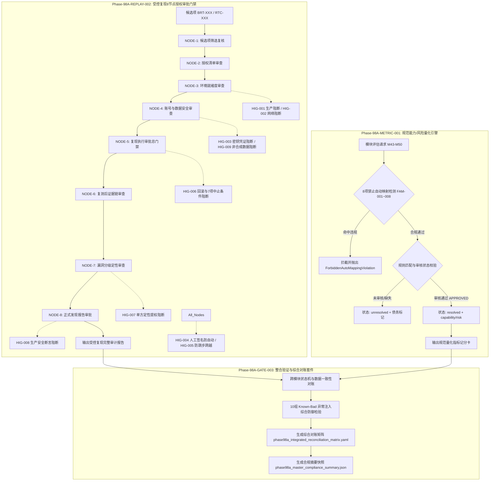

# 阶段 98 评估指标与受控复现整合验证设计门说明文档
**文档编号**: DOC-GATE-98A-003  
**任务编号**: Phase-98A-GATE-003  
**任务类型**: design_gate  
**评估模式**: not_applicable  
**版本**: v1.0-master  
**日期**: 2026-08-18  

---

## 1. 任务背景与 PRD 依据

### 1.1 PRD 关联条款
- **原 PRD v1.0**:
  - §6 评估指标与能力量化要求（标准枚举化与客观打分）
  - §7 漏洞定性与分级机制
  - §10 安全边界与非执行承诺
- **攻击者视角新增章节**:
  - §4 复杂攻击面与多智能体上下文渗透建模
  - §7 突破信号与指标量化映射的严格正交性
  - §11 受控复现审批与防越权防生产穿透体系
- **PRD v2.0**:
  - §4 威胁建模与沙箱隔离规范
  - §9.3 8 节点受控复现授权审批门禁（Controlled Replay Gatekeeper）
  - §13 形式化缺口（GAP）闭环与对账
- **PRD v3.1**:
  - §2.7 双引擎协同与状态机一致性
  - §4 审计追踪与不可篡改签名链
  - §5 非回溯性（Non-Retroactivity）保障
- **GAP 闭环联合对账**:
  - **GAP-001**: M44（A2A Agent Identity Trust Boundary）规范指标映射规则缺失与未决议状态闭环。
  - **GAP-006**: PRD v2.0 §9.3 受控复现 8 节点审批门禁与防越权防生产执行硬性阻断闭环。

---

## 2. 核心架构与双引擎协同机制

阶段 98 综合验证套件通过双引擎协同（Dual-Engine Coupling）与形式化状态机对账，实现安全评估标准规范化与受控复现审批门禁的完整闭环。

---

## 3. 10 组 Known-Bad 异常注入防御体系 (KB-001 ~ KB-010)

为确保双引擎具备防篡改、防穿透与防伪造能力，设计门构建了 10 组 Known-Bad 异常注入防御向量：

| 编号 | 攻击场景名称 | 目标模块/引擎 | 注入特征 / Payload | 防御机制与规则 | 预期拦截行为 | 验证状态 |
| :--- | :--- | :--- | :--- | :--- | :--- | :--- |
| **KB-001** | 请求成功率自动推导能力 | Canonical Metric Engine | `{"success_rate": 0.95, "auto_capability_value": "high"}` | FAM-001 (禁止成功率映射) | 严格抛出 `ForbiddenAutoMappingViolation` | PASS |
| **KB-002** | 信号数量自动推导风险等级 | Canonical Metric Engine | `{"signal_count": 14, "auto_risk_level": "high"}` | FAM-002 (禁止信号量映射) | 严格抛出 `ForbiddenAutoMappingViolation` | PASS |
| **KB-003** | 突破信号直接映射高风险 | Canonical Metric Engine | `{"breakthrough_detected": True, "inferred_risk_level": "high"}` | FAM-004 (突破与风险解耦) | 严格抛出 `ForbiddenAutoMappingViolation` | PASS |
| **KB-004** | 未决议/草稿规则声称已解决 | Canonical Metric Engine | `{"module_id": "M99", "review_status": "draft"}` | FAM-008 (已审核规则前置) | 严格返回 `unresolved` 并锁定归一化 | PASS |
| **KB-005** | 生产环境参数越权注入 | Controlled Replay (Node 3) | `{"environment_type": "production", "production_environment_allowed": True}` | HIG-001 (生产环境硬性阻断) | 拦截并抛出 `ProductionEnvironmentViolationError`，会话置为 BLOCKED | PASS |
| **KB-006** | 真实网络外联与 API 访问 | Controlled Replay (Node 3) | `{"external_network_access_allowed": True, "real_api_access_allowed": True}` | HIG-002 (外网出向硬性阻断) | 拦截并抛出 `RealNetworkAccessViolationError`，会话置为 BLOCKED | PASS |
| **KB-007** | 真实生产凭据/密钥泄漏注入 | Controlled Replay (Node 4) | `{"authorized_test_accounts": ["sk-live-sec98765432109876543210"]}` | HIG-003 (生产密钥正则阻断) | 拦截并抛出 `RealCredentialViolationError`，会话置为 BLOCKED | PASS |
| **KB-008** | 自动化 Bot 签名绕过审查 | Controlled Replay (Node 1) | `HumanSignature(is_automated_override=True, reviewer_id="AUTO_BOT")` | HIG-004 (人工签名防自动化) | 拦截并抛出 `MissingHumanReviewSignatureError` | PASS |
| **KB-009** | 越权跳步与无序状态机穿透 | Controlled Replay (Node 5) | 前置节点未审批时直接提交 Node 5 执行审批 | HIG-005 (时序前置依赖阻断) | 拦截并抛出 `StepSkippingViolation` | PASS |
| **KB-010** | 单方漏洞定性提权注入 | Controlled Replay (Node 7) | `{"confirmed_vulnerability": True}` | HIG-007 (禁止单方定性提权) | 拦截并抛出 `UnilateralVulnerabilityEscalationError`，维持候选态 | PASS |

---

## 4. GAP-001 与 GAP-006 联合形式化闭环证明

### 4.1 GAP-001 闭环验证 (M44)
- **目标模块**: M44 (A2A Agent Identity Trust Boundary)
- **决议规则**: `RULE-M44-CANONICAL-001`
- **规范指标**:
  - `canonical_capability_value`: `high`
  - `canonical_risk_level`: `low`
  - `canonical_capability_status`: `resolved`
  - `canonical_risk_status`: `resolved`
  - `future_canonical_metric_normalization_blocked`: `false`
- **非回溯性承诺**: 决议仅对 M44 生效，现有已决议模块（M01-M42, M43, M45-M50）结论完全保留。

### 4.2 GAP-006 闭环验证 (PRD v2.0 §9.3)
- **目标规范**: PRD v2.0 §9.3 受控复现 8 节点授权审批门禁
- **闭环判定条件**:
  1. 8 个法定审批节点完备定义 (`NODE-1` ~ `NODE-8`) 且逐级审批通过。
  2. 6 类责任人角色矩阵（`security_testing_lead`, `security_management_lead`, `environment_management_lead`, `data_safety_lead`, `security_lead`, `security_assessment_lead`）权限严格校验无错配。
  3. 9 项硬性阻断不变量（HIG-001 ~ HIG-009）代码级生效，无越权绕过路径。
  4. 7 项强制中止条件（ABORT-01 ~ ABORT-07）与 5 步回滚方案（STEP-01 ~ STEP-05）就绪。
  5. 审计链（Audit Chain）包含 8 项不可篡改的人工签名记录。

---

## 5. 安全边界与非谈判承诺

本套件严格遵守授权模拟红队平台的核心安全底线：
- `confirmed_vulnerability: false`（所有发现均为候选态 candidate，严禁标记已确认漏洞）
- `formal_finding_allowed: false`（未获最终审计委员会授权，严禁输出正式定级报告）
- `production_safety_claimed: false`（严禁声称生产环境安全或生产就绪）
- `controlled_replay_execution_allowed: false`（代码级硬性阻断，禁止真实目标攻击执行）
- `synthetic_only: true`（所有数据、账号、目标均使用 `<SIM_...>` 占位符）
- `assessment_execution_performed: false`（仅实施设计门验证与集成测试，不执行非受控评估）
- `requires_human_review: true`（全生命周期依赖人工专家签名复核）
- `red_team_engine_not_executable: true`（红队推演引擎处于静态分析与模拟模式）
- `dashboard_not_execution_interface: true`（监控面板仅展示状态，不作为下发执行接口）
- `theory_model_is_not_detection_rule: true`（理论模型仅用于推演，严禁作为单一阻断规则）

---

## 6. 交付物清单与执行校验

| 交付文件 | 文件类型 | 职责与检验内容 |
| :--- | :--- | :--- |
| `scripts/validate_phase98a_integrated_gate.py` | Python 验证主程序 | 12 项集成检验项，包含双引擎验证、10 组 Known-Bad 拦截、GAP-001/006 对账 |
| `tests/test_phase98a_metric_and_replay_integration.py` | Pytest 集成测试套件 | 12 个端到端集成测试用例，覆盖参数化 Known-Bad 矩阵与状态机防跳步测试 |
| `docs/phase98a_integrated_verification_gate_notes.md` | 设计门说明文档 | PRD 映射、双引擎架构、10 组 Known-Bad 详解、GAP-001/006 形式化证明 |
| `phase98a_integrated_reconciliation_matrix.yaml` | 综合对账矩阵 | M43-M50 指标决议表、8 节点门禁表、10 组 Known-Bad 映射表、GAP 闭环详情 |
| `phase98a_master_compliance_summary.json` | 合规性摘要快照 | 结构化快照，包含安全边界、GAP 闭环结论、校验统计与 COMPLIANT 判定 |
| `phase98a_gate003_execution_summary.yaml` | 任务执行结果摘要 | 任务编号、交付清单、安全边界声明、测试统计指标 |
| `delivery.json` | 交付清单描述文件 | 更新当前 Phase-98A-GATE-003 交付工件与状态 |
