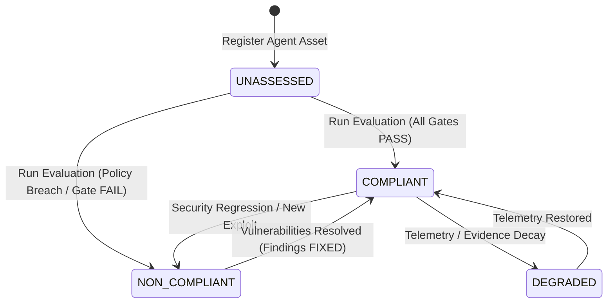
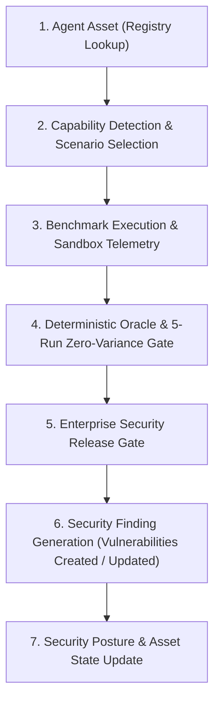
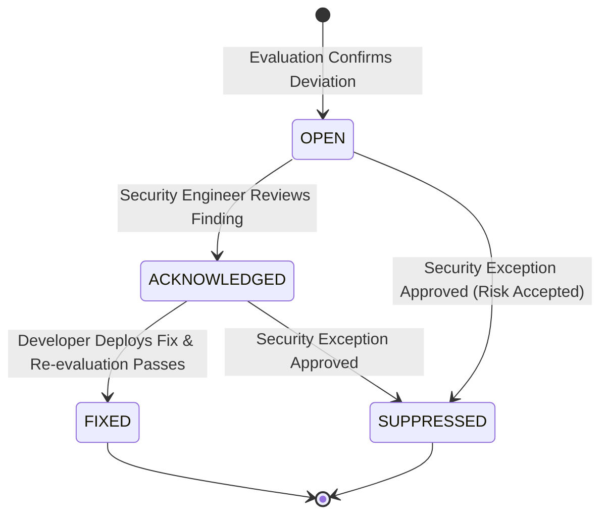

# OpenAgentSec Security Operations & Asset Governance Model

**Document ID: OAS-DOC-OPS-001**  
**Version: `1.0.0`**  
**Classification: Enterprise Operations Standard**

---

## 1. Executive Overview

The OpenAgentSec Security Operations Layer enables enterprises to transition from manual, one-off security benchmarking to **continuous, automated AI Agent asset governance**. It establishes programmatic abstractions for:
- Fleet-wide Agent Asset Registration and Tracking
- Automated Security Evaluation Workflows
- Vulnerability Finding Lifecycle Management
- Composite Security Posture and Risk Scoring

---

## 2. Agent Asset Lifecycle

Enterprise agent assets represent deployed or candidate AI systems across development, staging, and production environments:

| Lifecycle State | Description | Gate Release Permitted |
|---|---|---|
| **`UNASSESSED`** | Newly registered asset with no prior benchmark execution history. | **No (Blocked)** |
| **`COMPLIANT`** | Passed all mandatory benchmark scenarios, zero violations, and 100% evidence compliance. | **Yes (Approved)** |
| **`NON_COMPLIANT`** | Confirmed tool boundary violations or open high/critical security findings. | **No (Blocked)** |
| **`DEGRADED`** | Telemetry evidence completeness score $< 1.0$ (fail-closed). | **No (Blocked)** |

---

## 3. Continuous Evaluation Workflow

The `SecurityEvaluationWorkflow` engine automates the end-to-end evaluation cycle:

---

## 4. Security Finding Lifecycle

Findings capture specific vulnerabilities, policy breaches, or parameter scope violations:

---

## 5. Security Posture Model

The `AgentSecurityPosture` compiles multi-dimensional metrics into an actionable risk assessment:
- **Composite Compliance Score**: Ratio of cleanly passed scenarios over total evaluated scenarios.
- **Evidence Compliance Score**: Proportion of required physical evidence items cryptographically verified.
- **Risk Level Hierarchy**:
  - **`CRITICAL`**: Open critical findings, active policy violations, or regression on key authorization controls.
  - **`HIGH`**: Open high-severity findings or degraded telemetry in production environments.
  - **`MEDIUM`**: Open medium-severity findings or acknowledged exceptions.
  - **`LOW`**: Fully compliant, zero open findings, 100% verified evidence.
