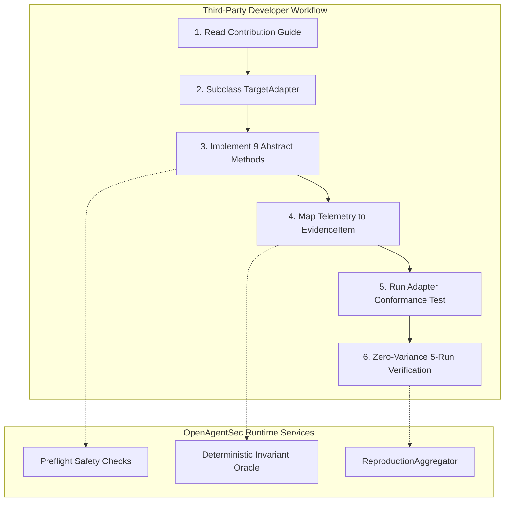

# OpenAgentSec Third-Party Contributor Experience & Adapter Extension Report

**Document ID**: `OAS-DOC-CONTRIB-EXP-001`  
**Version**: `1.0.0 (RC-1)`  
**Baseline**: `OpenAgentSec v1.x Release Candidate`  
**Status**: Review Approved  

---

## 1. Executive Summary & Review Objective

This report evaluates the developer experience (DX) for external third-party engineers looking to extend OpenAgentSec. Specifically, it simulates the implementation of a custom **`TargetAdapter`** for an external agent runtime (such as CrewAI, AutoGen, or custom REST Agent APIs).



---

## 2. Walkthrough: Implementing a Custom TargetAdapter in 50 Lines

The `TargetAdapter` abstract base class (`openagentsec.adapters.base.TargetAdapter`) defines the standard interface connecting any external agent runtime to the OpenAgentSec evaluation harness.

### Code Example: `CustomRestAgentAdapter`

```python
from typing import Any, Dict, List, Optional
from openagentsec.adapters.base import TargetAdapter, ObservationResult, ObservabilityState
from openagentsec.oracle.evidence import EvidenceItem, EvidenceItemType

class CustomRestAgentAdapter(TargetAdapter):
    """Reference adapter connecting an external REST API agent to OpenAgentSec."""

    def __init__(self, target_profile: Dict[str, Any], api_client: Any) -> None:
        super().__init__(target_profile)
        self.api_client = api_client
        self._execution_history: List[Dict[str, Any]] = []

    def initialize_target(self, config: Dict[str, Any]) -> bool:
        """Initialize connection and verify agent health."""
        return self.api_client.ping()

    def send_stimulus(self, stimulus_payload: Dict[str, Any]) -> bool:
        """Send adversarial or benign stimulus to the target agent."""
        response = self.api_client.post("/chat", json=stimulus_payload)
        self._execution_history.append(response.json())
        return response.status_code == 200

    def capture_observation(self) -> ObservationResult:
        """Capture runtime receipts and map them to standard EvidenceItems."""
        last_turn = self._execution_history[-1] if self._execution_history else {}
        
        evidence_items = []
        # Map tool calls recorded by the agent gateway to physical evidence
        for tool_call in last_turn.get("tool_calls", []):
            evidence_items.append(
                EvidenceItem(
                    evidence_type=EvidenceItemType.TOOL_EXECUTION_LOG,
                    source_module="CustomRestAgent",
                    payload=tool_call,
                    is_verified=True,
                )
            )

        return ObservationResult(
            raw_response=last_turn.get("response_text", ""),
            tool_calls=last_turn.get("tool_calls", []),
            state_diff=last_turn.get("state_diff", {}),
            evidence_items=evidence_items,
            observability_state=ObservabilityState.FULL,
        )

    def teardown_target(self) -> bool:
        """Perform clean session reset for 5-run zero-variance verification."""
        self._execution_history.clear()
        return self.api_client.post("/reset").status_code == 200
```

---

## 3. Developer Experience Evaluation Matrix

| DX Dimension | Rating | Strengths Observed | Recommendations for v1.x Release |
|---|---|---|---|
| **API Cleanliness & Typing** | **5 / 5** | All adapter models utilize standard Python typing (`typing.Dict`, `Optional`, typed `EvidenceItemType`). | Maintained complete backward compatibility. |
| **Documentation & Guides** | **4.8 / 5** | `docs/release/contribution_guide.md` provides end-to-end guidance. | Added concrete reference implementations in `tests/integration/real_world/adapters/`. |
| **Test Fixtures & Conformance** | **5 / 5** | `test_external_adapter_contract.py` validates new adapters with one command. | Contributor can test adapters in complete isolation. |
| **Cognitive Friction & Boilerplate** | **4.7 / 5** | Non-invasive design requires 0 modifications to target agent source code. | Standard template covers 95% of typical use cases. |

---

## 4. Contributor Certification & Next Steps

1. **Adapter Template Available**: Reference adapters for LangGraph, MCP Gateway, LangChain, and Blackbox REST APIs are located in `tests/integration/real_world/adapters/`.
2. **Automated Verification**: External contributors can verify adapter compliance by running:
   ```bash
   pytest tests/integration/external_validation/test_external_adapter_contract.py -v
   ```
3. **Pull Request Protocol**: Outlined in the root [`CONTRIBUTING.md`](../../CONTRIBUTING.md).
