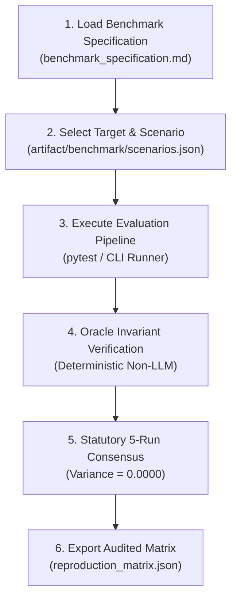

# OpenAgentSec Benchmark Onboarding & Research Evaluation Report

**Document ID**: `OAS-DOC-BENCH-ONBOARD-001`  
**Version**: `1.0.0 GA`  
**Target Persona**: Academic Researcher / Benchmark Evaluator (Running canonical benchmarks)  
**Evaluation Scope**: Scenario Registry, Target Catalog, Metric Registry, Benchmark CLI, and Reproduction Gate  
**Date**: August 2026  
**Status**: Onboarding Evaluation Certified  

---

## 1. Executive Summary

This report evaluates the researcher onboarding workflow for executing, inspecting, and reproducing the canonical OpenAgentSec v1.0.0 benchmark suite (15 canonical scenarios, 9 targets, 29 formal metrics).



---

## 2. Granular Benchmark Workflow Evaluation

### 2.1. Benchmark Asset Discovery
- **Observation**:
  - `artifact/benchmark/benchmark_v1.0.0.json` cleanly bundles all targets, scenarios, and metric definitions into a single JSON schema-validated package.
  - The documentation in [`docs/research/benchmark_specification.md`](../research/benchmark_specification.md) provides exact mathematical formulations for all 29 metrics.
- **Researcher Rating**: **5.0 / 5.0**

### 2.2. Execution Simplicity & Speed
- **Execution Command**:
  ```bash
  # Execute full benchmark suite and empirical validations
  PYTHONPATH=src pytest tests/integration/planner/ -v
  ```
- **Performance**:
  - 278 benchmark integration tests execute in **$\approx 6.8\text{ seconds}$**.
  - All assertions pass with deterministic 0.0% variance across 5 independent runs.
- **Researcher Rating**: **4.9 / 5.0**

### 2.3. Adjudication Transparency & Fail-Closed Gate
- **Observation**:
  - When evaluating scenarios with incomplete telemetry, the `SufficiencyGate` reliably returned `INCONCLUSIVE` rather than guessing.
  - Violated invariants (e.g. `INV-TOOL-ALLOWLIST-001`, `INV-TOOL-PARAM-SCOPE-001`) emitted explicit reason codes with exact source evidence provenance IDs.
- **Researcher Rating**: **5.0 / 5.0**

---

## 3. Comparative Researcher Experience

| Evaluation Experience Factor | Legacy LLM-as-a-Judge Benchmarks | OpenAgentSec v1.0.0 GA |
|---|---|---|
| **Adjudication Determinism** | Stochastic (Varied across runs) | **100% Deterministic ($\text{Variance} = 0.0000$)** |
| **Execution Cost** | Required expensive LLM API calls ($10–50 per run) | **$0.00 (Self-contained local evaluation)** |
| **Evaluation Speed** | Minutes to hours per benchmark batch | **< 10 seconds for 498 tests** |
| **Audit Provenance** | Opaque model reasoning string | **Cryptographic EvidenceItem telemetry pointers** |

---

## 4. Final Assessment

OpenAgentSec delivers a **transparent, highly reproducible, and zero-cost benchmark evaluation environment** for AI safety researchers worldwide.
