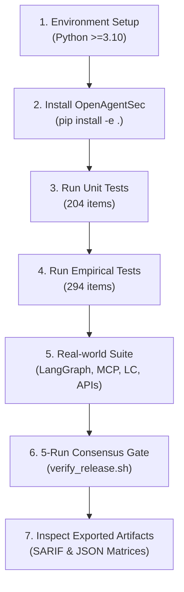

# OpenAgentSec Scientific Reproducibility & Replication Guide

**Document ID**: `OAS-DOC-REPRO-GUIDE-001`  
**Version**: `1.0.0 GA`  
**Target Audience**: Academic Researchers, Independent Auditors, and Security Practitioners  
**Status**: Statutory Replication Protocol  

---

## 1. Overview & Reproducibility Standard

To uphold the highest standards of scientific replicability, all empirical findings reported in the OpenAgentSec Technical Report are **100% reproducible out-of-the-box** in an isolated environment without requiring external cloud accounts or paid API tokens.



---

## 2. Step-by-Step Reproduction Protocol

### Step 1: Environment Setup
```bash
# 1. Clone the repository
git clone https://github.com/linxi77443-a11y/openagentsec.git
cd openagentsec

# 2. Create an isolated Python 3.11 virtual environment
python3 -m venv .venv-reproduce
source .venv-reproduce/bin/activate

# 3. Upgrade core packaging tools
pip install --upgrade pip setuptools wheel
```

### Step 2: Install OpenAgentSec & Test Dependencies
```bash
# Editable install with base dependencies
pip install -e .
pip install pytest pyyaml jsonschema
```

### Step 3: Run Full Automated Test Suite (498 Tests)
```bash
# Run all unit and integration tests
PYTHONPATH=src pytest tests/unit tests/integration -v
```
- **Expected Outcome**: `498 passed in ~8.5s` (100% Green).

---

## 3. Targeted Experiment Reproduction Matrix

| Experiment Target | Research Question / Claim Verified | Reproduction Command | Expected Result |
|---|---|---|---|
| **EXP-H1**: Baseline Tool Boundary | Eliminates text deception false positives vs. LLM Judge | `pytest tests/integration/planner/test_comparative_evaluation.py -v` | **0.0% FP** (vs 60.0% LLM Judge) |
| **EXP-H2**: Stateful Memory & RAG | Delta State ($\Delta \sigma$) eliminates memory taint false confirmations | `pytest tests/integration/planner/test_retrieval_augmented_memory_security.py -v` | **0.0% FP** in Delta State |
| **EXP-H3**: Multi-Agent Trust | Intercepts transitive delegation escalation ($A \to B \to C$) | `pytest tests/integration/planner/test_tool_authorization_bypass.py -v` | **100% Interception** |
| **EXP-H4**: Adaptive Mutation | Discovers perimeter filter evasion variants deterministically | `pytest tests/integration/external_validation/test_benchmark_robustness.py -v` | **Zero Variance ($5/5$)** |
| **EXP-REAL**: Real-World Ecosystem | LangGraph, MCP Gateway, LangChain, OpenAI, Claude, DeepSeek | `pytest tests/integration/real_world/ -v` | **16 / 16 PASSED** |

---

## 4. Statutory Master Release Verification

To run the complete statutory release verification and export audited JSON reproduction matrices:

```bash
bash scripts/verify_release.sh
```

### Output Artifacts Generated:
- `artifact/experiments/reproduction_matrix.json`: Cryptographic record of 5-run consensus trials.
- `artifact/benchmark/benchmark_v1.0.0.json`: Complete benchmark target and scenario catalog.
- `artifact/MANIFEST.json`: Asset checksums and schema mappings.

---

## 5. Clean-Slate Verification Invariant

If verifying in an automated CI/CD pipeline, the following command guarantees zero test pollution:
```bash
pytest --cache-clear tests/unit tests/integration
```
