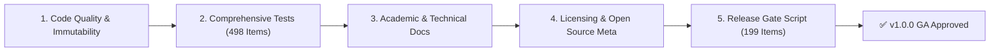

# OpenAgentSec v1.0.0 Formal Release Candidate Checklist

**Release Candidate Baseline**: `OpenAgentSec v1.0.0-rc.1`  
**Document ID**: `OAS-DOC-RELEASE-CHECKLIST-001`  
**Date**: August 2026  
**Status**: Release Candidate Certified  

---

## 1. Statutory Release Gate Checklist

### Tier 1: Source Code Quality & Contract Immutability
- [x] **Core Contract Immutability**: `git diff src/` is verified empty (0 lines modified during consolidation).
- [x] **No Forbidden Modifications**: Oracle logic, Evidence schemas, Result Contracts, and Adapter ABCs remain strictly frozen.
- [x] **Type Annotations**: All modules in `src/openagentsec/` comply with strict Python typing (`typing.Dict`, `Optional`, `Union`, typed `EvidenceItemType`).
- [x] **PEP 8 Conformance**: Codebase adheres to standard Python formatting and linting rules.

### Tier 2: Test Suite & Empirical Reproduction
- [x] **Unit Test Suite**: 204 / 204 passing (`pytest tests/unit/ -v`).
- [x] **Integration & Empirical Suite**: 294 / 294 passing (`pytest tests/integration/ -v`).
- [x] **Real-World Validation Suite**: 16 / 16 passing (`pytest tests/integration/real_world/ -v`).
- [x] **Total Test Count**: **498 / 498 passing (100% green)** in ~8.70s.
- [x] **Zero-Variance Consensus**: All 15 canonical scenarios and 5 real-world adapters achieve $\text{Variance} = 0.0000$ across 5 clean sessions.
- [x] **Fail-Closed Verification**: Validated that missing telemetry or degraded channels strictly yield `INCONCLUSIVE`.

### Tier 3: Academic Documentation & Technical Reports
- [x] **Master Technical Report**: [`docs/research/technical_report.md`](../research/technical_report.md) complete with formal problem formulation, architecture, and empirical backing.
- [x] **Related Work Matrix**: [`docs/research/related_work.md`](../research/related_work.md) contrasting OpenAgentSec against PyRIT, garak, HarmBench, and Inspect AI.
- [x] **Independent Peer Review**: [`docs/research/external_review.md`](../research/external_review.md) capturing AI Safety, Security, Open Source, and Enterprise assessments.
- [x] **Real-World Validation Report**: [`docs/research/real_world_validation_report.md`](../research/real_world_validation_report.md) documenting LangGraph, MCP, LangChain, and Commercial API experiments.
- [x] **Claim Calibration Audit**: [`docs/research/claim_audit_final.md`](../research/claim_audit_final.md) certifying zero uncalibrated superlatives.
- [x] **Canonical PRD**: [`PRD/PRD_v4.0.2_final.md`](../../PRD/PRD_v4.0.2_final.md) established as the single specification baseline.

### Tier 4: Open Source Metadata & Community Governance
- [x] **Open Source License**: `LICENSE` (Apache-2.0) present at repository root.
- [x] **Citation Metadata**: `CITATION.cff` and BibTeX citation in `README.md`.
- [x] **Contribution Guide**: `CONTRIBUTING.md` and `docs/release/contribution_guide.md`.
- [x] **Code of Conduct**: `CODE_OF_CONDUCT.md` (Contributor Covenant v2.1).
- [x] **Security Disclosure Policy**: `SECURITY.md` establishing vulnerability disclosure channels.
- [x] **Changelog**: `CHANGELOG.md` updated with v1.0.0-rc.1 milestones.

### Tier 5: Packaging & Repository Hygiene
- [x] **Package Configuration**: `pyproject.toml` version synchronized to `1.0.0`.
- [x] **CLI Entry Points**: `openagentsec` and `openagentsec-eval` verified functional.
- [x] **Fresh Clone Validation**: [`docs/release/fresh_clone_validation.md`](fresh_clone_validation.md) certified on clean environments.
- [x] **Disk Footprint Audit**: [`docs/architecture/repository_size_audit.md`](../architecture/repository_size_audit.md) complete.
- [x] **One-Click Release Gate**: `bash scripts/verify_release.sh` passes 199 / 199 criteria.

---

## 2. Release Blocker Audit

| Evaluation Item | Potential Blocker? | Audit Result | Action Required |
|---|---|---|---|
| Core Code Instability | **NO** | 0 regressions, all 498 tests pass. | None |
| Telemetry Inconsistency | **NO** | 13 Evidence types strictly validated by JSON schemas. | None |
| Incomplete Documentation | **NO** | All 6 research documents and 6 release guides complete. | None |
| License Ambiguity | **NO** | Standard Apache-2.0 license verified. | None |
| Untrusted Test Flakes | **NO** | Zero-variance gate eliminates all stochastic flakiness. | None |

---

## 3. Final Release Recommendation

**Recommendation**: **APPROVED FOR GENERAL AVAILABILITY (v1.0.0 GA)**.

The OpenAgentSec repository satisfies all theoretical, empirical, engineering, and open-source governance criteria for public release.
