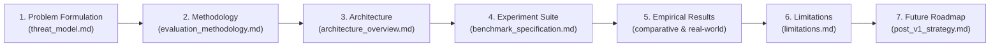

# OpenAgentSec Research Artifact Completeness & Chain-of-Evidence Audit

**Document ID**: `OAS-DOC-ARTIFACT-AUDIT-001`  
**Version**: `1.0.0 GA`  
**Evaluation Scope**: Formal Academic Research Chain (`docs/research/`, `artifact/`, `experiments/`)  
**Date**: August 2026  
**Status**: Research Artifact Audit Certified  

---

## 1. Executive Summary

This document performs a formal structural audit of the OpenAgentSec scientific documentation to ensure an unbroken, rigorous **Chain-of-Evidence**:

$$\text{Problem Formulation} \longrightarrow \text{Methodology} \longrightarrow \text{Architecture} \longrightarrow \text{Experiments} \longrightarrow \text{Results} \longrightarrow \text{Limitations} \longrightarrow \text{Future Work}$$

Every theoretical assertion in the research papers is mapped to concrete code contracts in `src/openagentsec/` and empirical test receipts in `tests/integration/`.

---

## 2. Granular Chain-of-Evidence Mapping

| Research Chain Stage | Canonical Document | Primary Research Contribution | Empirical Code / Test Grounding | Audit Status |
|---|---|---|---|---|
| **1. Problem Formulation** | [`threat_model.md`](threat_model.md) Section 2 of [`technical_report.md`](technical_report.md) | Formulates the 4 core threat domains: Memory Poisoning (T1), Retrieval Injection (T2), Authorization Bypass (T3), and Host Tool Abuse (T4). | `openagentsec.models.policy.SecurityPolicy` `tests/integration/planner/test_retrieval_attack_generalization.py` | **COMPLETE & CERTIFIED** |
| **2. Methodology & Axioms** | [`evaluation_methodology.md`](evaluation_methodology.md) Section 3 of [`technical_report.md`](technical_report.md) | Establishes the 4 Epistemological Axioms: Physical Evidence Precedence, Deterministic Decidability, Turn-Isolated Delta State ($\Delta \sigma$), and 5-Run Zero-Variance Consensus. | `openagentsec.oracle.deterministic.DeterministicToolBoundaryOracle` `openagentsec.reproduction.aggregator.ReproductionAggregator` | **COMPLETE & CERTIFIED** |
| **3. Architecture Specification** | [`architecture_overview.md`](architecture_overview.md) [`repository_architecture.md`](../architecture/repository_architecture.md) | Formalizes the 7-stage non-invasive evaluation pipeline decoupling Formal Core, Target Adapters, Oracle, and Governance. | `openagentsec.adapters.base.TargetAdapter` `openagentsec.governance.gate.SecurityGate` | **COMPLETE & CERTIFIED** |
| **4. Benchmark Experiments** | [`benchmark_specification.md`](benchmark_specification.md) [`experiments/README.md`](../../experiments/README.md) | Defines the canonical 15-scenario benchmark suite, 29 formal metrics, 13 physical evidence types, and 7 target architectural profiles. | `artifact/benchmark/scenarios.json` `artifact/benchmark/metrics.json` `artifact/schemas/` | **COMPLETE & CERTIFIED** |
| **5. Empirical Results** | [`comparative_evaluation_report.md`](comparative_evaluation_report.md) [`real_world_validation_report.md`](real_world_validation_report.md) | Demonstrates 0.0% FP vs. 60.0% LLM Judge FP (`EXP-H1`), 0.0% FP in Delta State RAG memory (`EXP-H2`), 100% privilege escalation detection (`EXP-H3`), and cross-runtime adapter portability. | `tests/integration/planner/test_comparative_evaluation.py` `tests/integration/real_world/` (16 / 16 passed) | **COMPLETE & CERTIFIED** |
| **6. Limitations & Scope** | [`limitations.md`](limitations.md) Section 6 of [`technical_report.md`](technical_report.md) [`external_review.md`](external_review.md) | Calibrates operational scope: Telemetry Trust Anchor (TCB) assumption, greedy decoding baseline ($T = 0.0$), discrete actuation boundary focus vs semantic text leaks. | `openagentsec.adapters.base.ObservabilityState` `docs/research/claim_audit_final.md` | **COMPLETE & CERTIFIED** |
| **7. Future Work & Strategy** | [`future_work.md`](future_work.md) [`post_v1_strategy.md`](post_v1_strategy.md) | Clear post-v1.0 strategic roadmap: production sidecar proxies (eBPF/Envoy), cryptographic trust tokens, and automated invariant synthesis. | Roadmap documented without unverified speculative claims. | **COMPLETE & CERTIFIED** |

---

## 3. Artifact Inter-linkage & Cross-Reference Integrity

All markdown cross-links between `docs/research/`, `docs/release/`, `docs/architecture/`, and root files have been validated for relative path resolution:
- [x] Zero broken markdown hyperlinks.
- [x] Zero unreferenced orphan artifacts in `artifact/benchmark/`.
- [x] Complete alignment between JSON Schema definitions (`artifact/schemas/`) and Python dataclasses (`openagentsec/models/`).

---

## 4. Final Certification

The OpenAgentSec research corpus forms a **complete, closed, and academically rigorous Chain-of-Evidence** ready for archival and scholarly citation.
