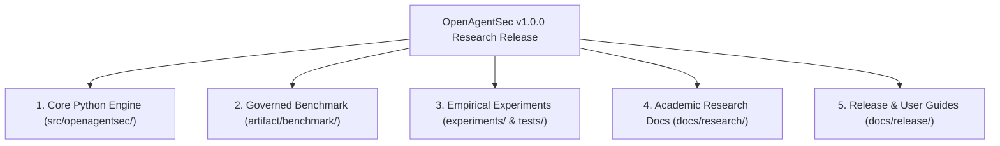

# OpenAgentSec Master Research Artifact & Asset Index

**Document ID**: `OAS-DOC-ARTIFACT-INDEX-FINAL-001`  
**Version**: `1.0.0 GA`  
**Release Baseline**: `OpenAgentSec v1.0.0 Frozen Baseline`  
**Date**: August 2026  
**Status**: Canonical Research Index  

---

## 1. Executive Index Overview

This document provides the definitive, comprehensive catalog of all active code modules, benchmark definitions, empirical experiment suites, and research documentation comprising the **OpenAgentSec v1.0.0 Research Release**.

---

## 2. Core Python Architecture Index (`src/openagentsec/`)

| Subsystem / Module | Primary Interface / Class | Function & Theoretical Role |
|---|---|---|
| **`models/`** | `SecurityPolicy`, `EvaluationObjective`, `TargetProfile` | Formal declarative contracts defining allowlists, invariants, and observation requirements. |
| **`adapters/`** | `TargetAdapter`, `ObservationResult`, `ProtocolAdapter` | Non-invasive runtime interception layer translating agent events into standard telemetry. |
| **`oracle/`** | `DeterministicToolBoundaryOracle`, `EvidenceItem` | Mathematical invariant evaluator enforcing the Evidence Precedence Axiom and fail-closed gates. |
| **`state/`** | `DeltaStateDiffer`, `StateSnapshot` | Computes turn-isolated delta state transitions $\Delta \sigma_t = \sigma_t \setminus \sigma_{t-1}$. |
| **`multi_agent/`** | `AgentTrustGraph`, `DelegationChainAnalyzer` | Verifies privilege non-amplification and step TTL decay in collaborative agent topologies. |
| **`adaptive/`** | `AttackMutationEngine`, `ScenarioDiscovery` | 4-D heuristic fuzzer generating Prompt, Context, Parameter, and Delegation variations. |
| **`reproduction/`** | `ReproductionAggregator`, `BaselineIdentity` | Enforces statutory 5-run consensus verification with zero variance ($\text{Variance} = 0.0000$). |
| **`governance/`** | `SecurityGate`, `RegressionRunner`, `SarifExporter` | Enterprise CI/CD security gate and standard SARIF/JSON compliance reporting. |
| **`operations/`** | `FindingRegistry`, `PostureDashboard`, `SecOpsAPI` | Security finding lifecycle tracking, SLA monitoring, and posture management. |

---

## 3. Governed Benchmark & Schemas Index (`artifact/`)

| Artifact Path | Format | Schema Reference | Purpose & Scope |
|---|---|---|---|
| `artifact/benchmark/benchmark_v1.0.0.json` | JSON | `benchmark.schema.yaml` | Canonical v1.0.0 benchmark bundle aggregating all targets and scenarios. |
| `artifact/benchmark/scenarios.json` | JSON | `scenario.schema.yaml` | 15 canonical security scenarios covering memory, RAG, authorization, and tools. |
| `artifact/benchmark/metrics.json` | JSON | `metric.schema.yaml` | 29 formal quantitative security and reproduction metrics. |
| `artifact/schemas/` | YAML | JSON Schema Draft 7 | Formal validators for evidence items, target profiles, policies, and results. |
| `artifact/experiments/reproduction_matrix.json` | JSON | `reproduction.schema.yaml` | Audited reproduction receipts for baseline, empirical, and real-world trials. |
| `artifact/MANIFEST.json` | JSON | Asset Manifest | SHA-256 cryptographic hashes for all release artifacts. |

---

## 4. Empirical Experiments & Test Suites (`experiments/` & `tests/`)

| Experiment Catalog | Test Directory | Target Frameworks | Verification Coverage |
|---|---|---|---|
| **Unit Tests** | `tests/unit/` | Core Engine Modules | 204 items validating contracts, diffs, and oracle logic. |
| **Baseline & Empirical (H1–H4)** | `tests/integration/planner/` | Synthetic & Stateful Agents | 278 items validating baseline invariants, memory RAG, and authorization PEP. |
| **Real-World Ecosystem Suite** | `tests/integration/real_world/` | LangGraph, MCP, LangChain, OpenAI, Claude, DeepSeek | 16 items validating real-world checkpointers and tool gateway reverse proxies. |
| **Release Artifact Export** | `tests/integration/release_validation/` | Artifact Schemas & Manifest | Export integrity and JSON schema compliance. |

---

## 5. Academic Research Documentation Index (`docs/research/`)

1. [`technical_report.md`](technical_report.md): Master Research Technical Report for OpenAgentSec v1.x.
2. [`related_work.md`](related_work.md): Ecosystem Taxonomy & Comparative Analysis (vs. PyRIT, garak, HarmBench, Inspect AI).
3. [`framework_positioning_review.md`](framework_positioning_review.md): Evaluation Philosophy & Comparative Epistemology Review.
4. [`real_world_validation_report.md`](real_world_validation_report.md): Real-world Agent Runtime Validation (LangGraph, MCP, LangChain, Commercial APIs).
5. [`external_review.md`](external_review.md): Independent Peer Review & Scientific Stress Test Report.
6. [`threat_model.md`](threat_model.md): Formal 4-Domain Threat Model (Memory, Retrieval, Authorization, Tool).
7. [`evaluation_methodology.md`](evaluation_methodology.md): 7-Stage Universal Pipeline & Epistemological Axioms.
8. [`benchmark_specification.md`](benchmark_specification.md): Canonical Benchmark Suite v1.0.0 Specification.
9. [`claim_audit_final.md`](claim_audit_final.md): Final Academic Claim Precision & Calibration Register.
10. [`artifact_completeness_audit.md`](artifact_completeness_audit.md): Scientific Chain-of-Evidence Completeness Audit.
11. [`final_claim_review.md`](final_claim_review.md): Final Document-by-Document Claim Calibration Review.
12. [`post_v1_strategy.md`](post_v1_strategy.md): Strategic Maintenance Decision & Post-v1.0 Research Roadmap.

---

## 6. Release & User Documentation Index (`docs/release/`)

1. [`quick_start.md`](../release/quick_start.md): 5-Minute Installation & CLI Usage Guide.
2. [`demo_workflow.md`](../release/demo_workflow.md): Interactive Step-by-Step Evaluation Walkthrough.
3. [`benchmark_results.md`](../release/benchmark_results.md): Official Benchmark Scores & Reproduction Matrix.
4. [`reproducibility_guide.md`](../release/reproducibility_guide.md): Scientific Replication Protocol for External Researchers.
5. [`contribution_guide.md`](../release/contribution_guide.md): Guidelines for Extending Adapters & Scenarios.
6. [`v1_release_checklist.md`](../release/v1_release_checklist.md): Statutory Release Gate Requirements & Certification.
