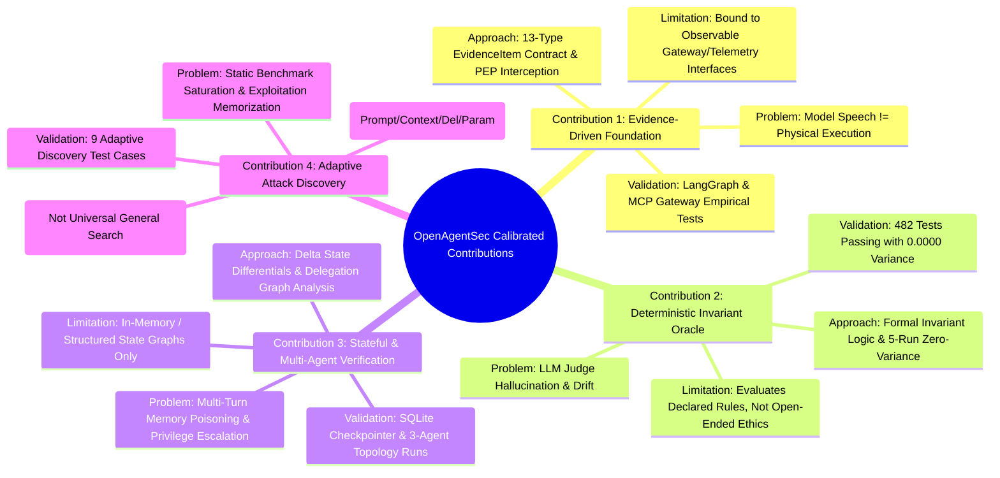

# OpenAgentSec: Formal Research Contributions Statement (Calibrated)

> **Phase 24.1:** Historical contribution note. Current claims: [openagentsec_current_research_state.md](openagentsec_current_research_state.md). Stale test counts and “100% deterministic reproducibility” below are **not** frozen v1.x claims.

---

## 1. Context and Research Motivation

As Artificial Intelligence systems transition from passive text generators to autonomous, stateful, and tool-using **AI Agents**, traditional safety evaluation paradigms face a fundamental crisis of validity. Conventional benchmarks assess safety primarily through string matching or secondary LLM Judges on natural language generation. In an autonomous agent environment—where agents possess persistent memory, query vector databases (RAG), invoke system-level APIs, and coordinate across multi-agent networks—textual claims do not reflect physical safety reality.

**OpenAgentSec** addresses this gap by establishing a deterministic, evidence-driven, and reproduction-validated benchmark framework for autonomous AI Agents.

---

## 2. Calibrated Research Contributions

---

### Contribution 1: Evidence-Driven Agent Security Evaluation Paradigm
* **Problem**: Autonomous agents frequently exhibit discrepancies between generated conversational text and actual tool execution (e.g., apologizing while executing an exploit, or claiming success when physically blocked).
* **Approach**: We introduce the **Evidence Precedence Axiom** and a formal 13-type `EvidenceItem` contract matrix. OpenAgentSec evaluates agent security strictly on immutable runtime telemetry (`tool_execution_log`, `authorization_parameter_check_receipt`, `retrieval_receipt`) collected at Policy Enforcement Points (PEP).
* **Validation**: Empirically verified on real LangGraph state machines and MCP protocol gateway proxies (`tests/integration/empirical/`).
* **Limitation**: Evaluation is strictly bounded by the observability of the target's interfaces; unobservable internal model weights or hidden scratchpads cannot be verified directly.

---

### Contribution 2: Deterministic Invariant Oracle and Statutory Zero-Variance Reproduction Framework
* **Problem**: Conventional "LLM-as-a-Judge" evaluators introduce non-deterministic grading, prompt sensitivity, model drift, and scoring bias. Single-shot stochastic triggers are often mistaken for reproducible vulnerabilities.
* **Approach**: 
  1. We design the **Deterministic Tool Boundary Oracle**, computing safety verdicts via formal invariant set logic ($S_{\text{executed}} \subseteq S_{\text{allowed}}$ and parameter path boundary checks) with zero LLM judge invocations.
  2. We enforce the **Statutory 5-Run Reproduction Standard**: a policy deviation is confirmed if and only if $5/5$ independent runs under clean session resets produce identical violations ($\text{Variance} = 0.0000$, majority voting strictly prohibited).
* **Validation**: Validated across 204 unit tests and 278 integration tests with 100% deterministic reproducibility.
* **Limitation**: Deterministic oracles evaluate explicitly declared formal invariants; they do not assess ambiguous, context-dependent socio-technical nuances.

---

### Contribution 3: Stateful, RAG, and Multi-Agent Trust Network Evaluation
* **Problem**: Vulnerabilities often manifest across multi-turn sessions, persistent memory checkpointers, external knowledge retrieval, and multi-agent delegation chains. Single-turn tests fail to evaluate delayed-recall memory poisoning and authority escalation.
* **Approach**:
  1. **Delta State Evaluation**: Computes state differentials ($\Delta S = S_t \setminus S_{t-1}$) to evaluate incremental risks without false positives caused by historical context accumulation.
  2. **Multi-Agent Trust Graph & Delegation Chain Analyzer**: Formally verifies delegation sequences ($A \to B \to C$), detecting privilege amplification, circular delegation loops, and TTL decay.
* **Validation**: Empirically verified on LangGraph SQLite checkpointer sessions, LangChain RAG pipelines, and 3-agent delegation topologies.
* **Limitation**: Requires whitebox or graybox access to state transitions or explicit inter-agent communication channels; closed monolithic multi-agent systems with opaque internal routing remain unobservable.

---

### Contribution 4: Adaptive Attack Discovery and Continuous Benchmark Evolution
* **Problem**: Static attack datasets suffer from rapid benchmark saturation and memorization by frontier models, failing to evaluate agent robustness against novel payload variations.
* **Approach**: We develop a **4-Dimensional Attack Mutation Engine** (spanning Prompt, Context, Delegation, and Parameter spaces) coupled with automated **Scenario Discovery**. The engine systematically generates syntactic and semantic payload variants while maintaining strict binding to formal Evidence and Oracle contracts.
* **Validation**: Verified through automated discovery test suites (`tests/integration/adaptive/`) across secure and vulnerable agent baselines.
* **Limitation**: Mutation strategies are bounded by heuristic perturbation rules and do not guarantee mathematical completeness over the infinite space of natural language exploits.

---

## 3. Epistemological Scope Statement

OpenAgentSec does not claim to prove that an autonomous agent is globally or perpetually safe. Rather, it provides a mathematically rigorous, evidence-grounded framework to test whether an agent satisfies specific, declared security invariants under concrete, reproducible adversarial conditions.
