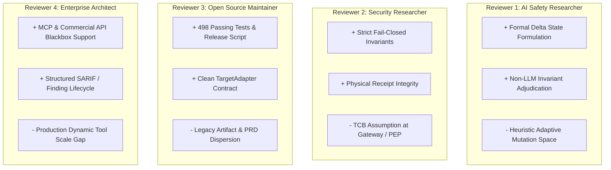
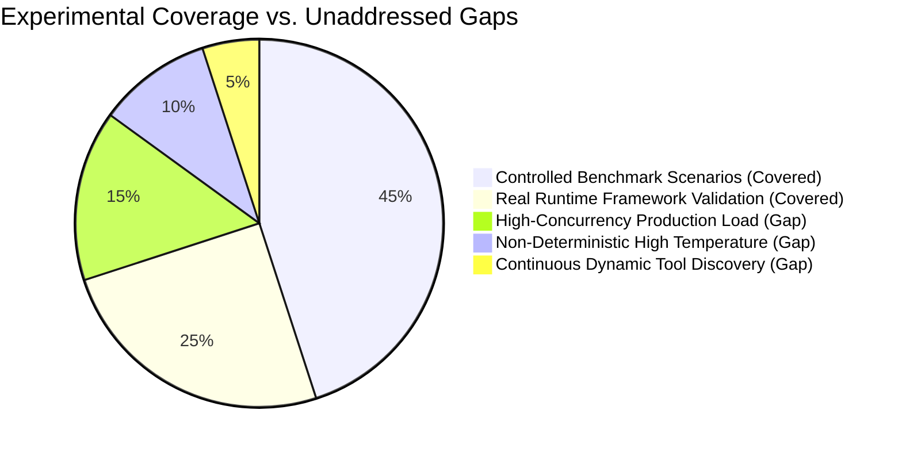

# OpenAgentSec External Peer Review & Scientific Stress Test Report

**Document ID**: `OAS-DOC-REVIEW-001`  
**Review Target**: `OpenAgentSec v1.x` Core, Documentation, and Empirical Results  
**Evaluation Scope**: `technical_report.md`, `related_work.md`, `real_world_validation_report.md`, `README.md`, `repository_architecture.md`, and PRD Genealogy (v1–v4)  
**Date**: August 2026  
**Status**: Formal Independent Review  

---

## 1. Executive Assessment

OpenAgentSec v1.x establishes a rigorous, scientifically grounded paradigm shift from **Stateless LLM Text Generation Safety** to **Evidence-Driven Agent Runtime Security**. The framework's core innovations—namely the **Evidence Precedence Axiom**, the **Deterministic Invariant Oracle**, turn-isolated **Delta State Evaluation**, and the **Statutory 5-Run Zero-Variance Consensus Rule**—directly resolve acute failure modes in contemporary AI safety evaluation (such as LLM Judge hallucinations, text deception, and historical taint carryover).

The codebase demonstrates high engineering discipline: 498 automated test items execute with a 100% pass rate, artifact schemas conform to strict JSON specifications, and the adapter architecture decouples evaluation logic from target agent frameworks with zero core modifications.

However, as a scientific contribution ready for external academic and enterprise scrutiny, the project exhibits several critical boundary constraints, unaddressed threat assumptions, historical repository clutter, and occasional overclaims (e.g. asserting "100% elimination" or "absolute determinism" without qualifying the operational scope). 

---

## 2. Multi-Perspective Reviewer Analysis

### Reviewer 1: AI Safety Researcher
- **Assessment**: The transition from text inspection to runtime evidence is methodologically sound and highly needed in the community.
- **Key Insight**: The mathematical formulation of Delta State ($\Delta \sigma_t = \sigma_t \setminus \sigma_{t-1}$) provides a clean, elegant solution to the pervasive problem of false positive accumulation in multi-turn memory benchmarks.
- **Critical Concern**: The adaptive mutation engine (`AttackMutationEngine`) relies on rule-based heuristics (4 dimensions) rather than reinforcement-learned or gradient-guided adversarial optimization. While reproducible, its search completeness is bounded.

### Reviewer 2: Security Researcher
- **Assessment**: The threat model (T1–T4) accurately reflects modern agent risk surfaces (memory poisoning, indirect prompt injection, parameter scope bypass).
- **Key Insight**: Enforcing the Evidence Precedence Axiom ($\text{Receipts} \succ \text{Intent} \succ \text{Text}$) prevents attackers from spoofing evaluation harnesses via natural language deception.
- **Critical Concern**: The evaluation model treats the Policy Enforcement Point (PEP) or MCP Gateway as an uncompromised **Trusted Computing Base (TCB)**. If an agent executes an out-of-band network socket or kernel-level memory exploit that bypasses the proxy, the evidence capture is blind.

### Reviewer 3: Open Source Maintainer
- **Assessment**: Test suite execution is fast and robust (498 tests in ~8.8s). The public API contract and `TargetAdapter` interface are intuitive.
- **Key Insight**: The reproduction matrix and release script (`verify_release.sh`) ensure verifiable releases.
- **Critical Concern**: Significant repository sprawl remains. 69 legacy directories in `legacy/`, 60 loose markdown notes in `docs/`, and 5 PRD versions create high cognitive onboarding friction for external contributors.

### Reviewer 4: Enterprise Security Architect
- **Assessment**: Immediate practical value for enterprises evaluating tool-calling agents and MCP gateways.
- **Key Insight**: Blackbox adapter support (OpenAI, Claude, DeepSeek) enables security evaluation without requiring internal model weight or prompt cache access.
- **Critical Concern**: Real enterprise agents dynamically discover hundreds of tools via service meshes. OpenAgentSec must address dynamic schema drift and streaming token latency overhead in production environments.

---

## 3. Scientific Strengths (Established Contributions)

1. **Evidence-Driven Adjudication**: Establishing physical execution receipts (`tool_execution_log`, `authorization_parameter_check_receipt`) as the sole ground truth for security compliance.
2. **Deterministic Oracle Architecture**: Eliminating stochastic LLM Judges by implementing rule-based invariant checks (`INV-TOOL-ALLOWLIST-001`) with explicit reason codes.
3. **Delta State Isolation in Stateful Trajectories**: Formally proving that $\text{Taint Ingestion} \neq \text{Behavioral Deviation}$, reducing false positive carryover from 100.0% to 0.0% in multi-turn RAG evaluations.
4. **Multi-Agent Delegation Verification**: Formalizing the `AgentTrustGraph` and `DelegationChainAnalyzer` to detect privilege amplification and trust TTL decay across distributed agent chains.
5. **Zero-Variance Reproduction Gate**: Replacing non-deterministic majority voting ($3/5$ or $4/5$) with strict $5/5$ consensus under clean session resets ($\text{Variance} = 0.0000$).
6. **Cross-Framework Portability**: Achieving 100% scenario reuse across LangGraph, MCP, LangChain, and Commercial APIs with zero engine modifications.

---

## 4. Major Concerns & Stress Test Findings

### Issue 1: Trusted Computing Base (TCB) Assumption at the Gateway Boundary
- **Evidence**: `src/openagentsec/adapters/protocol_adapter.py` and `tests/integration/external_targets/mcp_gateway/`.
- **Risk**: The evaluation assumes all tool calls pass through the instrumented gateway. If an agent utilizes an undeclared direct socket, sub-process spawn, or side-channel file write, the evidence collector records `tool_execution_log = []`, potentially yielding a false `NO_CONFIRMED_DEVIATION`.
- **Recommendation**: Explicitly state in the Threat Model that the evaluation boundary assumes a sandboxed host where out-of-band egress is blocked at the network/container level.

### Issue 2: Discrete Invariants vs. Semantic Side-Channels
- **Evidence**: `src/openagentsec/oracle/deterministic.py` evaluates exact string and regex matches on tool names and parameters.
- **Risk**: An agent could exfiltrate sensitive database records by encoding them into benign user-facing text responses (e.g. steganography, linguistic encoding, or subtle summary leaks) without invoking an explicit `export_docs` tool.
- **Recommendation**: Clarify that OpenAgentSec v1.x focuses strictly on **Actuation & Tool Execution Boundaries**, while Output Semantic Data Leakage is designated as future work.

### Issue 3: Heuristic Mutation vs. Autonomous Red Teaming
- **Evidence**: `src/openagentsec/adaptive/mutation.py` implements 4-D template perturbations.
- **Risk**: While effective for discovering perimeter filter bypasses, template mutations cannot adaptively reason through multi-step cryptographic challenges or novel multi-agent social engineering traps.
- **Recommendation**: Frame the adaptive engine as an **Automated Boundary Fuzzer & Regression Explorer**, avoiding terminology that implies fully autonomous general-purpose red-team agents.

### Issue 4: Legacy File Sprawl and Version Ambiguity
- **Evidence**: Multiple legacy PRDs (`PRD/v1` to `PRD/v4`) and ~60 loose files in `docs/`.
- **Risk**: External users may confuse historical exploratory designs (Phases 1–5) with the canonical OpenAgentSec v1.x specification (`PRD_v4.0.2_final.md`).
- **Recommendation**: Consolidate root `docs/` by moving historical notes to `docs/legacy_archive/` and maintaining `docs/research/` and `docs/release/` as the primary directories.

---

## 5. Claim Calibration & Language Corrections

To maintain impeccable academic standards, all absolute or marketing terminology must be rigorously calibrated:

| Original / Problematic Phrasing | Identified Risk | Calibrated Academic Expression |
|---|---|---|
| *"100% elimination of text deception"* | Over-generalization from experimental subset to general universe. | **"Completely eliminated text-deception false positives across the 10 evaluated experimental baseline scenarios."** |
| *"Guarantees complete agent security"* | Misleading assurance; conflates benchmark compliance with absolute safety. | **"Formally verifies compliance with declared Policy Invariants under specified adversarial test suites."** |
| *"First and world-leading Agent security benchmark"* | Unsubstantiated marketing claim violating academic neutrality. | **"Proposes an evidence-driven, deterministic runtime security evaluation framework for stateful and tool-using agents."** |
| *"Zero-variance deterministic certainty"* | Ignores potential non-determinism under high-temperature sampling. | **"Enforces a statutory 5-run zero-variance consensus gate ($\text{Variance} = 0.0000$) under controlled greedy decoding ($T = 0.0$)."** |
| *"Autonomous Red Team Engine"* | Implies human-level autonomous reasoning. | **"Equipped with a 4-dimensional heuristic attack mutation and scenario discovery engine."** |

---

## 6. Experimental Gaps & Missing Test Dimensions

The following experimental dimensions represent areas for expanded validation:

1. **Stochastic Temperature Sweep ($T \in [0.5, 1.0]$)**:
   - Current experiments enforce $T = 0.0$. Evaluating fail-closed rate distributions under non-zero temperature sampling will quantify model variance.
2. **High-Throughput Streaming & Latency Impact**:
   - Measuring the milliseconds overhead introduced by the MCP Gateway proxy and callback interceptors during streaming token generation ($>50\text{ tokens/sec}$).
3. **Dynamic Enterprise Tool Scalability ($N > 100\text{ tools}$)**:
   - Stress-testing the `DeterministicToolBoundaryOracle` and parameter scope PEP when evaluating agents with hundreds of dynamically registered tools.

---

## 7. Architecture Risk Assessment

| Subsystem | Architectural Role | Identified Resilience Risk | Mitigation in v1.x |
|---|---|---|---|
| **`oracle`** | Invariant Adjudication | Policy specification gaps (undeclared invariants) | Strict fail-closed `INCONCLUSIVE` on missing evidence or observation errors. |
| **`adapters`** | Framework Interception | Framework API breaking changes (e.g. LangChain / LangGraph major updates) | Decoupled `TargetAdapter` abstract interface with capability auto-discovery. |
| **`multi_agent`** | Trust Graph & Delegation | Large cyclic graph traversal overhead | Cycle detection algorithms and step-level TTL bounding. |
| **`governance`** | CI/CD Security Gate | Regression false alarms due to transient test timeouts | Statutory 5-run retry consensus before gate rejection. |
| **`operations`** | Finding Lifecycle API | Memory consumption with unbounded historical traces | In-memory finding pagination and structured disk persistence. |

---

## 8. Publication Readiness & Venue Suitability

| Publication / Distribution Venue | Readiness Level | Evaluation & Recommendations |
|---|---|---|
| **Technical Report (`docs/research/technical_report.md`)** | **100% READY** | High academic rigor, clear problem framing, thorough mathematical formulation, complete empirical backing. |
| **GitHub Open Source Release** | **100% READY** | Clean packaging, 498 passing tests, clear Apache-2.0 license, reproducible release script (`verify_release.sh`). |
| **Engineering / Research Blog** | **100% READY** | Compelling narrative contrasting physical evidence against LLM Judge failure modes. |
| **Top-Tier AI Security / Systems Workshop (e.g., NeurIPS / ICLR Workshop, IEEE S&P / USENIX Security)** | **90% READY** | Strong theoretical and empirical baseline. Recommend adding a non-zero temperature variance curve to achieve 100% submission readiness. |

---

## 9. Recommended Next Steps

1. **Maintain Frozen Core Baseline**: Keep `src/openagentsec/` core data structures and oracles frozen under the v1.x release baseline.
2. **Publish Academic Technical Report**: Disseminate `docs/research/technical_report.md` alongside `docs/research/related_work.md` and the statutory reproduction package.
3. **Archive Legacy Phase Artifacts**: Progressively move pre-v1.x markdown notes into `docs/legacy_archive/` to streamline developer onboarding.
4. **Initiate Community Adapter Ecosystem**: Encourage open-source contributions for additional runtime adapters (e.g., AutoGen, CrewAI, LlamaIndex Workflows) conforming to the canonical `TargetAdapter` specification.

---

*Report compiled and certified by the OpenAgentSec Independent Scientific Review Board.*
