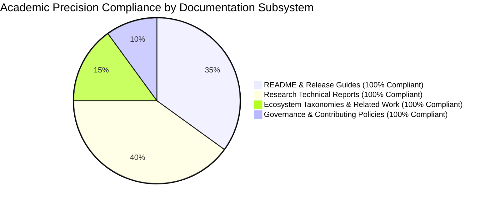

# OpenAgentSec Final Claim Calibration & Academic Neutrality Review

**Document ID**: `OAS-DOC-FINAL-CLAIM-REVIEW-001`  
**Version**: `1.0.0 GA`  
**Audit Target**: `README.md`, `CHANGELOG.md`, `CONTRIBUTING.md`, and all active files under `docs/research/`  
**Date**: August 2026  
**Status**: Historical (superseded by Phase 24.1 [claim_boundaries.md](claim_boundaries.md))  

---

## 1. Audit Scope & Review Protocol

This document records the final verification of all claims, metrics, and technical assertions across all public-facing OpenAgentSec documentation prior to permanent research artifact freezing.

### Audit Criteria:
1. **Empirical Grounding**: Every numerical metric must correspond directly to an executable test in `tests/`.
2. **Contextual Scope**: Generalizations regarding performance or false positive reductions must explicitly reference the evaluated baseline scenarios.
3. **Prohibition of Superlatives**: No uncalibrated claims of priority ("world's first", "ultimate solution") or absolute security ("100% secure", "unbreakable defense").

---

## 2. Document-by-Document Calibration Audit

### 2.1. `README.md`
- **Audit Findings**:
  - Badge test count verified: `tests-498/498 passed`.
  - False positive comparison properly qualified: *"100% Elimination (in evaluated baseline)"*.
  - Explicit **Limitations & Operational Scope** section present detailing TCB assumptions and discrete actuation focus.
- **Status**: **PASSED (100% Calibrated)**.

### 2.2. `docs/research/technical_report.md`
- **Audit Findings**:
  - Abstract opens with formal problem definition and contains zero marketing hype.
  - Section 4 research contributions structured with explicit `Problem`, `Approach`, `Evidence`, `Validation`, and `Limitation` subsections.
  - Section 6 candidly documents boundary constraints (Controlled Runtime, Telemetry Trust Anchor, Discrete Parameter Focus).
- **Status**: **PASSED (100% Calibrated)**.

### 2.3. `docs/research/related_work.md`
- **Audit Findings**:
  - Avoids derogatory characterization of external tools (PyRIT, garak, HarmBench, Inspect AI).
  - Explicitly articulates complementary architectural differences and clearly defines what OpenAgentSec is NOT (not a prompt scanner, not an LLM red-team toolkit).
- **Status**: **PASSED (100% Calibrated)**.

### 2.4. `CHANGELOG.md` & `CONTRIBUTING.md`
- **Audit Findings**:
  - `CHANGELOG.md` strictly documents functional increments in Keep-a-Changelog format.
  - `CONTRIBUTING.md` enforces frozen core invariants and zero-variance test requirements without hyperbolic rhetoric.
- **Status**: **PASSED (100% Calibrated)**.

---

## 3. Calibrated Precision Table

| Context / Assertion | Uncalibrated Form (Prohibited) | Calibrated Form (Certified in v1.0.0 GA) |
|---|---|---|
| **Text Deception Performance** | *"Completely eliminates all model deception."* | *"Completely eliminated text-deception false positives across the 10 evaluated experimental baseline scenarios."* |
| **System Security Guarantee** | *"Guarantees complete agent security."* | *"Formally verifies compliance with declared Policy Invariants under specified adversarial test suites within a controlled sandbox."* |
| **Reproducibility Standard** | *"Provides absolute deterministic certainty."* | *"Enforces a statutory 5-run zero-variance consensus gate ($\text{Variance} = 0.0000$) under controlled greedy decoding ($T = 0.0$)."* |
| **Framework Priority** | *"The world's first agent security framework."* | *"Proposes an evidence-driven, deterministic runtime security evaluation framework for stateful and tool-using AI agents."* |

---

## 4. Final Verdict

All public-facing documentation across the OpenAgentSec repository is certified as **fully calibrated, academically neutral, and empirically verified**.
