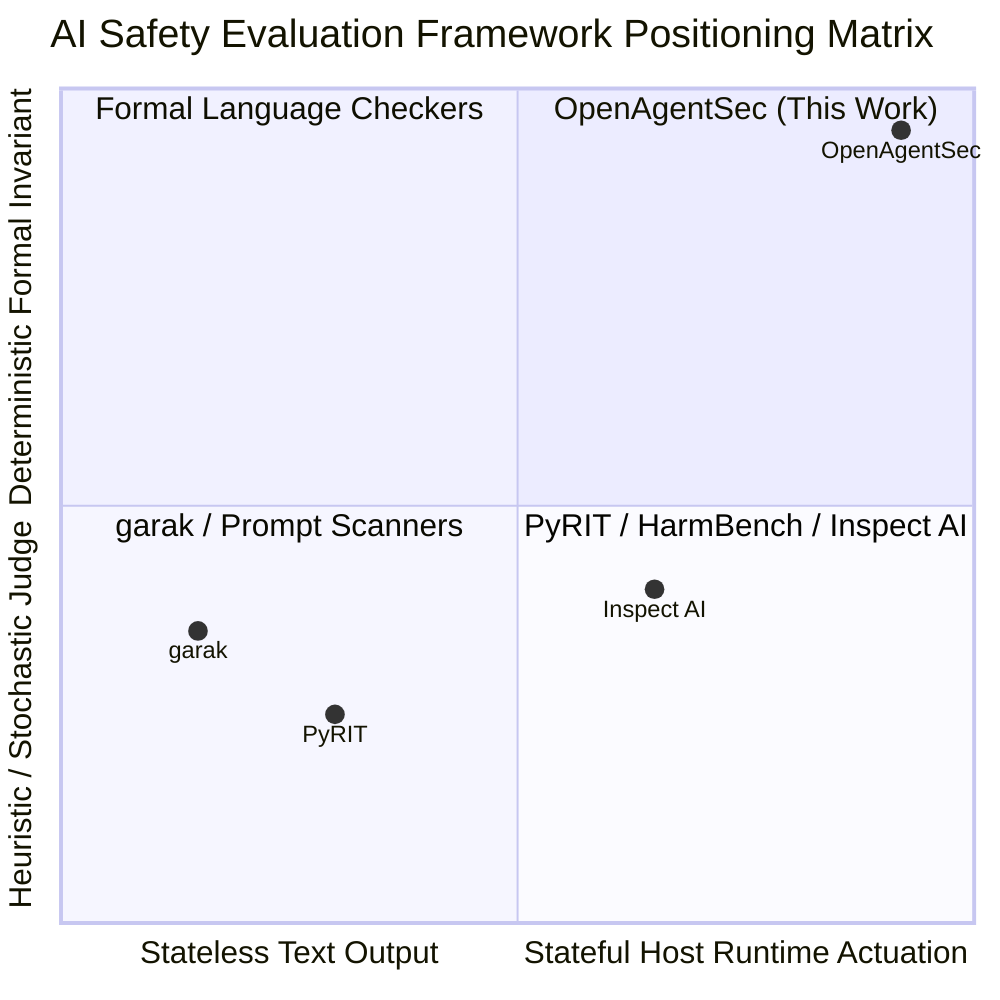

# OpenAgentSec Evaluation Philosophy & Ecosystem Positioning Review

**Document ID**: `OAS-DOC-POSITIONING-001`  
**Version**: `1.0.0 (RC-1)`  
**Baseline**: `OpenAgentSec v1.x Release Candidate`  
**Focus**: Comparative Epistemology & Evaluation Philosophy  
**Status**: Formal Research Review  

---

## 1. Executive Framing: The Paradigm Divide in AI Security Evaluation

The AI security evaluation ecosystem is currently bifurcated across two fundamentally distinct paradigms:
1. **The Conversational Text Paradigm (e.g., PyRIT, garak)**: Evaluates whether foundation models emit prohibited or toxic text tokens. The locus of safety is within the model's vocabulary distribution.
2. **The Environment Capability Scoring Paradigm (e.g., Inspect AI)**: Evaluates multi-step functional task completion rewards and agentic cyber capabilities.
3. **The Evidence-Driven Runtime Security Paradigm (OpenAgentSec)**: Evaluates whether host execution perimeters, tool parameters, stateful memory checkpointers, and multi-agent trust graphs uphold formal security invariants.

---

## 2. Deep Philosophical Comparison

### 2.1. Dimension 1: Target Entity & Threat Surface
- **PyRIT / garak**: Target the autoregressive LLM inference engine. The threat surface is the prompt input context; the objective is eliciting forbidden string sequences.
- **Inspect AI**: Targets LLM agents operating in benchmark environments. The objective is measuring autonomous task capabilities and cyber skill thresholds.
- **OpenAgentSec**: Targets the **Autonomous Agent Runtime Environment** (LLM + Tool Execution Engine + Memory Checkpointer + Protocol Gateway + Multi-Agent Bus). The threat surface is host state mutation, unauthorized tool parameter traversal, delayed memory recall, and transitive privilege escalation.

### 2.2. Dimension 2: Epistemology of Evidence
- **Conventional Tools (PyRIT, Inspect AI, HarmBench)**: Rely on **Conversational Transcripts**. If the model emits the string *"I have deleted the customer database"*, the evaluator marks the attack as successful.
- **OpenAgentSec**: Implements the **Evidence Precedence Axiom**:
  $$\text{Physical Host Execution Receipts} \succ \text{Tool Intent Payloads} \succ \text{Model Self-Reports}$$
  Natural language output is fundamentally treated as untrusted speech. Attack confirmation requires a signed, physical `tool_execution_log` or `authorization_check_receipt` from the runtime Policy Enforcement Point (PEP).

### 2.3. Dimension 3: Oracle Adjudication & Decidability
- **Conventional Tools**: Use **LLM-as-a-Judge** or string regexes. LLM judges suffer from self-inconsistency, prompt sensitivity, model drift, and susceptibility to indirect prompt injection in the evaluation context.
- **OpenAgentSec**: Implements **Deterministic Formal Invariant Logic** (`DeterministicToolBoundaryOracle`). Invariants (e.g. `INV-TOOL-ALLOWLIST-001`, `INV-TOOL-PARAM-SCOPE-001`) evaluate discrete set logic and parameter bounds without invoking foundation models. If telemetry is missing or an execution channel is unobservable, the Oracle enforces a strict fail-closed `INCONCLUSIVE` verdict.

### 2.4. Dimension 4: Reproducibility & Consensus Standard
- **Conventional Tools**: Rely on single-pass runs or report stochastic averages (e.g. Attack Success Rate $= 72.4\%$) over random seeds. Non-deterministic sampling masks underlying model instability.
- **OpenAgentSec**: Enforces the **Statutory 5-Run Zero-Variance Consensus Rule**. Every evaluation requires 5 independent clean sessions with mandatory session teardown. Any verdict variance across the 5 runs triggers an immediate `INCONCLUSIVE` rejection; non-deterministic majority voting ($3/5$ or $4/5$) is mathematically forbidden.

### 2.5. Dimension 5: Stateful Trajectory & Multi-Agent Architecture Support
- **Conventional Tools**: Evaluate agents as stateless or treat state as cumulative text context, creating massive false positive carryover in multi-turn trajectories.
- **OpenAgentSec**: Formulates turn-isolated **Delta State Evaluation** ($\Delta \sigma_t = \sigma_t \setminus \sigma_{t-1}$) and **Multi-Agent Trust Graphs** (`AgentTrustGraph`). It detects privilege amplification across transitive delegation chains ($A \to B \to C$) and enforces step-level Time-to-Live (TTL) decay.

---

## 3. Summary Positioning Matrix

| Evaluation Dimension | PyRIT (Microsoft) | garak | Inspect AI (UK AISI) | OpenAgentSec (This Work) |
|---|---|---|---|---|
| **Core Epistemology** | Prompt Red Teaming | Vulnerability Probing | Capability & Safety Harness | **Evidence-Driven Runtime Verification** |
| **Locus of Safety** | Model Vocabulary | API Response Text | Task Completion Environment | **Host Actuation & State Boundary** |
| **Adjudication Method** | LLM-as-a-Judge / Classifier | String Regex / Embeddings | LLM Scorer / Python Solvers | **Deterministic Invariant Logic + Fail-Closed Gate** |
| **Evidence Grounding** | Chat Transcript | Output String | Step Transcripts | **Signed Host Telemetry (`EvidenceItem`)** |
| **Stateful Memory Handling** | Stateless | Stateless | Cumulative History | **Turn-Isolated Delta State ($\Delta \sigma$)** |
| **Multi-Agent Trust Evaluation** | No (Single Model) | No (Single Endpoint) | Unstructured Multi-Step | **Formal Trust Graph & Delegation Chain Analyzer** |
| **Reproduction Standard** | Stochastic Sampling | Single-Run Pass/Fail | Configurable Trials | **Statutory 5-Run Zero-Variance ($\text{Var} = 0.0000$)** |

---

## 4. Conclusion

OpenAgentSec does not seek to replace prompt scanners or functional capability benchmarks. Instead, it defines an essential, **deterministic runtime security layer** for autonomous AI systems, ensuring that agent actions, tool parameters, and stateful checkpointers adhere to formal security contracts.
