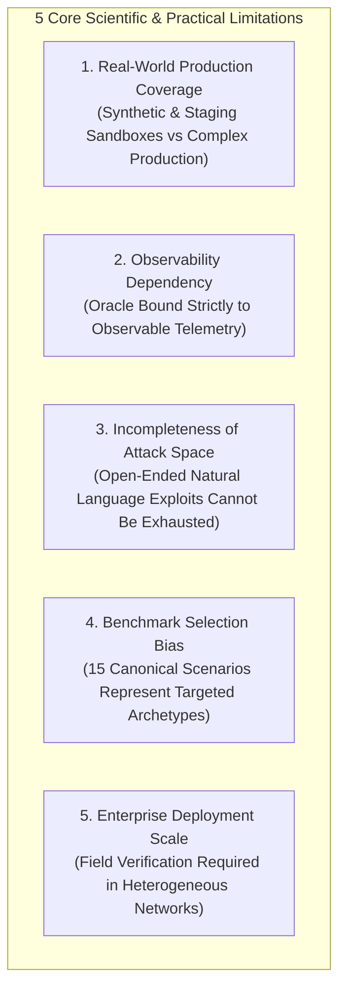

# OpenAgentSec: Comprehensive Scientific & Practical Limitations

**Document ID: OAS-DOC-LIMITATIONS-002**  
**Version: 1.0.0**

> **Phase 24.1:** Current limitations: [openagentsec_current_research_state.md](openagentsec_current_research_state.md) §11.

---

## 1. Overview

In adherence to scientific transparency and rigorous engineering standards, this document details the core boundaries, architectural constraints, and operational limitations of the OpenAgentSec framework v1.0.0.

---

## 2. Detailed Limitations Analysis

### 2.1 Limitation 1: Limited Real-World Production Agent Coverage
* **Current Boundary**: OpenAgentSec has been validated across simulated environments, local sandbox processes, and controlled staging targets (e.g., local LangGraph state machines, standalone MCP Tool Gateways, and isolated REST API calls).
* **Scientific Reality**: Large-scale enterprise production environments exhibit complex asynchronous event streams, distributed microservices, multi-tenant databases, and unpredictable network latencies that are not fully replicated in local sandbox benchmarks.
* **Implication**: Success in OpenAgentSec controlled benchmarks does not guarantee immunity from zero-day operational failures in high-concurrency production deployments.

---

### 2.2 Limitation 2: Oracle Dependency on Observable Telemetry
* **Current Boundary**: The `DeterministicToolBoundaryOracle` adjudicates safety by inspecting declared `EvidenceItem` instances (e.g., `tool_execution_log`, `authorization_parameter_check_receipt`).
* **Scientific Reality**: The oracle is fundamentally bound by the observability of the target:
  - If an agent possesses uninstrumented internal tools or hidden sub-processes that bypass the PEP Gateway, those executions are invisible (`ObservabilityState.UNOBSERVABLE`).
  - Closed-source commercial models (such as GPT-4o or Claude 3.5 Sonnet) do not expose private weights, hidden activations, or internal reasoning traces.
* **Implication**: When required evidence is unobservable, OpenAgentSec fails closed with verdict `INCONCLUSIVE`. It cannot evaluate what it cannot observe.

---

### 2.3 Limitation 3: Non-Exhaustiveness of the Unknown Attack Space
* **Current Boundary**: The Phase 12 `AttackMutationEngine` explores a 4-dimensional mutation space (Prompt, Context, Delegation, and Parameter).
* **Scientific Reality**: The natural language attack surface against Large Language Models is theoretically infinite and undecidable. Heuristic mutation operators and rule-based perturbations explore a structured subset of the attack space but cannot mathematically exhaust all semantic evasion variants.
* **Implication**: Passing an adaptive benchmark run proves robustness against the tested mutation distribution, but does not mathematically prove that no adversarial bypass exists.

---

### 2.4 Limitation 4: Benchmark Selection and Archetype Bias
* **Current Boundary**: OpenAgentSec Benchmark Suite v1.0.0 defines 15 canonical scenarios and 29 formal metrics.
* **Scientific Reality**: While these 15 scenarios cover the primary threat archetypes identified in literature (memory poisoning, indirect prompt injection, parameter path traversal, approval bypass, and trust decay), they represent a curated selection. Domain-specific business logic vulnerabilities (e.g., specialized algorithmic trading flaws, medical diagnosis evasion) require bespoke scenario authoring.
* **Implication**: Benchmark scores represent relative robustness across cataloged archetypes rather than universal domain-specific safety.

---

### 2.5 Limitation 5: Need for Enterprise Field Validation
* **Current Boundary**: OpenAgentSec establishes the framework contracts for CI/CD gates (`SecurityReleaseGate`) and finding lifecycles (`FindingManager`).
* **Scientific Reality**: Continuous integration into live DevSecOps workflows across heterogeneous cloud providers, legacy enterprise IAM systems, and evolving regulatory compliance frameworks requires long-term longitudinal field study.
* **Implication**: Organizational governance policies must be calibrated to specific enterprise risk appetites rather than relying on default threshold baselines.

---

## 3. Summary of Epistemological Position

| False Overclaim | Calibrated Scientific Reality |
|---|---|
| *"OpenAgentSec guarantees 100% Agent security."* | **OpenAgentSec evaluates whether an Agent satisfies declared Policy Invariants under specified adversarial conditions.** |
| *"The deterministic oracle detects all vulnerabilities."* | **The deterministic oracle accurately evaluates observed runtime facts against explicit invariant rules without stochastic judge drift.** |
| *"Adaptive testing uncovers all possible exploits."* | **Adaptive testing systematically generates structured variants to evaluate vulnerability boundaries beyond static prompts.** |
