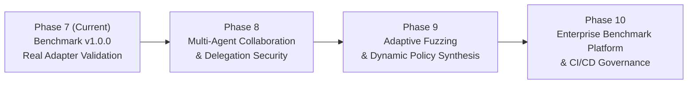

# OpenAgentSec Limitations and Future Work

**Document ID: OAS-DOC-LIMITATIONS-001**  
**Version: 1.0.0**

> **Phase 24.1:** Current limitations and future directions: [openagentsec_current_research_state.md](openagentsec_current_research_state.md) §11 and [future_work.md](future_work.md). Enterprise-platform roadmap language below is not a current research claim.

---

## 1. Boundary & Limitations (局限性与科学边界)

OpenAgentSec v1.0.0 provides a deterministic evaluation foundation for stateful and tool-using AI Agents. In keeping with scientific rigor, we explicitly document the current architectural boundaries and limitations:

1. **Multi-Agent Delegation & Cascading Authority (多 Agent 级联委托)**:
   - *Current Scope*: Evaluates single-agent and adapter-mediated topologies.
   - *Limitation*: Does not yet formalize transitive privilege delegation (A2A), cross-agent identity assertion forging, or sub-agent Byzantine spoofing.
2. **Stochastic Temperature & Behavioral Drift (非零温度随机性漂移)**:
   - *Current Scope*: Evaluates determinism and enforces zero-variance gates across independent runs.
   - *Limitation*: When evaluating commercial models configured with $\text{Temperature} > 0$, behavioral divergence is strictly treated as `INCONCLUSIVE` (fail-closed); probabilistic distribution modeling is left for future work.
3. **Multimodal Side-Channels (多模态与隐蔽侧信道)**:
   - *Current Scope*: Evaluates text and structured JSON-RPC tool parameters.
   - *Limitation*: Does not evaluate visual prompt injections (adversarial image embeddings), audio side-channels, or binary file steganography.
4. **Hidden Internal Model Reasoning (不可见模型私有隐层)**:
   - *Current Scope*: Outer-loop physical receipts and tool boundary interception.
   - *Limitation*: Internal model weights, hidden activation states, and proprietary Chain-of-Thought scratchpads remain unobservable in blackbox evaluations (`ObservabilityState.PARTIALLY_OBSERVABLE`).
5. **Unknown Private Tool APIs (私有未暴露工具接口)**:
   - *Current Scope*: Explicitly registered tools and MCP Gateway routes.
   - *Limitation*: If an agent possesses undocumented internal system tools that bypass the configured proxy gateway, the harness cannot verify physical receipts.

---

## 2. Future Roadmap (演进路线图)

### Phase 8: Multi-Agent Collaboration & Delegation Security
- Model multi-agent communication topologies (Supervisor-Worker, Peer-to-Peer, Hierarchical Swarm).
- Evaluate cascading privilege escalation, transitive identity delegation, and agent-to-agent message poisoning.

### Phase 9: Adaptive Security Testing & Dynamic Guardrail Synthesis
- Introduce autonomous fuzzing operators that mutate parameter payloads and test edge-case traversal patterns.
- Implement automated synthesis of Policy Enforcement Point (PEP) rules from verified attack traces.

### Phase 10: Enterprise Industry Benchmark Platform & CI/CD Governance
- Release full REST/GraphQL Dashboard APIs for automated enterprise agent CI/CD security pipelines.
- Publish open leaderboard and standard compliance reporting suites (ISO/IEC AI Safety, NIST AI RMF).
