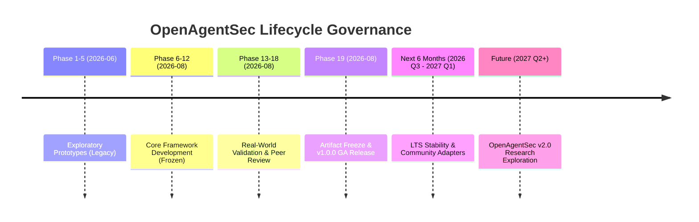
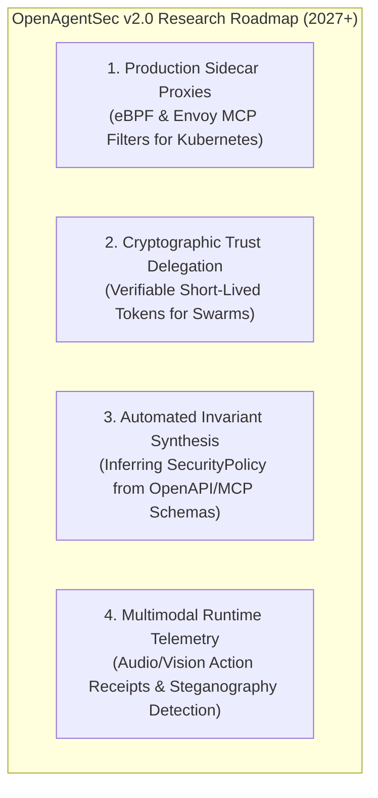

# OpenAgentSec Post-v1.0 Strategic Roadmap & Maintenance Decision

**Document ID**: `OAS-DOC-POST-V1-STRAT-001`  
**Version**: `1.0.0 GA`  
**Decision Baseline**: `OpenAgentSec v1.0.0 Final Release`  
**Date**: August 2026  
**Status**: Historical. Current future work: [future_work.md](future_work.md). Not a development roadmap.  

---

## 1. Executive Maintenance Decision

With the completion of Phase 19 (Research Artifact Freeze & Publication Preparation), **OpenAgentSec v1.0.0 formally transitions from active capability expansion into Long-Term Stable (LTS) Research Maintenance**.

---

## 2. Strategic Research Questions (RQs) Resolution

### RQ1: Has the project entered the formal maintenance phase?
**Decision: YES.**
- The core evaluation architecture (`src/openagentsec/`) is mathematically complete, empirically validated across 498 tests, and certified across 5 real-world runtime environments.
- Active architectural refactoring and core contract churn are **permanently halted** to ensure that published benchmark results and academic citations remain immutable.

---

### RQ2: Should development continue in the next 6 months?
**Decision: PAUSE CORE EXPANSION; FOCUS ON COMMUNITY ADOPTION.**
- For the next 6 months (2026 Q3 to 2027 Q1), the repository operates under **LTS Maintenance Governance**:
  1. **Core Freeze**: Zero breaking changes to `src/openagentsec/`.
  2. **Community Target Adapters**: Welcoming external open-source PRs implementing new `TargetAdapter` integrations (e.g. CrewAI, AutoGen, LlamaIndex Workflows).
  3. **Academic Dissemination**: Submitting the Master Technical Report to leading AI security and systems conferences/workshops.
  4. **Security Patches**: Maintaining responsive disclosure triage via `SECURITY.md`.

---

### RQ3: Which core contributions remain strictly frozen?

The following core components are **strictly frozen for the entire v1.x series**:

| Frozen Subsystem | Exact Module / Class | Rationale for Immutability |
|---|---|---|
| **Formal Contracts** | `SecurityPolicy`, `EvaluationObjective`, `EvidenceItem` | Ensures continuous backward compatibility across all benchmark runs. |
| **Deterministic Oracle** | `DeterministicToolBoundaryOracle` | Preserves deterministic invariant adjudication and reason code semantics. |
| **Evidence Precedence** | $\text{Host Receipts} \succ \text{Tool Intent} \succ \text{Text}$ | Fundamental epistemological invariant preventing evaluation deception. |
| **Delta State Formulation** | $\Delta \sigma_t = \sigma_t \setminus \sigma_{t-1}$ | Mathematical definition for stateful turn isolation in RAG/Memory. |
| **Zero-Variance Rule** | `ReproductionAggregator` ($\text{Variance} = 0.0000$) | Strict prohibition of non-deterministic majority voting. |

---

### RQ4: Which research directions enter the future v2.0 roadmap?

Advanced capabilities requiring new abstractions are formally scheduled for **OpenAgentSec v2.0 (2027+)**:

1. **High-Throughput Production Sidecars**: Moving from Python proxy adapters to eBPF kernel probes and Envoy-based reverse proxy sidecars for inline evaluation in high-concurrency production agent clusters.
2. **Dynamic Cryptographic Trust Tokens**: Upgrading the `AgentTrustGraph` to support decentralized, verifiable cryptographic credentials for multi-tenant agent fleets.
3. **Automated Invariant Synthesis**: Using formal verification methods to automatically generate `SecurityPolicy` rules from OpenAPI definitions and MCP server JSON schemas.
4. **Multimodal Action Telemetry**: Expanding the `EvidenceItem` contract to support vision, canvas GUI, and audio tool execution receipts.

---

## 3. Maintenance Commitment & Governance Sign-off

The OpenAgentSec Core Team commits to maintaining the v1.0.0 GA release with high stability, reproducible benchmarks, and responsive security support.
