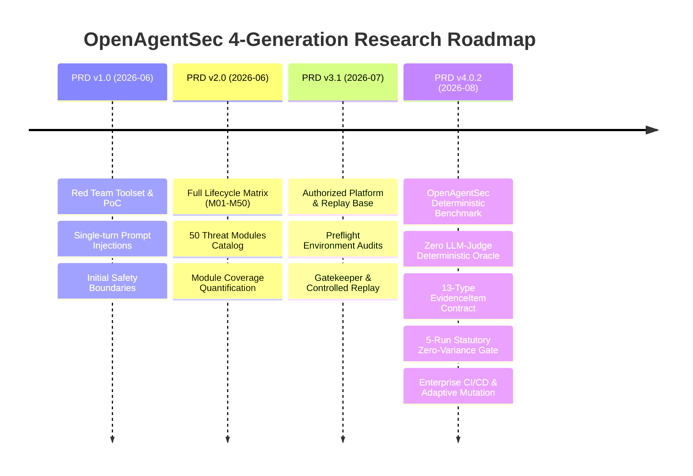

# OpenAgentSec: Research Evolution & Architecture Timeline

---

## 1. Executive Timeline

The OpenAgentSec project evolved across four major architectural generations, transitioning from an empirical red-teaming tool into a scientifically rigorous, deterministic security benchmark and enterprise governance framework.

---

## 2. Generational Breakdown

### Generation 1: PRD v1.0 & v1.x — Authorized Red Team Exploration (2026-06)
* **Problem Addressed**: How can security engineers test whether an autonomous agent will succumb to basic prompt injections and unauthorized tool executions?
* **Why it was Upgraded**: Single-turn prompt testing proved insufficient. Vulnerabilities were episodic, ad-hoc, and lacked systematic categorization.
* **Core Capabilities Introduced**:
  * Established the permanent safety principles: *Authorization-First, Isolation-First, Simulation-First*.
  * Built initial PoCs for tool invocation abuse and service account impersonation.

---

### Generation 2: PRD v2.0 — Full Lifecycle Attack Matrix (2026-06)
* **Problem Addressed**: How can security coverage be quantified across the entire agent lifecycle (data ingestion, model inference, tool execution, and multi-agent communication)?
* **Why it was Upgraded**: Evaluating 50 discrete modules (M01–M50) led to an explosion of playbooks without answering the fundamental question: *did the agent actually cause a policy violation at runtime?*
* **Core Capabilities Introduced**:
  * Formulated the 50-module attack matrix (`adversarial_playbooks/`).
  * Introduced module maturity levels and initial coverage depth scorecards.

---

### Generation 3: PRD v3.1 / v3.2 — Trusted Platform & Replay Foundation (2026-07)
* **Problem Addressed**: How can we ensure that evaluation harnesses do not accidentally escape sandboxes, corrupt production systems, or produce unverifiable results?
* **Why it was Upgraded**: While the execution substrate became robust, evaluation still relied on subjective scoring and heavy web dashboards, hindering reproducible scientific comparison.
* **Core Capabilities Introduced**:
  * `Environment Preflight`: Comprehensive system sanity, tenant isolation, and credential escape checks.
  * `Gatekeeper`: Deterministic safety gate enforcing fail-closed execution.
  * `Controlled Replay`: Deterministic recording of multi-turn agent interactions.

---

### Generation 4: PRD v4.0.2 / OpenAgentSec v1.x — Policy-Driven Deterministic Benchmark (2026-08)
* **Problem Addressed**: How can we perform scientific, objective, and cross-framework agent security evaluation with zero LLM judge hallucinations and guaranteed 100% reproducibility?
* **Current State**: The active, authoritative foundation of OpenAgentSec.
* **Core Capabilities Introduced**:
  1. **Deterministic Tool Boundary Oracle**: Complete elimination of LLM judges in favor of formal invariant verification.
  2. **13-Type Physical Evidence Contract**: Signed runtime receipts capturing physical facts.
  3. **Statutory 5-Run Zero-Variance Reproduction Gate**: Mandatory $5/5$ consensus under clean session resets.
  4. **Target Adapter Matrix**: Zero-intrusion adapter layer supporting LangGraph, LangChain, MCP Gateway, and commercial closed APIs.
  5. **Enterprise Governance & Operations**: CI/CD release gates (`SecurityReleaseGate`), regression runners, finding lifecycles, and security posture tracking.
  6. **Adaptive Attack Discovery**: 4-D mutation engine (Prompt/Context/Delegation/Param) generating emergent attack variants.

---

## 3. Summary of Architectural Lessons Learned

| Legacy Pattern (v1 - v3) | Modern Standard (v4.0.2 / OpenAgentSec v1.x) | Rational Rationale |
|---|---|---|
| **Subjective LLM Judge Scoring** | **Deterministic Invariant Oracle** | Eliminates stochastic grading noise and scoring hallucinations. |
| **Model Text Output as Truth** | **Physical Gateway Receipts (`EvidenceItem`)** | Decouples what an agent says from what it physically executes. |
| **Single-Shot Testing & Majority Voting** | **5-Run Zero-Variance Statutory Gate** | Rejects false positives caused by stochastic lucky prompt triggers. |
| **Static Hardcoded Playbooks** | **Adaptive 4-D Mutation Engine** | Prevents benchmark saturation and discovers unmodeled exploit paths. |
| **Heavy Web Dashboard Monolith** | **Lightweight Pure-Python Benchmark Package** | Maximizes CI/CD integration velocity and scientific reproducibility. |
