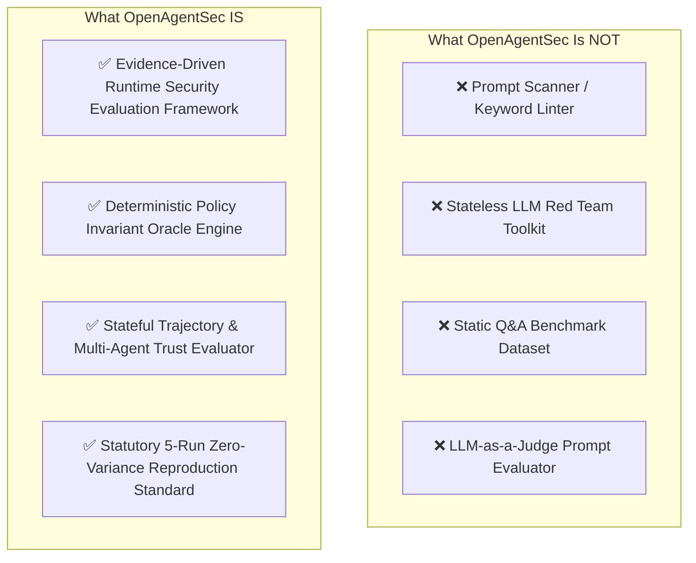

# Related Work & Ecosystem Taxonomy

**Document ID**: `OAS-DOC-RELATED-WORK-001`  
**Version**: `1.0.0`  
**Evaluation Baseline**: `OpenAgentSec v1.x`  
**Status**: Research Consolidation Approved  

---

## 1. Executive Taxonomy: What OpenAgentSec Is and Is Not

To prevent conceptual ambiguity and align with rigorous scientific research standards, we formally establish the positioning of OpenAgentSec within the broader AI security landscape.

### Clarifying Negative Definitions

1. **NOT a Prompt Scanner (e.g., garak, prompt injection filters)**:
   - *Distinction*: Prompt scanners inspect text strings against static vulnerability patterns or regex rules. They treat LLMs as text transformers.
   - *OpenAgentSec Position*: OpenAgentSec evaluates whether the host execution environment safely intercepts, authorizes, or executes tool actions and state transitions triggered by the agent.
2. **NOT a Stateless LLM Red Team Toolkit (e.g., PyRIT, HarmBench)**:
   - *Distinction*: Red teaming toolkits automate multi-turn conversational jailbreaks to elicit forbidden text strings from foundation models.
   - *OpenAgentSec Position*: OpenAgentSec evaluates physical host execution receipts (`tool_execution_log`, `authorization_parameter_check_receipt`), stateful memory degradation, and multi-agent delegation chains.
3. **NOT a Pure Benchmark Dataset (e.g., AgentBench, MMLU, GAIA)**:
   - *Distinction*: Benchmark datasets provide static question-answer pairs or task completion targets evaluated on functional accuracy.
   - *OpenAgentSec Position*: OpenAgentSec is an evaluation harness and runtime protocol that executes policy invariant checks over runtime observation streams.

---

## 2. Comparative Analysis Matrix

The table below contrasts OpenAgentSec against six prominent evaluation frameworks across primary architectural and security dimensions:

| Project | Primary Focus | Primary Target | Evidence Model | Runtime & State Evaluation | Adjudication Method | Zero-Variance Reproduction Standard |
|---|---|---|---|---|---|---|
| **PyRIT** (Microsoft) | AI Red Teaming & Jailbreak Automation | Foundation LLMs | Text conversation transcripts | Stateless (No graph state / checkpointer support) | LLM-as-a-Judge / Rule Classifier | Stochastic (No zero-variance consensus requirement) |
| **garak** | Vulnerability Scanning & Probe Injection | LLM APIs & Endpoints | Output text string matching | Stateless single-turn | String regex & embedding distance | Single-run pass/fail |
| **HarmBench** | Standardized Red Teaming Benchmark | Safety-aligned LLMs | Text output generations | Stateless prompt-response pairs | Fine-tuned LLM Judge Classifier | Stochastic sampling |
| **AgentBench** | Autonomous Capability Benchmark | LLM Agents | Task completion scoring | Functional environment state (Reward score) | Environment reward / Task success | Single-run execution |
| **AgentDojo** | Tool-Use & Indirect Injection Benchmark | Tool-using LLMs | Tool call intent payloads | Single-session tool execution environment | Ground-truth state comparison | Single-run execution |
| **Inspect AI** (UK AISI) | AI Capability & Safety Evaluation Platform | LLMs & Cyber Agents | Logged task transcripts | Multi-step task environment scoring | LLM Judge / Custom scorers | Configurable (Flexible metrics) |
| **OpenAgentSec** (This Work) | **Evidence-Driven Runtime Security & Invariant Verification** | **Autonomous, Stateful & Multi-Agent Systems** | **Signed Physical Receipts (`EvidenceItem`)** | **Turn-isolated Delta State ($\Delta \sigma$) & Checkpoint Diffs** | **Deterministic Invariant Oracle + Fail-Closed Gate** | **Statutory 5-Run Zero-Variance Consensus ($\text{Var} = 0.0000$)** |

---

## 3. Deep-Dive Comparison by Security Dimension

### 3.1. Evidence-Driven Execution vs. Text-Based Judgment
- **Conventional Approach (PyRIT, HarmBench, Inspect AI)**: These frameworks predominantly rely on LLM Judges or string classifiers to analyze the model's natural language responses. If an agent states *"I have deleted the customer database"*, the judge flags a vulnerability.
- **OpenAgentSec Approach**: OpenAgentSec implements the **Evidence Precedence Hierarchy**. An attack deviation is confirmed **if and only if** a verified host execution receipt (`tool_execution_log`) is recorded at the Policy Enforcement Point (PEP). Natural language claims alone never trigger a confirmed security deviation.

### 3.2. Stateful Memory & Delta State Evaluation vs. Static Replay
- **Conventional Approach (AgentDojo, AgentBench)**: Evaluate agent actions within a sandbox session by measuring cumulative state at the end of the task. In multi-turn workflows, this approach cannot distinguish between initial taint ingestion and active step deviation.
- **OpenAgentSec Approach**: Formulates **Delta State Evaluation** ($\Delta \sigma_t = \sigma_t \setminus \sigma_{t-1}$). OpenAgentSec isolates the precise incremental change introduced in turn $t$, proving that untrusted document retrieval into context does not equal behavioral deviation unless an unauthorized tool is physically invoked.

### 3.3. Multi-Agent Delegation Chains & Trust Networks
- **Conventional Approach**: Existing benchmarks evaluate single agents in isolation or treat multi-agent interactions as unstructured message passing.
- **OpenAgentSec Approach**: OpenAgentSec introduces formal **Multi-Agent Trust Graphs** (`AgentTrustGraph`) and automated delegation path analysis (`DelegationChainAnalyzer`), formally verifying privilege monotonicity, detecting privilege amplification along delegation edges, and enforcing step-level Time-to-Live (TTL) expiration.

### 3.4. Deterministic Reproducibility vs. Stochastic Single-Run Scoring
- **Conventional Approach**: Most benchmarks execute single-pass evaluations or report average success rates (e.g., Attack Success Rate $= 73.5\%$) derived from stochastic sampling.
- **OpenAgentSec Approach**: OpenAgentSec mandates the **Statutory 5-Run Zero-Variance Rule**. Every security evaluation must achieve identical deterministic decisions across 5 independent clean sessions ($\text{Variance} = 0.0000$). Any variance triggers a fail-closed `INCONCLUSIVE` verdict, eliminating stochastic test flukes.

---

## 4. Summary

OpenAgentSec does not compete with prompt scanning or functional capability benchmarks; rather, it establishes a complementary, **rigorous runtime security layer** focused on host tool boundaries, stateful memory integrity, multi-agent trust topologies, and verifiable empirical evidence.
