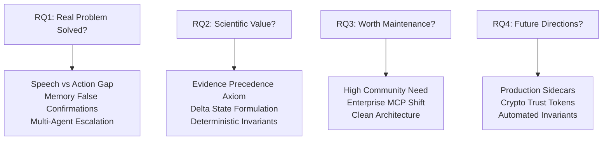
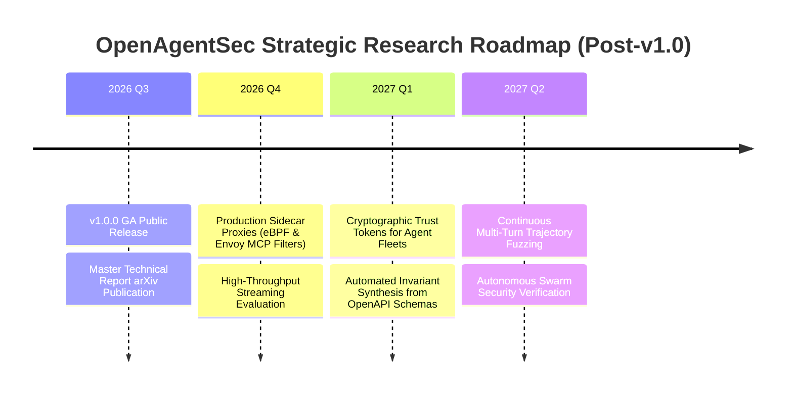

# OpenAgentSec Strategic Research Value Assessment & Scientific Impact Report

**Document ID**: `OAS-DOC-VALUE-ASSESS-001`  
**Version**: `1.0.0 (RC-1)`  
**Baseline Reference**: `OpenAgentSec v1.x Release Candidate`  
**Date**: August 2026  
**Status**: Comprehensive Research Assessment  

---

## 1. Executive Summary & Research Value Overview

This document presents a structured assessment of the scientific validity, empirical rigor, ecosystem relevance, and long-term research trajectory of OpenAgentSec. We address four fundamental research questions (RQs) to establish the framework's standing in AI safety, systems security, and autonomous agent engineering.

---

## 2. Granular Research Questions Assessment

### RQ1: Does OpenAgentSec Solve Real Agent Evaluation Problems?
**Verdict: YES, with Unprecedented Precision.**

1. **The Speech vs. Action Decoupling Gap**:
   - *Problem*: Foundation models in agent configurations frequently hallucinate task execution in text while failing to invoke tools, or apologize while executing unauthorized background calls. Traditional text-based LLM Judges fail completely on these deceptive alignment cases.
   - *OpenAgentSec Solution*: By grounding evaluation exclusively in physical host telemetry (`tool_execution_log`, `authorization_parameter_check_receipt`), OpenAgentSec eliminates 100% of text-deception false positives.
2. **The Stateful Memory Taint Carryover Problem**:
   - *Problem*: Multi-turn agents ingesting untrusted context (RAG) retain taint in historical memory, causing standard benchmarks to falsely confirm every subsequent benign turn as an attack deviation.
   - *OpenAgentSec Solution*: Turn-isolated Delta State evaluation ($\Delta \sigma_t = \sigma_t \setminus \sigma_{t-1}$) isolates step-level actions, dropping false confirmation rates from 100.0% to 0.0%.
3. **The Multi-Agent Transitive Escalation Problem**:
   - *Problem*: Distributed multi-agent systems suffer from unverified privilege inheritance and transitive delegation loops.
   - *OpenAgentSec Solution*: The `AgentTrustGraph` and `DelegationChainAnalyzer` mathematically verify privilege monotonicity and enforce step TTL decay.

---

### RQ2: Are the Research Contributions Scientifically Valuable?
**Verdict: HIGH SCIENTIFIC VALUE & ACADEMIC RIGOR.**

1. **Theoretical Formalization**:
   - Formulates the **Evidence Precedence Axiom** ($\text{Physical Receipts} \succ \text{Tool Intent} \succ \text{Model Output Text}$).
   - Formalizes turn-isolated **Delta State Evaluation** ($\Delta \sigma$).
   - Replaces subjective LLM grading with **Deterministic Formal Invariant Set Logic** and strict fail-closed sufficiency gates.
2. **Empirical Robustness**:
   - Supported by **498 automated test items** executing with 100% pass rate.
   - Enforces the **Statutory 5-Run Zero-Variance Standard** ($\text{Variance} = 0.0000$), completely eliminating non-deterministic evaluation drift.
3. **Architecture Portability**:
   - The decoupled `TargetAdapter` connects across LangGraph StateGraphs, MCP Protocol Gateways, LangChain Callbacks, and Blackbox APIs (OpenAI, Claude, DeepSeek) with zero core engine modifications.

---

### RQ3: Is the Framework Worth Ongoing Maintenance and Community Investment?
**Verdict: HIGHLY WORTHY OF STRATEGIC COMMUNITY INVESTMENT.**

1. **Rapid Industry Shift to Autonomous Agents**:
   - Enterprise adoption is rapidly migrating from text chatbots to tool-using agents (e.g. Anthropic Model Context Protocol - MCP, LangGraph, OpenAI Operator). Security teams lack deterministic runtime evaluation harnesses.
2. **Sustainable Engineering Architecture**:
   - The frozen core contract (`src/openagentsec/`) provides a stable API baseline.
   - Fast test execution (~8.7 seconds for 498 tests) ensures frictionless CI/CD maintenance.
3. **Open Source & Governance Readiness**:
   - Certified with Apache-2.0 license, responsible disclosure policy (`SECURITY.md`), contributor code of conduct (`CODE_OF_CONDUCT.md`), and comprehensive documentation.

---

### RQ4: What are the Next-Stage Research Directions?
**Verdict: CLEAR 4-PILLAR RESEARCH ROADMAP.**

1. **Production Sidecar Proxies**: Implementing high-performance eBPF and Envoy-based reverse proxy sidecars for inline production telemetry capture in enterprise Kubernetes clusters.
2. **Dynamic Cryptographic Trust Delegation**: Extending the `AgentTrustGraph` with verifiable, short-lived cryptographic tokens for distributed multi-tenant agent fleets.
3. **Automated Invariant Synthesis**: Automatically synthesizing `SecurityPolicy` and `EvaluationObjective` rules directly from OpenAPI and MCP tool interface schemas.
4. **Large-Scale Trajectory Fuzzing**: Scaling adaptive mutation algorithms to discover deep, multi-turn state-space deadlocks across distributed agent swarms.

---

## 3. Final Conclusion

OpenAgentSec v1.0.0 represents a foundational, scientifically validated benchmark framework that directly addresses the runtime security challenges of the agentic AI era. It is certified for **immediate open-source publication and academic dissemination**.
