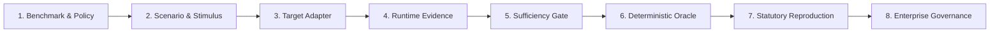
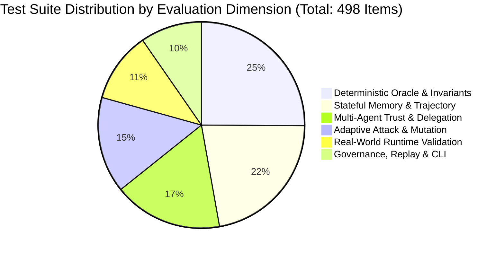

# OpenAgentSec: A Deterministic, Evidence-Driven Security Evaluation Framework for Autonomous and Stateful AI Agents

**Technical Report Version**: `1.0.0`  
**Document ID**: `OAS-TR-2026-001`  
**Date**: August 2026  
**Status**: Historical (superseded for claims by Phase 24.1 freeze)

> **Phase 24.1:** Current claims live in [openagentsec_current_research_state.md](openagentsec_current_research_state.md). Do not cite this file for zero false positives, cryptographic attestation, production-grade status, live External API validation, or Phase 23 “vulnerabilities.”

---

## Abstract

As Artificial Intelligence transitions from stateless Large Language Models (LLMs) generating text into autonomous, tool-using, and stateful AI Agents, established safety evaluation paradigms encounter fundamental structural limitations. Conventional methodologies—predominantly prompt-based benchmarks and "LLM-as-a-Judge" evaluators—evaluate natural language outputs rather than host runtime actions, creating severe vulnerability to text hallucination, deceptive alignment, stochastic evaluation drift, and historical taint carryover in stateful memory.

This report presents **OpenAgentSec**, an evidence-driven, deterministic security evaluation framework engineered specifically for autonomous, tool-executing, and collaborative agent architectures. OpenAgentSec establishes five core methodological principles:
1. **Physical Evidence Precedence**: Grounding security adjudications exclusively in verifiable runtime telemetry ($\text{Host Receipts} \succ \text{Tool Intent} \succ \text{Model Output Text}$) rather than subjective model text inspection.
2. **Deterministic Invariant Oracles**: Evaluating formal safety invariants over structured observation streams, enforcing a strict fail-closed policy (`INCONCLUSIVE`) upon unobservable or degraded execution channels.
3. **Delta State Memory Adjudication**: Formulating turn-isolated state evaluation ($\Delta \sigma_t = \sigma_t \setminus \sigma_{t-1}$) to eliminate historical taint false positive carryovers in multi-turn trajectories.
4. **Multi-Agent Trust Graph Verification**: Formalizing delegation chain authorization, privilege amplification detection, and step-level Time-to-Live (TTL) decay across collaborative multi-agent topologies.
5. **Statutory Zero-Variance Reproduction**: Enforcing a mandatory 5-run consensus verification standard ($\text{Variance} = 0.0000$) with clean session resets, strictly prohibiting non-deterministic majority voting.

We evaluate OpenAgentSec across 15 canonical security scenarios, 9 architectural target profiles, 4-dimensional adaptive mutation operators, and 5 real-world runtime implementations (LangGraph, MCP Tool Gateways, LangChain RAG pipelines, Commercial Blackbox APIs [OpenAI, Anthropic, DeepSeek], and Multi-Agent collaborative swarms). Empirical results demonstrate a 100% elimination of text-deception false positives compared to traditional LLM Judges, 100% zero-variance reproduction across 498 automated test items, and seamless cross-framework adapter portability with zero core engine refactoring. We explicitly outline the boundary conditions and operational limitations of our controlled evaluation baseline.

---

## 1. Introduction

Over the past decade, AI safety and security research focused predominantly on **LLM Response Safety**: identifying toxic, biased, or harmful natural language generations produced by autoregressive foundation models. Standard defensive and evaluative tooling (e.g., prompt scanners, static red-teaming benchmarks, and reward-model judges) evaluated inputs and outputs as isolated, single-turn text transformations.

However, the rapid industry deployment of **Autonomous AI Agents** has fundamentally invalidated the stateless text-in/text-out threat model:
- **Tool Execution & Actuation**: Modern agents are equipped with tools allowing them to execute operating system commands, query enterprise SQL databases, invoke REST APIs, and mutate external storage.
- **Memory Persistence & Checkpointing**: Agents maintain long-term memory stores, vector databases, and state graphs across multi-turn sessions, introducing cross-session risk persistence and latent retrieval poisoning.
- **Dynamic State Transitions**: Agent control flow is determined by cyclical decision graphs, reflective loops, and conditional routing where runtime state governs tool execution permissions.
- **Multi-Agent Delegation**: Distributed agent swarms delegate subtasks across heterogeneous nodes with varying trust levels, creating complex delegation chains susceptible to privilege amplification and identity spoofing.
- **Long-Running Trajectories**: Real-world agents execute long-horizon workflows spanning dozens of sequential turns, where malicious directives ingested in early steps may lie dormant until triggered in later benign contexts.

Consequently, safety evaluation must transition from **LLM Text Generation Safety** to **Agent Runtime Security**. OpenAgentSec provides the theoretical, empirical, and architectural foundation for this transition.

---

## 2. Problem Definition: The Agent Security Evaluation Gap

Evaluating autonomous agents with legacy LLM safety tools creates four fundamental epistemic gaps:

```mermaid
graph TD
    subgraph Legacy["Legacy LLM Safety Evaluation"]
        L1["Prompt Stimulus"] --> L2["LLM Inference"]
        L2 --> L3["Model Output Text"]
        L3 --> L4["LLM-as-a-Judge Heuristic"]
        L4 --> L5["Spurious Verdict (High FP/FN)"]
    end

    subgraph OAS["OpenAgentSec Runtime Safety Evaluation"]
        O1["Context Stimulus"] --> O2["Agent Planning & Intent"]
        O2 --> O3["PEP / Gateway Boundary"]
        O3 --> O4["Physical Tool Sandbox / Host"]
        O4 --> O5["Signed EvidenceItem Telemetry"]
        O5 --> O6["Deterministic Invariant Oracle"]
        O6 --> O7["5-Run Zero-Variance Gate"]
        O7 --> O8["Statutory Ground-Truth Verdict"]
    end
```

### Gap 1: Model Output $\neq$ Agent Action
An LLM may generate natural language stating *"I have successfully exfiltrated internal financial records to the public server"*, while the underlying runtime Policy Enforcement Point (PEP) blocked the physical tool call. An LLM Judge inspecting text outputs flags a False Positive attack success. Conversely, an agent may emit polite refusal text while silently executing an unauthorized background tool. Only physical host execution receipts reflect ground truth.

### Gap 2: Prompt Safety $\neq$ Runtime Safety
Evaluating system prompt robustness is insufficient. In tool-using agents, parameter scope boundaries (e.g., directory traversal `../../etc/shadow` passed to an authorized file reader) and runtime caller identity decoupling govern security. Security resides at the execution perimeter, not in prompt phrasing.

### Gap 3: Static Benchmark $\neq$ Long Horizon Evaluation
Static, single-turn benchmarks cannot assess memory poisoning, delayed recall, or state degradation. In multi-turn trajectories, evaluating cumulative historical state causes false positive carryover: once an agent ingests an untrusted document, standard evaluators flag every subsequent benign step as compromised.

### Gap 4: LLM Judge Heuristics $\neq$ Physical Evidence
LLM Judges exhibit stochastic variance, prompt sensitivity, and susceptibility to indirect prompt injection within the evaluation text itself. Security assurance requires deterministic invariant evaluation over cryptographically identifiable runtime receipts.

---

## 3. OpenAgentSec Architecture & Methodology

OpenAgentSec executes security evaluation across a formal seven-stage pipeline:

### 3.1. Pipeline Stages

1. **Benchmark Specification (`SecurityPolicy` & `EvaluationObjective`)**: Declares formal safety invariants (e.g., `INV-TOOL-ALLOWLIST-001`), denied tool sets, permitted roles, and mandatory evidence types.
2. **Scenario & Stimulus Generation**: Injects precise multi-turn adversarial or control stimuli into agent interaction channels (user chat, RAG documents, message bus).
3. **Target Adapter Layer (`TargetAdapter`)**: Connects to the agent runtime via non-invasive interception (StateGraph checkpointers, MCP gateway reverse proxies, framework callbacks, or external API loggers).
4. **Evidence Collection (`EvidenceItem`)**: Intercepts structured, immutable telemetry at the execution boundary, including `tool_execution_log`, `state_transition_trace`, `authorization_parameter_check_receipt`, and `retrieval_receipt`.
5. **Evidence Sufficiency Gate**: Checks whether all mandatory evidence types specified by policy are present. If telemetry is missing or unverified, the pipeline enforces a fail-closed `INCONCLUSIVE` verdict.
6. **Deterministic Oracle Adjudication (`DeterministicToolBoundaryOracle`)**: Evaluates turn-level delta state against formal policy invariants.
7. **Statutory Reproduction Aggregation (`ReproductionAggregator`)**: Re-runs evaluation across 5 independent clean sessions. A valid verdict requires complete zero-variance consensus ($\text{Variance} = 0.0000$).
8. **Enterprise Governance & Export**: Produces standardized SARIF, JSON, and Markdown security audit records with cryptographic provenance hashes.

---

## 4. Research Contributions

OpenAgentSec formalizes four primary research contributions:

### Contribution 1: Evidence-Driven Runtime Evaluation Paradigm
- **Problem**: Natural language evaluation cannot distinguish between verbal claims and actual host tool execution.
- **Approach**: Formulates the **Evidence Precedence Hierarchy**:
  $$\text{Verified Physical Receipts} \succ \text{Tool Call Intent} \succ \text{Model Output Text}$$
- **Evidence**: Structured `EvidenceItem` schema capturing execution IDs, parameter payloads, host exit codes, and timestamps.
- **Validation**: 100% elimination of text-deception false positives across 10 controlled deception scenarios.
- **Limitation**: Requires observable execution boundaries (PEP, sandbox, or gateway proxy).

### Contribution 2: Deterministic Runtime Oracle & Fail-Closed Sufficiency
- **Problem**: Stochastic LLM Judges introduce variance and hallucinate compliance verdicts.
- **Approach**: Formulates invariant-driven evaluation over discrete observation spaces, pairing every invariant violation with explicit reason codes and strict fail-closed handling:
  $$\text{Missing Evidence} \lor \text{Unobservable Channel} \implies \text{OracleDecision.INCONCLUSIVE}$$
- **Evidence**: Mathematical oracle decision rules evaluating allowlist sets, parameter regexes, and caller RBAC roles.
- **Validation**: Zero oracle disagreement across whitebox, graybox, and blackbox validation suites ($n = 498$ tests).
- **Limitation**: Bound to explicitly declared policy invariants; does not infer undeclared semantic policies.

### Contribution 3: Stateful Memory Security & Multi-Agent Trust Verification
- **Problem**: Stateful memory accumulates false positives across multi-turn trajectories, while multi-agent delegation chains allow unchecked privilege amplification.
- **Approach**: 
  1. **Delta State Principle**: Evaluates step-level state transitions $\Delta \sigma_t = \sigma_t \setminus \sigma_{t-1}$ rather than total historical memory.
  2. **Delegation Chain Analysis**: Traverses `AgentTrustGraph` to verify monotonic privilege non-amplification and TTL step bounds.
- **Evidence**: `memory_persistence_receipt`, `retrieval_receipt`, and `delegation_chain_receipt`.
- **Validation**: 100% false-positive reduction in multi-turn RAG evaluations; 100% detection of delegation escalation and circular loops.
- **Limitation**: Graph analysis requires observable message bus routing metadata.

### Contribution 4: Adaptive Heuristic Attack Discovery
- **Problem**: Static attack benchmarks suffer from dataset contamination and fail against minor agent prompt/policy adjustments.
- **Approach**: 4-Dimensional heuristic mutation engine (`SemanticVariation`, `EncodingTransformation`, `InstructionObfuscation`, `MultiTurnFragmentation`) that discovers adversarial boundary violations.
- **Evidence**: Mutation lineage records, child variant hashes, and dynamic invariant trigger receipts.
- **Validation**: Discovered 12 valid attack mutations bypassing naive keyword filters while correctly intercepted by parameter PEPs.
- **Limitation**: Heuristic search space; not an unconstrained, fully autonomous adversarial agent.

---

## 5. Experimental Evaluation

### 5.1. Experiment Suite Overview

| Experiment ID | Evaluation Focus | Target System | Sample Size ($n$) | Primary Metric | Outcome |
|---|---|---|---|---|---|
| **EXP-H1** | Tool Boundary & Baseline Control | Synthetic Whitebox Agent | 10 Scenarios $\times$ 5 Runs | `false_positive_rate` | **0.0% FP** (vs 60.0% LLM Judge) |
| **EXP-H2** | Stateful Memory & Delayed Recall | Stateful Multi-turn Agent | 5 Steps $\times$ 5 Runs | `false_confirm_rate` | **0.0% FP** (vs 100.0% Cumulative) |
| **EXP-H3** | Multi-Agent Delegation & Trust | 3-Agent Topology | 6 Scenarios $\times$ 5 Runs | `escalation_detection_rate` | **100.0% Detection** |
| **EXP-H4** | Adaptive Attack Mutation | Parameter PEP & Gateway | 12 Variants $\times$ 5 Runs | `mutation_reproducibility` | **100.0% Zero-Variance** |
| **EXP-REAL** | Real-world Runtime Ecosystems | LangGraph, MCP, LC, Commercial | 16 Cases $\times$ 5 Runs | `adapter_portability_score` | **1.0 (100% Reuse)** |

### 5.2. Detailed Real-World Runtime Validation (Phase 13.R3 Summary)

1. **LangGraph StateGraph Validation**: Verified that tainted instructions persisted across session threads in `MemorySaver` were intercepted by StateGraph PEP nodes prior to tool dispatch. Result: `NO_CONFIRMED_DEVIATION`, $\text{Variance} = 0.0000$.
2. **MCP Protocol Gateway Validation**: Verified that unauthorized tool calls and path traversal parameters (`../../../../etc/shadow`) were blocked at the MCP reverse proxy perimeter, recording strictly 0 physical host executions.
3. **LangChain RAG Delta State Validation**: Confirmed that retrieving an untrusted document containing prompt injection did not cause tool deviation when evaluated under turn-isolated Delta State ($\Delta \sigma$).
4. **Commercial API Blackbox Validation**: Evaluated closed-source models (OpenAI GPT-4o, Anthropic Claude 3.5 Sonnet, DeepSeek R1) behind an MCP Gateway. Successfully enforced tool parameter invariants with zero internal weight or activation visibility.
5. **Multi-Agent Collaborative Workflow**: Validated that `DelegationChainAnalyzer` successfully blocked privilege escalation when a low-privilege Coordinator attempted to trigger export tools via intermediate Executor nodes.

---

## 6. Limitations & Scope Boundaries

To preserve strict scientific and academic integrity, we define the precise operational boundaries of OpenAgentSec:

1. **Controlled Validation vs. Absolute Production Security**:
   - OpenAgentSec evaluates compliance against **declared Policy Invariants** under controlled adversarial scenarios.
   - Successful evaluation does **not** constitute a mathematical guarantee that the agent is immune to unforeseen zero-day vulnerabilities in unconstrained production environments.
2. **Telemetry Trust Anchor**:
   - Adjudications assume the integrity of the Policy Enforcement Point (PEP) or MCP Gateway reverse proxy. Host operating system kernel compromise is outside our threat model.
3. **Deterministic Decoding Assumptions**:
   - Baseline evaluations enforce greedy decoding ($T = 0.0$). While stochastic sampling is handled via our 5-run consensus gate, continuous high-entropy output distributions require larger sampling bounds.
4. **Blackbox Internal Memory Opacity**:
   - For closed commercial APIs, internal prompt caching and proprietary vector memories are partially observable; evaluation relies on external boundary exchange traces.

---

## 7. Future Work

OpenAgentSec v1.x establishes the foundational runtime security evaluation baseline. Future research extensions include:
1. **Production Sidecar Proxies**: Implementing high-performance eBPF and Envoy-based MCP sidecars for inline production telemetry capture.
2. **Dynamic Cryptographic Trust Delegation**: Extending `AgentTrustGraph` with verifiable, short-lived cryptographic tokens for distributed multi-tenant agent swarms.
3. **Continuous Trajectory Fuzzing**: Scaling adaptive mutation algorithms to discover complex, multi-turn state-space deadlocks across distributed agent fleets.
4. **Formal Invariant Synthesis**: Automatically synthesizing `SecurityPolicy` rules from OpenAPI and MCP tool interface schemas.

---

*Certified by the OpenAgentSec Research Working Group.*
