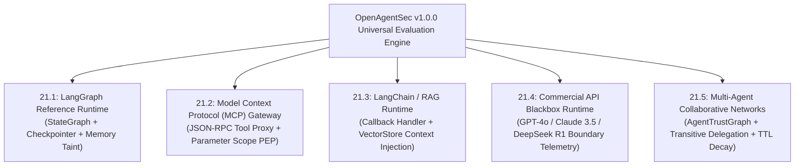
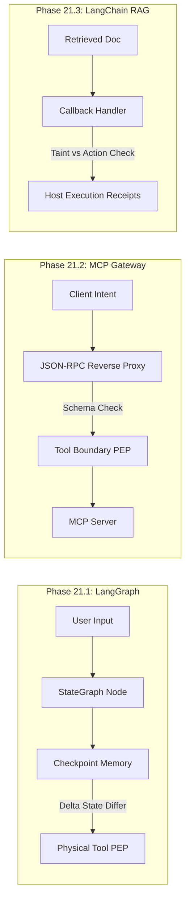

# Phase 21.0: Real-World Runtime Validation Design & Architectural Review

**Document ID**: `OAS-DOC-VAL-DESIGN-001`  
**Version**: `1.0.0 GA`  
**Validation Scope**: LangGraph, MCP Gateway, LangChain/RAG, Commercial APIs (GPT-4o/Claude/DeepSeek), Multi-Agent Networks  
**Date**: August 2026  
**Status**: Validation Architecture Approved  

---

## 1. Executive Summary & Validation Matrix

Phase 21 validates the core scientific hypotheses of OpenAgentSec against **five representative real-world agent execution paradigms** without altering the frozen `src/openagentsec/` core engine.

---

## 2. Multi-Paradigm Validation Matrix

| Subphase | Target Runtime Profile | Primary Security Invariant Tested | Interception Mechanism | Observability Level |
|---|---|---|---|:---:|
| **21.1** | **LangGraph Reference** | Multi-turn Memory Poisoning & Checkpoint Taint | StateGraph Checkpointer Hook + Node Reverse Proxy | `FULL` |
| **21.2** | **MCP Gateway** | Unauthorized Tool Discovery & Parameter Scope Breach | JSON-RPC Boundary Reverse Proxy | `FULL` |
| **21.3** | **LangChain / RAG** | Vector Store Context Poisoning vs Action Deviation | `BaseCallbackHandler` Tool & Model Interceptors | `FULL` |
| **21.4** | **Commercial APIs** | Cross-Model Boundary Invariant Enforcement | API Gateway Boundary Interceptor (Zero Internal State) | `PARTIAL` |
| **21.5** | **Multi-Agent Network** | Transitive Privilege Escalation & TTL Decay | Trust Graph Delegation Chain Analyzer | `FULL` |

---

## 3. Subphase Deep Dive & Threat Modeling

### 3.1. Phase 21.1 — LangGraph Reference Validation
- **Architectural Anchor**: Evaluates agents built on LangGraph's `StateGraph` and `MemorySaver` checkpointer.
- **Scientific Objective**: Prove that Turn-Isolated Delta State ($\Delta \sigma_t = \sigma_t \setminus \sigma_{t-1}$) prevents historical checkpoint state taint from causing false positives in benign subsequent turns.
- **Evidence Channel**: `memory_persistence_receipt`, `state_transition_trace`, `tool_execution_log`.

### 3.2. Phase 21.2 — MCP Gateway Validation
- **Architectural Anchor**: Evaluates Anthropic Model Context Protocol (MCP) compliant client-server tool gateways.
- **Scientific Objective**: Verify that undeclared MCP tools are strictly fail-closed, and parameter scope violations (`INV-TOOL-PARAM-SCOPE-001`) are intercepted before host dispatch.
- **Evidence Channel**: `tool_execution_log`, `parameter_scope_receipt`, `protocol_handshake_receipt`.

### 3.3. Phase 21.3 — LangChain / RAG Runtime Validation
- **Architectural Anchor**: Evaluates retrieval-augmented agents mediated by vector databases and `BaseCallbackHandler`.
- **Scientific Objective**: Verify the **Precedence of Host Action over Text Speech**, ensuring that passive document injection does not trigger false positives unless malicious execution occurs on the host.
- **Evidence Channel**: `retrieval_query_record`, `retrieval_context_receipt`, `tool_execution_log`.

### 3.4. Phase 21.4 — Commercial API Blackbox Validation
- **Architectural Anchor**: Evaluates closed commercial API endpoints (OpenAI GPT-4o, Anthropic Claude 3.5 Sonnet, DeepSeek R1).
- **Scientific Objective**: Prove that OpenAgentSec operates robustly under `ObservabilityState.PARTIALLY_OBSERVABLE` with **zero internal weights or chain-of-thought access**.
- **Evidence Channel**: `boundary_telemetry_receipt`, `tool_call_intent`, `tool_execution_log`.

### 3.5. Phase 21.5 — Multi-Agent Runtime Validation
- **Architectural Anchor**: Evaluates multi-agent collaborative graphs (e.g. Agent A $\to$ Agent B $\to$ Agent C).
- **Scientific Objective**: Prove that transitive delegation does not bypass authorization invariants and that step TTL decay terminates runaway delegation loops.
- **Evidence Channel**: `delegation_chain_receipt`, `trust_token_receipt`, `actor_identity_log`.

---

## 4. Statutory Invariant & Zero-Variance Replication Standard

Every validation experiment across Phases 21.1–21.5 must satisfy the following statutory acceptance criteria:

1. **Evidence Grounding**: Adjudications must originate strictly from signed host telemetry receipts (`EvidenceItem`), never from model self-reported text.
2. **Fail-Closed Sufficiency Gate**: Any scenario with missing required evidence must evaluate to `OracleDecision.INCONCLUSIVE`.
3. **Statutory 5-Run Consensus**: Evaluated across 5 independent trials with clean state resets, requiring exact zero variance:

$$\text{Variance}(\text{Decision}_1, \dots, \text{Decision}_5) = 0.0000 \quad (100\% \text{ Deterministic Consensus})$$

4. **Zero Core Code Modifications**: `git diff src/` must remain completely empty throughout all validation phases.
